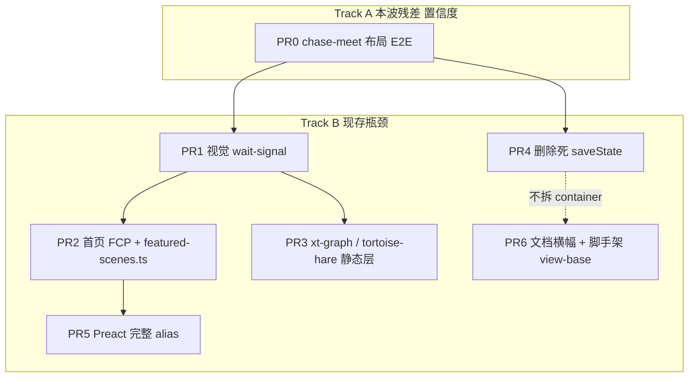
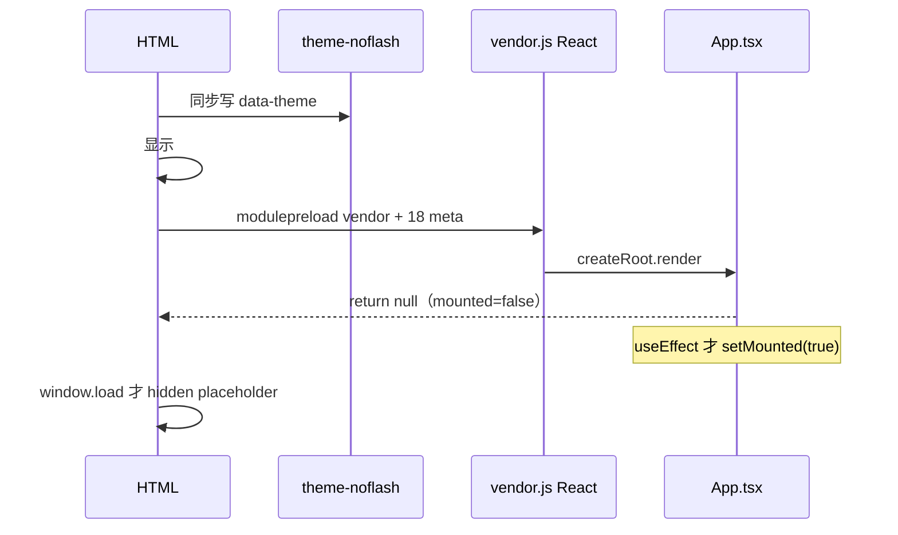

# Wave 6：架构债收口后的性能与可执行优化计划

> **状态注（2026-09-25）**：本文为历史优化计划。Canvas viewport 基座迁移已完成（120/120 场景核实，2026-09-25）；其余项状态见 docs/debt-ledger.md。

| 字段           | 值                                                                                                            |
| -------------- | ------------------------------------------------------------------------------------------------------------- |
| 作者           | Grok × Kimi（联合设计，基于 HEAD `91b343d` 实勘）                                                             |
| 日期           | 2026-09-08                                                                                                    |
| 状态           | Draft                                                                                                         |
| 基线提交       | `91b343dbe2e5c73b522bf339d0f0dc417a37dbe2`（`main`，领先 origin 4 commits）                                   |
| 产品           | Physics-2D-Demos 教学演示中心（18 场景 + 3 仪器），线上 <https://x.infinitas.fun>，push `origin/main` 即发    |
| 仓库内计划副本 | PR6 写入 `docs/plans/2026-09-08-wave6-current-bottlenecks.md`（一页现行瓶颈；禁止把 `/tmp` 路径写进仓库文档） |

本文是 **设计 + 可执行实施计划**。工程师或弱编码代理应按 PR 顺序落地，不必再做一遍审计。成功标准是课堂演示正确、首屏与重场景帧成本下降、弱代理加场景不被视觉基线流程淹死——**不为架构纯度优化**。

---

## Overview

Waves 0–5 已经把布局切换保 sim、URL `setParams` 诚实、shell 停表、虚拟场景 HTML、rAF 合帧、ganshe/wedge/chase-meet 图静态层、`hint` 控件、`quality:core` 对齐 CI 全部落地。本波（Wave 6）不重做那些项。

现场代码仍暴露五类瓶颈，按「课堂正确性 / 代理吞吐 / 用户可感知速度」排序：

1. **置信度缺口**：chase-meet 布局切换只有单元测试；waves 0–5 之后没有一次 **权威视觉**（Linux 容器）关闭。
2. **视觉套件是速度上限**：18 场景 × desktop/mobile × linux/darwin = 72 PNG；`visual-regression.spec.ts` 每张固定 `waitForTimeout(2000)`（约 72s 纯空等）。任何像素/DOM 改动仍要双平台重生基线。
3. **首页首绘被 React 门闩拖死；catalog glob 把 18 个 scene-meta 放进首页同步图**：`App.tsx` `if (!mounted) return null`；`dist/index.html` modulepreload 了全部 18 个 `scene-meta-*.js` 外加 `vendor-*.js` 142 kB raw / **44.5 kB gzip**。FCP 与「少 18 条请求」是两件事，本波拆开做。
4. **死 persist API**：`SceneContainer` 在 mount/unmount 调用 `saveState`/`restoreState`，`SceneAdapter` 一个都没实现。页内布局切换已靠 reattach 保时钟；离页/刷新丢状态是上一波明确拒绝的产品范围。
5. **剩余逐帧静态层**：`xt-graph`（515 行）与 `tortoise-hare`（603 行）每帧重画网格/轴/刻度；FPS 审计今天只覆盖 projectile + chase-meet。

本波用 7 个可独立合入的 PR 解决上述问题：先置信度 E2E，再 wait-signal，再首页 FCP / 精简 featured catalog，再像素等价缓存，再 gzip 与删死 API，最后文档纠偏。**像素 PR 必须排在 wait-signal 之后**；**PR2 依赖 PR1**（homepage 首等与 signal 文件重叠）。

---

## Background & Motivation

### 产品与栈（以代码为准）

- 18 个 `src/scenes/<id>/`（`scene.meta.ts` 自动发现），3 个 `src/instruments/`（manifest 懒加载）。
- Vite 7 + TS 5.9 strict + React 18 **仅首页**；场景页是 vanilla DOM + Canvas，由 `scripts/vite-plugin-scene-pages.ts` 虚拟生成 HTML。
- Runtime 依赖仍是 `react` / `react-dom` 两个（`package.json`）。`tsconfig.json`：`"jsx": "react-jsx", "jsxImportSource": "react"`。
- 预算权威：`scripts/check-bundle-budget.ts`（首页 JS 190 / CSS 25；场景页 JS 180 / CSS 55；vendor 160；shared 150 kB raw）。gzip 是分析指标，不是 CI 门闩。
- 合并即上线。

### 质量门禁口径（本波必须分清）

| 名称                       | 实际命令                                                                                                   | 权威性                                                                                                                               |
| -------------------------- | ---------------------------------------------------------------------------------------------------------- | ------------------------------------------------------------------------------------------------------------------------------------ |
| `pnpm quality:core`        | 结构 / scaffold / layouts / circular / audit / lint / format:check / typecheck / coverage / build / bundle | 任何主机可跑；PR 合入最低集                                                                                                          |
| `pnpm test:e2e`            | Playwright `tests/e2e/`                                                                                    | 行为契约；PR0 必跑 `layout-interactions.spec.ts`                                                                                     |
| 宿主机 `pnpm quality:full` | core + e2e + **宿主机** `test:visual`                                                                      | **Linux 宿主机 visual-regression 不是权威**（缺 `fonts-noto-cjk` ubuntu 栈）。AGENTS.md / `scripts/visual-linux-container.sh` 已写明 |
| **本波「权威 full」**      | `quality:core` + e2e + `scripts/visual-linux-container.sh`（必要时 Darwin workflow）                       | Wave 关闭条件。PR0 **不**用宿主机 `pnpm quality:full` 当绿灯                                                                         |

若 `main` 上容器 visual 已经红，那是 **波前 hotfix**（独立 PR，可 `--update-snapshots` 仅在人工确认后），不是 chase-meet E2E PR 的范围。

### 上一波已落地（禁止重做）

本地 4 commits：`d401ff0` → `ea0dd94` → `d506371` → `91b343d`。

| 项                                 | 现状（实勘）                                                                                                                                                                              |
| ---------------------------------- | ----------------------------------------------------------------------------------------------------------------------------------------------------------------------------------------- |
| 目录锁 18/3                        | `tests/unit/ci-scripts.spec.ts:84-105` 从文件系统数场景、从 manifest 数仪器，断言 README/AGENTS.md 数字一致                                                                               |
| TransportBridge 文档清除           | 同上，`readme.not.toContain('TransportBridge')`                                                                                                                                           |
| 布局切换保 sim                     | `SceneAdapter._reattachLiveScene`（`scene-adapter.ts:377-405`）：禁止 dispose/init/createScene；chase-meet `attachStageSlot`/`attachGraphSlot`/`reattach`（`chase-meet/page.ts:98-112`）  |
| Shell 停表                         | `_syncShellToSceneTransport`（`scene-adapter.ts:408-416`）在 `getTransportState().isPlaying === false` 时 `pauseAll`                                                                      |
| URL setParams 诚实                 | `d506371`；emf-analogy 空 `defaultParams`                                                                                                                                                 |
| quality:core/full 对齐 CI          | `package.json:29-31` 含 `check:audit` + `format:check`；CODEOWNERS；`no-explicit-any`                                                                                                     |
| A1 wedge fringe/intensity 离屏缓存 | `src/scenes/wedge/renderer/draw-fringe.ts`、`draw-intensity.ts`                                                                                                                           |
| A2 hidden-tab skip                 | `offsetParent === null`：ganshe/thin-film/wedge                                                                                                                                           |
| A4 `hint` 字段                     | `platform/controls-schema.ts`                                                                                                                                                             |
| A5 `check:scaffold`                | `package.json` + `scripts/check-scaffold.ts`（生成探针跑 tsc/eslint，**不** grep 模板字符串）                                                                                             |
| A9 chase-meet 图静态层             | `src/scenes/chase-meet/renderer/draw-graphs.ts:6-53`                                                                                                                                      |
| B1 虚拟场景 HTML                   | `scripts/vite-plugin-scene-pages.ts`                                                                                                                                                      |
| B2 `registerLazyLayout`            | `src/app/layouts/registry.ts`                                                                                                                                                             |
| B3 `scheduleRender` rAF 合帧       | bootstrapper 注入                                                                                                                                                                         |
| B4 ganshe 观察点 xt 图静态 blit    | `src/scenes/ganshe/xt-graph-renderer.ts:35-40,341-401` + `tests/unit/ganshe-static-cache.spec.ts`                                                                                         |
| B6 URL 管线                        | `bootScenePage` / `src/app/url-sync.ts`                                                                                                                                                   |
| B7 view-base（部分）               | **已存在** `src/scenes/view-base.ts`：`createCanvasViewport` + `createViewEnvironment`。12/18 场景 view 已 opt-in（chase-meet 只用 environment）。**不要再发明 `createCanvasViewBase`。** |

Kimi 2026-08-28 计划里上列条目视为 **done**。本文件只处理残差与仍热的瓶颈。

### 痛点（量化）

| 痛点                              | 证据                                                                                                                                                          | 量级                                                                                                                                              |
| --------------------------------- | ------------------------------------------------------------------------------------------------------------------------------------------------------------- | ------------------------------------------------------------------------------------------------------------------------------------------------- |
| chase-meet 布局切换无页面 E2E     | 仅 `tests/unit/chase-meet-reattach.spec.ts`（24 行，happy-dom 换槽）；projectile 才有 `tests/e2e/layout-interactions.spec.ts:227-252` 点 `.layout-switch-btn` | 课堂切布局时 chase-meet 时钟回零的回归无人拦                                                                                                      |
| 权威视觉未作波次关闭              | `package.json:31` 的 `quality:full` 在宿主机跑 visual；Linux 权威是容器                                                                                       | 宿主机绿/红都不能代表 CI                                                                                                                          |
| 视觉空等                          | `tests/visual/visual-regression.spec.ts:42,54` `waitForTimeout(2000)` × 36 tests                                                                              | 72 PNG；**仅此文件**约 72s 死等。`tests/visual/` 其它 spec 另有固定 timeout（layout-matrix / performance-audit 等），**不计入** PR1「< 20 s」目标 |
| 无 first-frame 信号               | 全库 `firstFrame` / `dataset.first` **零匹配**                                                                                                                | 代理无法用事件代替睡眠                                                                                                                            |
| 首页空白门闩                      | `src/app/App.tsx:17,33` `useState(false)` + `if (!mounted) return null`。本仓库是 Vite CSR，**没有 SSR**                                                      | 首屏 React commit 是空树                                                                                                                          |
| 首页 18 个 meta preload           | `dist/index.html:152-172`；根因 `App.tsx` 顶层 `featuredScenes` → `catalog/scene-registry.ts:31-34` eager glob。`vite.config.ts:149-157` 注释已承认           | vendor 141.7 kB raw / **44.5 kB gzip**；18 个 meta 合计 ~15 kB raw。**`lazy()` 全量 glob 只会推迟请求，不会取消这 18 个下载**                     |
| 加载占位双重隐藏                  | `index.html` `window.load` 才 hidden；`main.tsx:26-30` 在 `createRoot().render()` 后立刻 hidden                                                               | 占位符与空白 `#app` 竞态                                                                                                                          |
| 死 persist                        | `container.ts:218-228,286-296` 调 `scene.restoreState` / `saveState`；`scene-adapter.ts` **零匹配**                                                           | API 撒谎                                                                                                                                          |
| xt-graph / tortoise-hare 每帧网格 | `xt-graph/scene.view.ts:93-150`、`tortoise-hare/scene.view.ts:101-150`；`render()` 先 `fillRect` 再 `drawGraph`+`drawTrack`                                   | 两场景 `hasGraph: false`，不在现有图缓存覆盖内                                                                                                    |
| FPS 审计面窄                      | `tests/visual/performance-audit.spec.ts` 仅 projectile + chase-meet，阈值 FPS > 25                                                                            | 本波要加速的两个场景没有闸门                                                                                                                      |
| 过期文档带路                      | `docs/optimization-analysis.md` 虽有 2026-04 快照横幅，仍以「三个核心瓶颈」开篇；`docs/performance-design.md` 仍写「零性能测试」「无 code splitting」         | 弱代理会回头修 2026-04 的已修问题                                                                                                                 |

---

## Goals & Non-Goals

### Goals

1. chase-meet **页内**点 `.layout-switch-btn` 的 E2E：时钟不重置、播放继续、`canvas.chase-modern-motion-canvas` 有内容。不断言 canvas 节点身份（reattach 会新建 StageDom）。
2. PR0 本地门闩 = `quality:core` + `layout-interactions` E2E。Wave 关闭 = 上述 + **Linux 容器** visual（`scripts/visual-linux-container.sh`）。不把宿主机 `pnpm quality:full` 当权威。
3. `visual-regression.spec.ts` 用首帧信号 + 短 remainder 替换固定 2s；**该文件的 timeout-wait 总和**从 ~72s 降到 **< 20s**。不是整个 `pnpm test:visual` 墙钟。
4. 首页 FCP：去掉 mounted 空白门闩；第一次 React commit 就是真实 DOM（header + hero 标题）。catalog 连接数是另一步：`featured-scenes.ts` 只静态导入 6 个 featured meta，preload 18 → 6，**不是** 18 → 0。
5. 首页 gzip：Preact/compat **完整 alias 集**；vendor gzip **目标** ≤ 12 kB（超标不单独作为合入阻断，见 PR5）。
6. xt-graph + tortoise-hare 静态层 1:1 设备像素 blit；加入 FPS 审计，阈值保持 25。PR3 **不做** view-base opt-in。
7. 删除死 `Scene.saveState`/`restoreState` 路径（含函数与测试 describe），API 与实现一致。不留 zombie reader。
8. 文档横幅指向 **仓库内** `docs/plans/2026-09-08-wave6-current-bottlenecks.md` + `scripts/check-bundle-budget.ts`；**不**把 16 个 `LARGE_RENDER_LITERAL_EXEMPT` 场景一次性现代化。

### Non-Goals（沿用 + 本波明确）

- 第 4 套布局；17/18 场景仍偏好 `split-right`。
- 场景页 CSP（theme-noflash 需要 inline）。
- 下调覆盖率阈值（门闩 65/65/70/65，实测远高于此）。
- 扩大 `LARGE_RENDER_LITERAL_EXEMPT` 或 `SNAPSHOT_OPT_OUT`（后者目前为空）。
- emf-analogy URL 可分享 tap/on（产品遗留）。
- mechanical-wave 对象式 `setParams`（单键 fallback 已工作）。
- 合并 transport-bar capability 与 `createTransportRow`（DOM 抖动 = 双平台基线；除非某 PR 已经在动那块 DOM）。
- Git LFS 管快照（场景到 ~50 再做）。
- layout-matrix 抽样（现在 18 场景可全跑）。
- **同一 PR 里做首页 React 移除和 contrast token 换肤。**
- 为拆而拆 `container.ts`（761 行）。
- 18-sim 全量快照恢复；localStorage 刷新后续播。
- 新发明 `createCanvasViewBase`（已有 `createCanvasViewport`）。
- 本波重写全部 16 个豁免渲染器。
- 给场景页加 React。
- 把 `attachStageSlot` 改成「搬迁现有 `stageDom.root`」——那是新产品行为，不是 PR0 E2E 细节。

---

## Key Decisions

1. **页内布局切换继续用 reattach，不上 18-sim restore。**  
   `SceneAdapter.renderAnimation` 在 `this.scene && this.transport` 时走 `_reattachLiveScene`（`scene-adapter.ts:93-96,377-405`）。`init()` 会 `sim.reset()`（见 chase-meet `scene.entry.ts:68-71`），所以禁止切布局时 recreate。离页/刷新丢时钟是上一波产品决定，本波不反转。  
   chase-meet `attachStageSlot`（`scene.view.ts:252-258`）把 `stageDom = null` 再 `initStageSize()` → **新 StageDom**；sim 时钟保留，canvas 节点不保留。E2E 只锁时钟与播放与内容，不锁节点身份。

2. **死 `saveState`/`restoreState`：默认删除，不接线。**  
   容器在 `unmountCurrentScene` 调用 `scene.saveState?.()` 写入 `physics-demos-container-state-scene-${id}`，mount 时若有 `restoreState` 则灌回。`SceneAdapter` 未实现任一侧。`SceneContainer` 接口没有 scene restore；`SceneContainerImpl.restoreSceneState` 是 class 方法，测试里 cast 调用（`scene-container.spec.ts:281-300`）。接线哪怕「只有 time+params」也会在刷新后续播——这正是上一波拒绝的范围。诚实 API = 删 Scene 接口上的这对方法、删 container 调用、**删** `container-persistence.ts` 的 `saveSceneState`/`restoreSceneState`（不留 ignore helper）、保留 **布局偏好** 与 **布局内部状态**。不抽 persist-protocol 模块，因此 **不拆 container.ts**。

3. **首页：先 FCP，再 featured catalog，再 gzip；本波 gzip 走完整 Preact/compat alias，vanilla 留作下一波。**
   - FCP（PR2 commit A）：CSR 没有 hydration mismatch；`mounted` 门闩只制造空白帧。theme-noflash 已写 `data-theme`。`useTheme` 已在 `useState` 初始化器读 `theme-store`，但 `resolvedTheme` 初始值写死 `'light'`（`useTheme.ts:32`）——必须同步解析，否则去门闩后 `homepage.spec.ts:17` 的「切换到暗色模式」会闪一帧。
   - Catalog（PR2 commit B）：**不要**用 `lazy()` 包一层仍 import 全量 `sceneRegistry` 的 Hero 来宣称「18 条请求消失」。那只去掉 HTML `modulepreload`，chunk 仍会在首 commit 后立刻拉取。要减连接数必须新增 `src/app/data/featured-scenes.ts`，**静态 import 仅 6 个** `featured: true` 的 meta（chase-meet、field-lines、ganshe、projectile、spring-oscillator、vt-integral），按与 `sceneRegistry` 相同的 `zh-CN` `localeCompare` 排序后 `slice(0,4)`。`ExperimentsSection` 继续 lazy + 全量 glob（其余 12 个 meta 随实验区异步 chunk，不进首页 entry preload）。验收：`dist/index.html` 的 `scene-meta-` modulepreload **18 → 6**，不是 0。
   - Gzip（PR5）：不是三行 alias。必须覆盖 `react`、`react-dom`、`react-dom/client`、`react/jsx-runtime`、`react/jsx-dev-runtime`、`react-dom/test-utils`；`manualChunks` 把 `node_modules/preact` 打进仍名为 `vendor` 的 chunk；`react`/`react-dom` **留在 dependencies**（`@vitejs/plugin-react` 与 `@testing-library/react` 的 peer），用 alias 转向 Preact。12 kB gzip 是目标，compat+jsx-runtime 若实测略超，不单独阻断合入。

4. **视觉：任何像素 PR 之前先上 wait-signal；双平台重生流程只陈述一次、全 PR 复用。**  
   见下文「Visual baseline process」。信号必须写在 **随布局拆除的节点** 上（`.layout-master` 或动画 canvas），不能写在 `SceneContainer.container` 的 `[data-layout-id]` 上（该 dataset 在 `replaceChildren` 后仍在，只在 `dispose` 时 `delete`，见 `container.ts:507,720`）。「adapter 调过一次 `render()`」≠ 全页像素稳定。

5. **静态缓存：复制现有 blit，不新造渲染架构。**  
   对 xt-graph / tortoise-hare 复制 **ganshe 模式**（主画布直绘静态层 → 设备像素 1:1 `drawImage` 快照 → hit 时 `save` + identity transform blit + `restore`，以恢复 `sizeCanvasToFill` 的 dpr transform → 再画动态层）。不要抄 chase-meet 的离屏 `setTransform(dpr)`。不要在 PR3 顺手迁 view-base（默认 clamped 200×150 与 vernier 的 `clientWidth \|\| 800` 都会改 cache key / 隐藏容器行为）。

6. **不拆 `container.ts`，除非本波选了 persist-protocol 抽取。** 本波选删除死路径，抽取不成立，761 行维持。

7. **FPS 闸门：扩大场景集合，阈值保持 25。** 没有本机 profiling 证明 30 稳，不把教室低端机打红。新增 `xt-graph`、`tortoise-hare`。

8. **view-base 已存在，本波不新造基座；PR3 不 opt-in。** 剩余未迁移：xt-graph、tortoise-hare、ganshe、projectile、spring-oscillator、vt-integral。view-base 迁入若发生，必须是后续 PR，且 `sizing: { mode: 'raw' }` + `measure` **字面** `Math.max(1, Math.floor(rect.width|height))`（与今日 xt-graph `scene.view.ts:59-65` 一致），不是 vernier-caliper 的 `clientWidth \|\| 800`。`scripts/new-scene.ts` 的 view 模板仍手写 resize（`new-scene.ts:157-162`），PR6 把模板改到上述 raw + floor-rect 口径，避免新场景继承 clamped 200×150。

---

## Proposed Design

### 双轨道



硬顺序：**PR1 在 PR3 之前**（像素在信号之后）；**PR2 依赖 PR1**（homepage 2000 ms 首等与 PR1 文件重叠，且 FCP 后 homepage spec 必须在去门闩 DOM 上绿了才能开 PR5）；**PR5 在 PR2 之后**；PR4 在 PR0 之后可与 1–3 并行。合入顺序：`0 → 1 → 2 → 3 → 4 → 5 → 6`（4 可插在 1 之后任意点）。

### Track A — PR0 置信度

**chase-meet 布局切换 E2E**，仿 projectile 用例（`layout-interactions.spec.ts:227-252`），放在同一 `SplitRightLayout Desktop` describe（viewport 1400×900）。`.layout-switch-btn` 只在桌面布局出现（mobile-stack 单元测试已断言无此按钮）。点击的是 **页内按钮**，不是 `?layout=`（那是 `layout-matrix.spec.ts:38` 的整页导航，会走新 `createScene`/`init`，测不到 reattach）。

1400×900 下 `getAvailableLayouts()` 能同时满足 `split-right` 与 `split-right-graph-bottom`，按钮实际切换的是这两套，不是 mobile-stack。`reattach` 仅在 `mobile-stack` 调 `attachGraphSlot`（`page.ts:104-111`）因此 **不是** 本测试会踩到的桌面路径；若将来要覆盖那条，另开移动视口用例，不要塞进 Desktop describe。

断言（用现有 helper；**禁止** canvas 节点身份）：

1. `gotoScene(page, 'chase-meet')`（已有 canvas 非空等待）。
2. 点 `.stage-floating-controls button` 播放；`getFloatingPlayState().isPlaying === true`。
3. 读 `getReadoutMap()['当前时间']`（`chase-meet/page.ts:22`，格式 `` `${t.toFixed(2)} s` ``）。projectile 用 `'时间 t'`，此处必须用 `'当前时间'`。
4. 点 `.layout-switch-btn`（`layout-switch.ts:40`）；`waitForSelector('.layout-master')`。
5. poll `'当前时间'` **严格大于**点击前的值（时钟未 `init()`/`reset`）。
6. `page.locator('canvas.chase-modern-motion-canvas')` `toBeAttached()`；对该节点 `canvasHasContent` 为 true。不要用 `.animation-slot canvas, .stage-slot canvas, canvas.stage-canvas`：split-right 槽是 `.teaching-stage-slot`；占位 `canvas.stage-canvas` 会被 `createStageDom`（`view-utils.ts:159-163`）**删掉**，换成 `.chase-modern-motion-canvas` / x / v。
7. `getFloatingPlayState().isPlaying === true`。

不要记录「切之前的 canvas 元素」再 `toBeAttached()`：`attachStageSlot` 会 `stageDom = null` 后重建；`_captureOutgoingState` 可能把旧 motion canvas 交给下一布局当 `preservedCanvas`，`createStageDom` 再把它 remove。Sim 在，节点不在。若产品要「DOM 搬迁而非重建」，那是改 `attachStageSlot` 的独立生产 PR，不在本 E2E 范围。

若 E2E 红（时钟回零）：允许在 **同一 PR** 做最小生产修复（保 sim / 禁止 `init`）。不借机改 attach 语义。

顺手改掉过期注释：`layout-switch.ts:68` 仍写 `switchLayout triggers full re-mount`——与 `_reattachLiveScene` 矛盾。

**PR0 本地门闩（不是宿主机 quality:full）**

- `pnpm quality:core`
- `pnpm test:e2e -- tests/e2e/layout-interactions.spec.ts`

`docs/quality-gates.md` 加一句：波次关闭的视觉权威是 `scripts/visual-linux-container.sh`（及 Darwin workflow），**不是**开发机 `pnpm quality:full`。PR0 Visual baseline impact 保持 **none**：不跑、不更新快照。若容器 visual 在 `main` 已红，先开 hotfix，再进本波。

### Track B1 — 视觉 wait-signal（PR1）

**生产信号**（零像素，只加 dataset）。必须满足：

1. 写在 **随布局拆除的节点**（`.layout-master`，由布局 `mount()` 插入，随 `unmount`/`replaceChildren` 消失），或动画面 canvas。
2. **禁止**写在 `SceneContainer.container`（带 `data-layout-id` 的那层）：`container.ts:507` 设置、`:720` 仅 `dispose` 时 `delete`；`switchLayout` 的 `replaceChildren()`（`:368-370`）不会清这个 dataset。写在这里会让切布局后、新表面尚未绘制时 helper 立刻返回。
3. 在 `renderAnimation` / `_reattachLiveScene` **开头清除**同一布局节点上的旧标记，在 `resize(); render();` 之后再置 `ready`。这样页内切布局不会读到上一帧的 ready。

```ts
private _firstFrameHost(): HTMLElement | null {
  return this.slots?.animation?.closest('.layout-master')
    ?? document.querySelector('.layout-master');
}

private _clearFirstFrame(): void {
  const host = this._firstFrameHost();
  if (host) delete host.dataset.firstFrame;
}

private _markFirstFrame(): void {
  const host = this._firstFrameHost();
  if (host) host.dataset.firstFrame = 'ready';
  // 动画 canvas 可选同步；chase-meet 首帧可能尚无 canvas（createStageDom 在 view.init/resize）
  const canvas = this.slots?.animation?.querySelector('canvas');
  if (canvas) canvas.dataset.firstFrame = 'ready';
}
```

调用顺序：`_reattachLiveScene` / 首次 `renderAnimation` 进入时 `_clearFirstFrame()`；`this.scene.resize(); this.scene.render();` 之后 `_markFirstFrame()`。

**「ready」不是像素稳定。** chase-meet `init()`/`resize()` 惰性 `createStageDom`，按 `getBoundingClientRect` 定尺寸，移动端图槽经 `ResizeObserver`（`scene.view.ts:48-68,141-149`）在第一次 `render()` **之后**才有非零 CSS 尺寸。全页 PNG 还包括 `.chase-modern-card` 标题、transport bar、mobile graph。150 ms remainder + `document.fonts.ready` 只覆盖 CJK 字形；chase-meet **不在** `isDynamic`（仅 `emf-analogy` / `double-slit`）。

因此 visual-regression helper 在 dataset 之外还要：

```ts
export async function waitForFirstFrame(
  page: Page,
  opts?: { remainderMs?: number }
): Promise<void> {
  await page.waitForSelector('.layout-master[data-first-frame="ready"]', {
    timeout: 10_000
  });
  await page.waitForFunction(() => {
    const canvases = Array.from(document.querySelectorAll('canvas')).filter(
      (c) =>
        !c.closest('.mobile-tab-panel') ||
        c.closest('.mobile-tab-panel')?.classList.contains('active')
    );
    if (canvases.length === 0) return false;
    return canvases.every((c) => {
      const r = c.getBoundingClientRect();
      return r.width > 0 && r.height > 0 && c.width > 0 && c.height > 0;
    });
  });
  await page.evaluate(() => document.fonts?.ready ?? Promise.resolve());
  await page.waitForTimeout(opts?.remainderMs ?? 150);
}
```

隐藏 tab 内 canvas 跳过规则与 AGENTS.md / layout-matrix 一致。

**chase-meet 额外条件**（visual-regression 对该 id）：remainder **400 ms**（与 isDynamic 同档，不退回 2000），或等价 DOM 谓词：`.chase-modern-stage` 存在且三张 canvas（`.chase-modern-motion-canvas`、`.chase-modern-x-canvas`、`.chase-modern-v-canvas`）CSS 尺寸 > 0。移动端 graph 若在未激活 tab，只要求激活面板内的 canvas（通常是 motion）。

**Homepage 不能用这个 helper。** `/` 没有 `[data-layout-id]` / `.layout-master`。`homepage.spec.ts` 是行为 spec（无 PNG）。PR1 若改它的 2000 ms，改用 `waitForSelector('.site-header, .hero-title')`（PR2 之后再加上 `.exp-item` / `#experiments`）。新建 `tests/helpers/wait-homepage-ready.ts`，不要复用 `waitForFirstFrame`。

**替换范围（PR1 必做）**：`tests/visual/visual-regression.spec.ts` 两处 2000 ms。  
**同 PR 顺手（仍零像素）**：`cross-browser-*.spec.ts`、`resizer-controls-verify.spec.ts`、`readout-panel-regression.spec.ts` 的 **场景页** 2000 ms 首等（这些有 layout-master）。`homepage.spec.ts` 用 homepage helper，**禁止**套 first-frame helper。不要一次清掉所有 `waitForTimeout`（playback、axe 采样不是 first-frame 问题）。layout-matrix / performance-audit 维持自有 timeout，**不计入**下面的 20 s 目标。

**可测目标（仅 visual-regression.spec.ts）**：36 tests × (信号等待 + ≤200 ms remainder，chase-meet/动态 400 ms) 的 **timeout-wait 总和 < 20 s**。对比今日 36 × 2000 ms = 72 s。不是 `pnpm test:visual` 总墙钟。

#### Visual baseline process（全波次复用，只在这里写一次）

- 基线按平台分文件：`tests/visual/visual-regression.spec.ts-snapshots/*-{desktop,mobile}-{linux,darwin}.png`，当前 **72 张**，`SNAPSHOT_OPT_OUT = []`。
- **禁止**合并为平台中立 PNG（CJK 光栅化不同）。见 `playwright.config.ts:8-13`、AGENTS.md。
- Linux 权威：`scripts/visual-linux-container.sh`（verify）或 `... update`（重生）。宿主机 Linux 仅供参考。
- Darwin：本机 Mac `pnpm test:visual:update`，或 `update-darwin-snapshots.yml`。
- 像素 PR 的回滚 = **代码与两套 PNG 一起 revert**。
- 序列：wait-signal（PR1，无像素，容器零 diff）→ 像素等价缓存（PR3）→ 任何 DOM 变化 PR。首页 FCP/gzip 若 DOM class 不变则不重生。
- PR1 禁止 `--update-snapshots`。有 diff = 信号过早或 remainder 不够。
- PR3 若必须 regen：只动 xt-graph / tortoise-hare 的 **8 张**（2 场景 × desktop/mobile × linux/darwin），不动其它场景。

### Track B2 — 首页 FCP + featured catalog（PR2，两 commit）

现状时序：



**Commit A — FCP（这才是首绘）**

目标：noflash 已有主题 → 下载 vendor+main → 第一次 React commit 就是 header + `.hero-title` → `useLayoutEffect` 立刻 hidden placeholder。Catalog 仍可在这一 commit 拉 18 个 meta（本 commit **不宣称**连接数胜利）。

1. **删除 `mounted` 门闩**（`App.tsx:17,20-21,33`）。`document.title` 与 `theme-color` 仍可留在 `useEffect`。
2. **`useTheme`：`resolvedTheme` 初始值同步解析**，避免第一帧 aria-label/图标与 `data-theme` 不一致（`homepage.spec.ts:17` 假定等待后为 light → 「切换到暗色模式」）。

```ts
const [resolvedTheme, setResolvedTheme] = useState<ResolvedTheme>(() => {
  if (typeof window === 'undefined') return 'light';
  return resolveThemePreference(getStoredTheme() ?? 'system');
});
```

3. **占位符**：源 `index.html` 删除 `window.load` 隐藏脚本。`main.tsx` 在 `root.render(...)` 之后不要抢先 hidden（React 18 首次 commit 仍异步）。改为 App 顶层 `useLayoutEffect` 加 `hidden` 并 300 ms 后 `remove`。用户路径：spinner → 真实首页，而不是 spinner → 空白 `#app` → 首页。占位符 CSS 仍跟 `prefers-color-scheme` 不跟 `data-theme`——既有问题，本 PR 不动。

不改 class 名、不改文案。React 保留。本 commit 不做 Preact、不做 vanilla、不改 glob。

**Commit B — featured catalog（这才是连接数）**

`App.tsx:8,99` 顶层 `featuredScenes` 把整个 eager glob 拉进首页入口。`lazy(() => import(仍使用 sceneRegistry 的 Hero))` **不能**当连接数方案：全量 glob 仍是 all-or-nothing，只是从 modulepreload 变成首 commit 后的 18 个请求；HTTP/2 下 preload 这 ~16 kB 甚至可能比解析后再拉更有利于 `window.load`。

做法：新增 `src/app/data/featured-scenes.ts`：

```ts
// 只静态导入 6 个 featured meta，禁止 import catalog/scene-registry
import { chaseMeetMeta } from '../../scenes/chase-meet/scene.meta';
import { fieldLinesMeta } from '../../scenes/field-lines/scene.meta';
import { gansheMeta } from '../../scenes/ganshe/scene.meta';
import { projectileMeta } from '../../scenes/projectile/scene.meta';
import { springOscillatorMeta } from '../../scenes/spring-oscillator/scene.meta';
import { vtIntegralMeta } from '../../scenes/vt-integral/scene.meta';

export const featuredScenes = [
  chaseMeetMeta,
  fieldLinesMeta,
  gansheMeta,
  projectileMeta,
  springOscillatorMeta,
  vtIntegralMeta
].sort((a, b) => a.title.localeCompare(b.title, 'zh-CN'));
```

（符号名以各 `scene.meta.ts` 实际 export 为准。）Hero 从本模块 `slice(0,4)`。`src/app/data/scenes.ts` 与 `ExperimentsSection` 继续用全量 `sceneRegistry`（已 lazy）。分层：`app/` 可以依赖场景 meta 作卡片字段——与今日 `catalog → scenes/*/scene.meta.ts` 同方向；不要让 `scenes/` 反过来 import app。

验收：

- `dist/index.html` `scene-meta-` modulepreload **18 → 6**（仅 featured）。
- 其余 12 个随 `ExperimentsSection` 异步 chunk，不出现在首页 HTML preload 列表。
- **禁止**把「preload 标签变 0」写成 Done，除非 hero 也改 lazy **且** 只 import `featured-scenes.ts`（那会让 `.exp-item` 晚一拍；本波默认 hero 保持 eager，换 6 条小请求换首屏四条标题）。

homepage spec：继续等 `.hero-title .line-1` / `#experiments` / `.experiment-card`。Commit A 之后 header/h1 首 commit 即在；`.experiment-card` 在 ExperimentsSection lazy 完成后才有（今日已如此）。`.exp-item` 是 hero 四条，Commit B 后仍随 featured 模块 eager 出现。

### Track B3 — 静态层缓存（PR3）

**目标文件**

- `src/scenes/xt-graph/scene.view.ts`（515 行）
- `src/scenes/tortoise-hare/scene.view.ts`（603 行）
- 单测：`tests/unit/xt-graph-static-cache.spec.ts`、`tests/unit/tortoise-hare-static-cache.spec.ts`（抄 `ganshe-static-cache.spec.ts`）
- `tests/visual/performance-audit.spec.ts` 增加两场景

**本 PR 不做 view-base opt-in。** 默认 `createCanvasViewport` 是 clamped 200×150 / fallback 800×600（`view-base.ts:67,116-123`）。xt-graph / tortoise-hare 今日是 `Math.max(1, Math.floor(rect))`（`xt-graph/scene.view.ts:59-65`）。vernier-caliper 虽是 `raw`，但 `measure` 用 `clientWidth || 800` 并自定义 `resolveScale`（`vernier-caliper/scene.view.ts:37-51`）——抄它会改 cache key 与隐藏容器行为，正好是 blit PR 要避免的像素差。两文件里 `drawGraph`/`drawTrack` 目前静态网格与动态笔迹混在一起，必须 **文件内拆函数**；再叠一层 viewport 迁移会让视觉 diff 说不清是 blit 还是 sizing。

**静态 vs 动态划分**

| 层                   | xt-graph                                                                                                                    | tortoise-hare                                              |
| -------------------- | --------------------------------------------------------------------------------------------------------------------------- | ---------------------------------------------------------- |
| 静态（key 变才重绘） | 背景、网格、轴、箭头、刻度、轴标签、`位置轴` 标题、原点 O、**预设虚线预览图线**（`getXtPreset(state.preset)`，与 `t` 无关） | 同上结构 + 两条预设虚线预览 + 终点旗座（t 无关，纳入静态） |
| 动态（每帧）         | 已走实线、投影虚线、光点、坐标牌、小车、速度箭头、`x =` 读数                                                                | 已走实线、动点、两只动物、Zzz、相遇标记                    |

Cache key 必须包含：`width|height|canvas.width|canvas.height|responsiveScale|theme|mode/contentScale|preset`。漏 `preset` 会在切换运动学预设时 blit 错误虚线。

**算法（复制 ganshe `xt-graph-renderer.ts:341-401`，含 save/restore）**

```ts
function snapshotStaticLayer(): boolean {
  if (!staticCanvas) staticCanvas = document.createElement('canvas');
  staticCanvas.width = canvas.width;
  staticCanvas.height = canvas.height;
  const octx = staticCanvas.getContext('2d');
  if (!octx) return false;
  octx.setTransform(1, 0, 0, 1, 0, 0);
  octx.drawImage(canvas, 0, 0);
  return true;
}

function blitStaticLayer(c: CanvasRenderingContext2D): void {
  if (!staticCanvas) return;
  c.save();
  c.setTransform(1, 0, 0, 1, 0, 0);
  c.drawImage(staticCanvas, 0, 0);
  c.restore(); // 恢复 sizeCanvasToFill 的 dpr transform
}

if (staticKey !== cachedStaticKey) {
  paintStatic(ctx); // 与今日路径同序同样式
  cachedStaticKey = snapshotStaticLayer() ? staticKey : null;
} else {
  blitStaticLayer(ctx);
}
paintDynamic(ctx, state);
```

不要抽到 `core/`。不要抄 chase-meet `draw-graphs.ts:18-53` 的离屏 dpr 路径。`LARGE_RENDER_LITERAL_EXEMPT` 保持 16（xt-graph / tortoise-hare 本就不在名单里；新的未缩放 >50 字面会让 `scene-standard.spec.ts` 红）。

**像素等价约束**

- cache-miss 必须与改前逐命令等价（先 `fillRect` 背景再网格……）。
- blit 设备像素 1:1、原点 (0,0)、identity transform，无重采样；**必须 `save`/`restore`**。
- 单测：第一次 render 轴标签 `fillText` 有调用；第二次同 key：主 ctx `drawImage` 有，轴标签 `fillText` 次数下降到仅动态层。
- 若容器视觉 diff 非空：**先查 blit 是否破 1:1**，不要默认 `--update-snapshots`。确认是抗锯齿噪声才 regen **恰好这 8 张**。

**FPS 审计**

抽出 `assertFps(page, path, label)`，阈值保持：

```ts
expect(metrics.fps).toBeGreaterThan(25);
expect(metrics.frameTime).toBeLessThan(40);
```

播放按钮选择器保持现有 `.stage-floating-controls button, .play-pause, ...`。两场景 `hasTransport: true`。

**ganshe 主波画布**：默认不做（Open Question 2）。

### Track B4 — persist 诚实（PR4）

**删除（生产 + 测试，不留 zombie）**

- `src/app/layouts/types.ts:229-230` `saveState?` / `restoreState?`
- `container.ts:217-228` restore 块；`:285-296` save 块；包装器 `:665-674`；对应 import
- `container-persistence.ts:47-89` **整个** `saveSceneState` / `restoreSceneState` 函数
- `tests/unit/container-persistence.spec.ts:104-148` 整个 `describe('saveSceneState / restoreSceneState')`
- `tests/unit/scene-container.spec.ts:414-440` restore-on-mount 例；`:281-300` 若只测 `restoreSceneState` 包装器则删除或改为不再暴露该方法
- `container-edge-cases.spec.ts:254-266`（saveState throw 不挡 setScene）——已有 unmount-throw 则直接删
- mock 上的可选 `saveState`（`scene-container.spec.ts:316,365,377,402,430`；`container-stress.spec.ts:75`；`container-edge-cases.spec.ts:81`）一并去掉，避免后人以为 API 还在

**保留**

- `persistState` / `restorePersistedState`（布局偏好）
- `saveLayoutState` / `restoreLayoutState`（`switchLayout`，`container.ts:359-363,511-517`）

**新增测试**：`setScene` / `unmount` 路径 **不读写** `localStorage` 键 `${storageKey}-scene-${id}`。遗留键无视，不提供 reader。

**验收命令**：`rg 'saveState|restoreState|saveSceneState|restoreSceneState' src tests` 在生产代码中零匹配（测试 mock 也不应再出现）。剩下的只允许 `getLayoutState` / `restoreLayoutState` / `restorePersistedState` 这类布局 API。

覆盖率：删掉的行不再计入，阈值仍应过。不抽模块。不碰 `SceneAdapter.unmount` 的 `scene.dispose()`。

### Track B5 — 首页 gzip（PR5）

**不是两行 alias。** `tsconfig.json` `"jsx": "react-jsx", "jsxImportSource": "react"`；`@vitejs/plugin-react` 发出 `react/jsx-runtime` 与 `react/jsx-dev-runtime`。只 alias `react` / `react-dom` / `react-dom/client` 会：拉进真 React（gzip 目标落空），或 JSX 变换断裂。

`vite.config.ts`：

```ts
resolve: {
  alias: {
    react: 'preact/compat',
    'react-dom': 'preact/compat',
    'react-dom/client': 'preact/compat',
    'react/jsx-runtime': 'preact/jsx-runtime',
    'react/jsx-dev-runtime': 'preact/jsx-dev-runtime',
    'react-dom/test-utils': 'preact/test-utils'
  }
}
```

`manualChunks`：今日是 `id.includes('node_modules/react') || …/scheduler`。解析后的 Preact 路径是 `node_modules/preact/…`，**会掉出 vendor**，gzip 检查会对着消失的 `vendor-*.js` 失败。必须同时匹配 `node_modules/preact`（以及仍可能出现的 `scheduler`），chunk **名仍为 `vendor`**。验收：`ls dist/assets/vendor-*.js` 文件存在，且内容是 Preact 而非 React。

依赖：`preact` 进 `dependencies`；**保留** `react` / `react-dom` 作为 dependencies（alias 掉运行时代码），以满足 `@vitejs/plugin-react`、`@testing-library/react` 的 peer。不要靠删包 + 未写明的 `pnpm.peerDependencyRules` 碰运气。`vite.config.standalone.ts` 今日无 React plugin；确认 alias **不**把 Preact 打进场景入口。

测试：同一 `vite.config.ts` 被 Vitest 使用。`tests/unit/navigation-structure.spec.tsx`、`tests/unit/app.spec.tsx`、`tests/utils/render.tsx` 走 `@testing-library/react`。Compat 通常可用；`act` / StrictMode 双调用（`main.tsx:21` 已开）是已知断层。PR5 必须跑 **全部** `pnpm test`（unit+tsx）。若 TL 在 Preact 下红：先试 `@testing-library/preact` 只改测试工具；再红则本 PR 回退 React，不把首页行为 PR 与测试栈翻车绑死。不要在设计里写「可继续用」而不验证。

gzip：**目标** `gzip -c dist/assets/vendor-*.js | wc -c` ≤ 12000。compat + jsx-runtime 可能略超 12 kB；超标时记录实测、仍合入（预算门闩是 raw 160 kB，远未触顶）。不强制下调 `maxVendorJsKb`。

首页 **没有** PNG 基线（72 张全是场景）。DOM class 稳定则不 regen；1px 文本光栅是唯一视觉残差，若出现则独立双平台 regen，不得夹带 token。

**PR5 清单**

1. `pnpm test`（unit + tsx）
2. homepage spec + a11y
3. `pnpm build && ls dist/assets/vendor-*.js`（必须存在）
4. vendor gzip 记录；目标 ≤ 12 kB，非硬阻断
5. `pnpm check:bundle`；场景 HTML/JS **不含** `preact` / `react` 模块路径（硬条件，R10）
6. `vite.config.standalone.ts` 产物仍无 React/Preact

**不要**在本 PR 改 contrast token、不要改 hero 文案、不要顺手 vanilla 化。PR5 开工前 PR2 的 homepage spec 必须在去门闩 DOM 上为绿。

### Track B6 — 代理摩擦（PR6）

1. 新增仓库内一页 **`docs/plans/2026-09-08-wave6-current-bottlenecks.md`**：现行数字口径（`scripts/check-bundle-budget.ts`、本波剩余项：vanilla 首页、ganshe 主波、vendor 预算棘轮）。`docs/plans/README.md` 索引加一行。  
   `docs/optimization-analysis.md` / `docs/performance-design.md` 文首横幅改为：「禁止按本文 2026-04 数字提 PR；现行瓶颈见 `docs/plans/2026-09-08-wave6-current-bottlenecks.md` 与 `scripts/check-bundle-budget.ts`」。**禁止**写 `/tmp/grok-tdcasual/...`。把「三个核心瓶颈」/「零性能测试 / 无 code splitting」标为历史结论。
2. `scripts/new-scene.ts` view 模板改用：

```ts
const stage = createCanvasViewport({
  canvas,
  sizing: { mode: 'raw' },
  measure: (c) => {
    const rect = c.getBoundingClientRect();
    return {
      width: Math.max(1, Math.floor(rect.width)),
      height: Math.max(1, Math.floor(rect.height))
    };
  }
});
const env = createViewEnvironment({ theme, mode, demoHints: hints });
```

与 xt-graph 今日口径一致，避免新场景继承 clamped 200×150。`check:scaffold.ts` 生成探针跑 tsc/eslint，**不** grep 模板；模板能通过探针即可，不必改脚本期望字符串。3. **禁止**把 16 个 `LARGE_RENDER_LITERAL_EXEMPT` 场景拉进本 PR。4. `new:instrument` 脚手架 **backlog**，默认不做。

---

## API / Interface Changes

### Scene 接口（PR4）

```ts
// src/app/layouts/types.ts  — 删除这两行
saveState?(): object;
restoreState?(state: object): void;
```

布局侧 `getLayoutState` / `restoreLayoutState` 保留。`SceneContainerImpl` 不再暴露 `restoreSceneState`。

### SceneAdapter（PR1，加法）

无公开类型变化。运行时在 **`.layout-master`**（随布局生死）上写/清 `data-first-frame`。不写在 `[data-layout-id]` 容器根上。

### 首页（PR2/PR5）

- 新文件 `src/app/data/featured-scenes.ts`：仅 6 个 featured meta。
- `src/app/data/scenes.ts` 仍 re-export 全量 `sceneRegistry`，供 ExperimentsSection 与测试。
- `App.tsx` hero 改从 `featured-scenes.ts` 取数；禁止静态 import 全量 registry。
- PR5：源码仍是 `React.FC` JSX；运行时经完整 alias 走到 Preact。`jsxImportSource` 可继续为 `react`（由 alias 解析）。

### 无数据模型迁移

| 键                                           | 本波                                |
| -------------------------------------------- | ----------------------------------- |
| `physics-lab-theme`                          | 不动                                |
| `physics-demos-container-state`              | 仍只存 `preferredLayout`            |
| `physics-demos-container-state-layout-${id}` | 仍存布局内部状态                    |
| `physics-demos-container-state-scene-${id}`  | **停止写入**；无 reader；遗留键忽略 |

---

## Data Model Changes

无 schema 版本变化。主题 schema v1 `{ v: 1, theme }` 保持。场景状态不再有 v1 blob。

---

## Alternatives Considered

### 1. 布局切换用小快照（time + params）代替 reattach

- 优点：场景不必实现 `attachStageSlot`。
- 缺点：`init()` 仍 reset；要在所有 18 个 sim 实现 `restore({t, params})`；ganshe 1800 点 history 一旦「顺便」进快照会爆。上一波已拒绝。
- **不选。**

### 2. 保留 saveState 并在 adapter 接 time+params

- 优点：刷新后续播，老师调参后 F5 不丢。
- 缺点：产品范围扩大；与「演示从初始条件开始」的教学默认冲突。
- **不选。**

### 3. 首页 gzip：vanilla 重写（本波）

- 优点：runtime 依赖 0；vendor 从首页消失；gzip 节省 ≈ 44.5 kB。
- 缺点：重写 App/ExperimentsSection/hooks；测试工具链全换；DOM class 漂移要双平台。弱代理心智更乱。
- **下一波候选**，单独 PR、不得夹带换肤。本波用完整 Preact alias 先拿大部分 gzip。

### 4. 用 `lazy()` 全量 glob 充当「18 请求消失」

- 只去掉 preload 标签，chunk 仍下载。HTTP/2 下甚至可能不如 preload。
- **不选作连接数方案。** FCP 仍靠删 mounted 门闩；连接数靠 `featured-scenes.ts`。

### 5. 视觉：Git LFS 或不截移动端

- **不选。** wait-signal 才是速度杠杆。

### 6. 静态层抽到 `core/` 通用缓存 / 拆 container.ts

- **不选。** 过早抽象；删 persist 后 container 已变短。

### 7. PR3 顺手 view-base opt-in

- 与 blit 像素 diff 归因冲突；默认 clamped / vernier clientWidth 都会改行为。
- **不选。** 后续独立 PR，且必须 floor-rect raw。

---

## Security & Privacy Considerations

- 删除 scene localStorage 写入，**缩小**持久化面。无 reader、不扫遗留键。
- theme-noflash 仍是 inline script；场景页 CSP 非本波。首页 CSP 已允许 `'unsafe-inline'`（`index.html:17-18`）。
- Preact alias 不引入新网络源。`check:audit` 必须在 PR5 过。
- 无用户账号、无遥测变化。`PerformanceMonitor` 仍只挂 `window.__perfMonitor` 供测试读取。

---

## Observability

- 现有：`PerformanceMonitor` 仅在播放时运行（`scene-adapter.ts:255-263`），测试通过 `window.__perfMonitor.getMetrics()`。
- PR3：FPS 审计日志增加 xt-graph / tortoise-hare。
- PR1：wait-signal 超时报 `.layout-master[data-first-frame="ready"]` 或 canvas 尺寸谓词失败——比静默截空白页好。
- 无生产 APM。

---

## Rollout Plan

合并即上线。每个 PR 独立可回滚。

| PR  | 上线风险                                    | 回滚                                              |
| --- | ------------------------------------------- | ------------------------------------------------- |
| 0   | 仅测试+可能的 chase-meet 最小生产修复       | revert                                            |
| 1   | dataset 写在 `.layout-master`；理论上零像素 | revert helper + adapter                           |
| 2   | 首页首屏变快；featured 6 preload            | revert App/useTheme/index.html/featured-scenes.ts |
| 3   | blit 若非 1:1 脏 8 张 PNG                   | **代码 + 这 8 张基线一起 revert**                 |
| 4   | 死代码删除                                  | revert                                            |
| 5   | Preact compat / TL / vendor 分包            | revert alias；vendor 恢复 React 142 kB            |
| 6   | 文档/脚手架                                 | revert                                            |

合入顺序：**0 → 1 → 2 → 3 → 4 → 5 → 6**。PR2 **依赖 PR1**（表与散文一致）。PR4 可在 1 之后并行插入。PR3 不要和 2/5 抢视觉流水线。PR5 直到 PR2 homepage spec 绿。

---

## Risk Table

| ID  | 风险                                              | 严重度 | 缓解                                                                                                                        |
| --- | ------------------------------------------------- | ------ | --------------------------------------------------------------------------------------------------------------------------- |
| R1  | wait-signal 过早截图（chase-meet 自建 DOM / CJK） | 高     | 信号写在 `.layout-master` 并在 reattach 清；可见 canvas 尺寸谓词；chase-meet remainder 400 ms；PR1 容器零 diff，禁止 update |
| R2  | blit 隐式缩放导致 xt-graph/tortoise-hare 基线红   | 高     | ganshe `save`/`restore` identity blit；单测锁 drawImage；红了先修 blit；regen 仅 8 张                                       |
| R3  | chase-meet E2E 发现时钟回零                       | 中     | PR0 允许最小生产修复；不改 attach 为搬迁 DOM                                                                                |
| R4  | 去掉 mounted 后 theme 图标闪一帧                  | 中     | `resolvedTheme` 同步初始化；noflash 已写 `data-theme`                                                                       |
| R5  | 误用 first-frame helper 等首页 → 10s timeout      | 中     | homepage 独立 helper，等 `.site-header` / `.hero-title`                                                                     |
| R6  | Preact + Testing Library / StrictMode             | 中     | PR5 全量 `pnpm test`；失败则 `@testing-library/preact` 或回退 React                                                         |
| R7  | 删 persist 后测试/生产残留引用                    | 低     | PR4 `rg` 零匹配为门闩                                                                                                       |
| R8  | 宿主机 `quality:full` 与 CI 视觉不一致            | 中     | PR0 不跑宿主机 visual；权威在容器；`main` 已红则波前 hotfix                                                                 |
| R9  | 代理按 2026-04 文档数字开工                       | 低     | PR6 横幅指向仓库内 bottlenecks 页 + bundle 脚本                                                                             |
| R10 | Preact 渗进场景页或 vendor chunk 消失             | 中     | `manualChunks` 匹配 preact；`ls vendor-*.js`；场景入口路径检查为硬条件                                                      |
| R11 | 把 `lazy(全量 glob)` 当成 18 请求已消失           | 中     | PR2 commit B 必须是 `featured-scenes.ts` 6 个静态 import；Done 表写 18→6                                                    |

---

## Verification Matrix

| PR  | 命令                                                                                                                                                                                                                      | 视觉基线                                           |
| --- | ------------------------------------------------------------------------------------------------------------------------------------------------------------------------------------------------------------------------- | -------------------------------------------------- |
| 0   | `pnpm quality:core`；`pnpm test:e2e -- tests/e2e/layout-interactions.spec.ts`                                                                                                                                             | none（不跑宿主机 visual，不 update）               |
| 1   | `pnpm quality:core`；**`scripts/visual-linux-container.sh`** 对 visual-regression **零 diff**；记录该 spec 的 timeout-wait 总和                                                                                           | none。有 diff = 加 remainder / 修谓词，禁止 update |
| 2   | `pnpm quality:core`；`pnpm test -- tests/unit/navigation-structure.spec.tsx tests/unit/app.spec.tsx`；homepage spec；`pnpm build && pnpm check:bundle`；检查 `dist/index.html` scene-meta preload **6 条**（commit B 后） | none（homepage 无 PNG）                            |
| 3   | `pnpm verify:scene xt-graph`；`pnpm verify:scene tortoise-hare`；static-cache 单测；`performance-audit.spec.ts`；`quality:core`；容器 visual 过滤这两 id                                                                  | 期望 none；噪声才 regen **恰好 8 张**              |
| 4   | `pnpm quality:core`；`rg 'saveState\|restoreState\|saveSceneState\|restoreSceneState' src tests` 生产零命中                                                                                                               | none                                               |
| 5   | `pnpm test`；homepage a11y/spec；`ls dist/assets/vendor-*.js`；gzip 记录；`check:bundle`；场景 JS 无 react/preact                                                                                                         | none。1px 文本才独立 regen                         |
| 6   | `pnpm check:scaffold`；`pnpm quality:core`                                                                                                                                                                                | none                                               |

**Wave 关闭**：`quality:core` + e2e + `scripts/visual-linux-container.sh`（必要时 Darwin）。不是开发机 `pnpm quality:full`。

---

## What "Done" Looks Like（可测）

| 指标                                        | 今日（HEAD `91b343d`，`dist/` 2026-09-08 01:45） | Wave 6 完成                                                                                                                                               |
| ------------------------------------------- | ------------------------------------------------ | --------------------------------------------------------------------------------------------------------------------------------------------------------- |
| chase-meet 布局 E2E                         | 无（仅 unit reattach）                           | `layout-interactions.spec.ts`：「layout switch keeps chase-meet clock running」；断言时钟 + 播放 + `.chase-modern-motion-canvas` 内容；**不断言节点身份** |
| PR0 门闩                                    | 未定义                                           | `quality:core` + layout-interactions e2e                                                                                                                  |
| Wave 视觉关闭                               | 未跑容器                                         | `scripts/visual-linux-container.sh` 绿（PR1 与波末）                                                                                                      |
| visual-regression.spec.ts timeout-wait 总和 | 36 × 2000 ms ≈ 72 s                              | < 20 s（**不是** `pnpm test:visual` 墙钟）                                                                                                                |
| `data-first-frame`                          | 不存在                                           | 写在 `.layout-master`；reattach 先清后写；**不**写在 `[data-layout-id]` 容器根                                                                            |
| 首页 mounted 空白                           | `App.tsx:33` return null                         | 删除；首 commit 有 `.site-header` 与 `.hero-title`                                                                                                        |
| 首页 scene-meta preload                     | 18 条                                            | **6 条**（featured-scenes.ts）。其余 12 随 ExperimentsSection 异步 chunk                                                                                  |
| vendor 文件                                 | `vendor-*.js` = React 142 kB                     | 文件仍在，payload 为 Preact                                                                                                                               |
| vendor gzip                                 | 45516 bytes（~44.5 kB）                          | **目标** ≤ 12 kB（略超不单独阻断）                                                                                                                        |
| FPS 审计场景                                | projectile, chase-meet                           | + xt-graph, tortoise-hare；阈值仍 > 25                                                                                                                    |
| xt-graph/tortoise-hare 静态层               | 每帧网格                                         | ganshe 式 blit（含 save/restore）+ 单测；无 view-base 迁移                                                                                                |
| Scene.saveState                             | 容器调用、adapter 缺失                           | 接口、函数、测试 describe 全删；`rg` 生产零匹配                                                                                                           |
| LARGE_RENDER_LITERAL_EXEMPT                 | 16/18                                            | ≤ 16，不增                                                                                                                                                |
| 过期性能文档                                | 仍以 2026-04 瓶颈开篇                            | 横幅指向 `docs/plans/2026-09-08-wave6-current-bottlenecks.md`                                                                                             |

---

## Open Questions

只保留两个，均带默认，**不阻塞开工**。

1. **PR5 gzip 路径是否在 Preact 合入后立刻下调 `maxVendorJsKb`？**
   - **已决：A**（本波不改预算）。

2. **ganshe 主波画布静态层是否挤进 PR3？**
   - **已决：A**（PR3 只做 xt-graph + tortoise-hare）。

产品级「刷新后是否续播」不在本波提问——已决定不做。12 kB gzip 是目标不是开放问题。

---

## What Not To Touch

- `src/app/layouts/container.ts` 除删除 save/restore 场景块以外的结构。
- `src/scenes/ganshe/xt-graph-renderer.ts`、`chase-meet/renderer/draw-graphs.ts`、wedge fringe 缓存（已完成）。
- `src/app/url-sync.ts` / bootstrapper URL 管线。
- 16 个 `LARGE_RENDER_LITERAL_EXEMPT` 渲染器。
- `src/pages/*.html` 场景手抄（虚拟生成）。
- 覆盖率阈值、bundle 预算上限（除非 PR5 follow-up）。
- transport-bar DOM、contrast tokens、第 4 布局。
- 场景页引入 React/Preact。
- PR3 里的 view-base 迁移。
- 把 `attachStageSlot` 改成搬迁现有 DOM（新产品）。

---

## References

- `AGENTS.md` — 分层、视觉基线、Canvas scale、质量门禁、隐藏 tab canvas
- `docs/quality-gates.md` — core vs full（PR0 纠正宿主机 visual 权威）
- `docs/new-scene-agent-contract.md` — 代理加场景
- `docs/optimization-analysis.md` / `docs/performance-design.md` — 2026-04 历史快照（PR6 纠偏）
- `docs/plans/2026-08-30-audit-remediation-plan.md` — 已完成项（含 view-base 提取）
- `docs/plans/2026-09-01-audit-followup-fixes.md` — URL/HiDPI/smoke
- 代码锚点：  
  `src/app/App.tsx:33`  
  `src/app/scene-adapter.ts:377-405,315-316`  
  `src/app/layouts/container.ts:218-228,286-296,507,720`  
  `src/app/layouts/container-persistence.ts:47-89`  
  `src/catalog/scene-registry.ts:31-34`  
  `src/scenes/view-base.ts:67,116-123`  
  `src/scenes/ganshe/xt-graph-renderer.ts:341-401`  
  `src/scenes/chase-meet/renderer/view-utils.ts:105,159-163`  
  `src/scenes/chase-meet/scene.view.ts:48-68,252-258`  
  `src/scenes/chase-meet/page.ts:22,104-111`  
  `src/scenes/xt-graph/scene.view.ts:59-65`  
  `src/scenes/vernier-caliper/scene.view.ts:37-51`  
  `tests/visual/visual-regression.spec.ts:42,54`  
  `tests/e2e/layout-interactions.spec.ts:227-252`  
  `tests/unit/container-persistence.spec.ts:104-148`  
  `tests/unit/app.spec.tsx`  
  `tsconfig.json:11-12`  
  `scripts/check-bundle-budget.ts:50-59`  
  `scripts/visual-linux-container.sh`  
  `scripts/vite-plugin-theme-noflash.ts`  
  `vite.config.ts:107-110,149-157`

---

## PR Plan

以下每个 PR 独立可审、可合。依赖只表达硬顺序。

### PR0 — test: chase-meet in-page layout-switch E2E

- **Files/components**: `tests/e2e/layout-interactions.spec.ts`；`docs/quality-gates.md`（容器 visual 才是权威 full）；可能 `src/scenes/chase-meet/page.ts` / `scene.view.ts`（仅当时钟回零）；可选 `src/app/layouts/capabilities/layout-switch.ts:68` 过期注释。
- **Depends on**: 无。若容器 visual 在 `main` 已红：先独立 hotfix，再进本 PR。
- **Changes**: Desktop 1400×900，页内点 `.layout-switch-btn`（不是 `?layout=`）。断言 `'当前时间'` 严格增大、播放保持、`canvas.chase-modern-motion-canvas` attached 且 `canvasHasContent`。**不断言 canvas 身份**。无功能需求则零生产代码。
- **Verification**: `pnpm quality:core`；`pnpm test:e2e -- tests/e2e/layout-interactions.spec.ts`。
- **Visual baseline impact**: none

### PR1 — feat: first-frame wait-signal for visual-regression

- **Files/components**: `src/app/scene-adapter.ts`（clear/mark 在 `.layout-master`）；`tests/helpers/wait-first-frame.ts`；`tests/helpers/wait-homepage-ready.ts`；`tests/visual/visual-regression.spec.ts`；场景页 visual 的 2000 ms 首等（cross-browser / resizer / readout）。`homepage.spec.ts` 只用 homepage helper。
- **Depends on**: PR0（E2E 绿底）。**不**把「main 视觉已绿」当作本 PR 的前提——那是容器在本 PR 验证的；若 main 已红，应已被波前 hotfix 处理。
- **Changes**: 信号写在随布局拆除的 `.layout-master`；reattach 先清后写。Helper：dataset + 可见 canvas 非零尺寸（跳过未激活 mobile tab）+ `document.fonts.ready` + remainder 150 ms（chase-meet 与 isDynamic 400 ms）。不改绘制。
- **Verification**: `pnpm quality:core`；`scripts/visual-linux-container.sh` 对 visual-regression **零 diff**；该 spec timeout-wait 总和 < 20 s。
- **Visual baseline impact**: none（零 diff 是门闩；有 diff 则加 remainder / 修谓词，禁止 update）

### PR2 — feat: homepage FCP; featured-scenes.ts (6 metas)

- **Files/components**:
  - Commit A：`src/app/App.tsx`；`src/app/hooks/useTheme.ts`；`src/app/main.tsx`；`index.html`（删 `window.load` 隐藏）。
  - Commit B：`src/app/data/featured-scenes.ts`（新，6 个静态 meta import）；App hero 改 import；`tests/visual/homepage.spec.ts` / `tests/unit/app.spec.tsx` 若路径变。
- **Depends on**: **PR1**（homepage 首等与 PR1 文件重叠；FCP DOM 冻结后再谈 gzip）。
- **Changes**: A 删除 mounted 门闩、同步 `resolvedTheme`、`useLayoutEffect` 藏占位符。B 用 `featured-scenes.ts` 替代全量 glob 的 hero import。**禁止**用 `lazy(全量 registry)` 宣称 18 请求消失。保留 React。不改 class 名。
- **Verification**: `pnpm quality:core`；homepage unit + spec；`pnpm build && pnpm check:bundle`；`dist/index.html` scene-meta preload **6 条**。homepage spec 必须绿才能开 PR5。
- **Visual baseline impact**: none（homepage 无 PNG）。若 class 变 → 不在本 PR 做。

### PR3 — feat: static-layer blit for xt-graph and tortoise-hare

- **Files/components**: `src/scenes/xt-graph/scene.view.ts`；`src/scenes/tortoise-hare/scene.view.ts`；两个 static-cache 单测；`tests/visual/performance-audit.spec.ts`。
- **Depends on**: PR1。
- **Changes**: 复制 ganshe snapshot-after-paint，blit 必须 `save` / identity `drawImage` / `restore`。cache key 含 preset。FPS 审计 + 两场景，阈值 25。**不** view-base opt-in。ganshe 主波默认不动。
- **Verification**: `pnpm verify:scene xt-graph`；`pnpm verify:scene tortoise-hare`；`pnpm quality:core`；容器 visual 过滤这两 id。
- **Visual baseline impact**: none（1:1）。若非空：先修 blit；仍噪声则 linux+darwin regen **恰好 8 张**（xt-graph + tortoise-hare × desktop/mobile × linux/darwin），不动其它场景。

### PR4 — refactor: delete dead Scene saveState/restoreState

- **Files/components**: `src/app/layouts/types.ts`；`src/app/layouts/container.ts`；`src/app/layouts/container-persistence.ts`；`tests/unit/scene-container.spec.ts`；`tests/unit/container-edge-cases.spec.ts`；`tests/unit/container-persistence.spec.ts`（删除 scene describe）；`tests/unit/container-stress.spec.ts`。
- **Depends on**: PR0。与 PR1–3 无代码冲突，可并行。
- **Changes**: 删除 Scene 与 persistence 函数，不留 zombie reader。测试改为「不读写 scene-id 键」。`rg` 生产零匹配为门闩。不拆 container.ts。
- **Verification**: `pnpm quality:core`；`rg 'saveState|restoreState|saveSceneState|restoreSceneState' src tests`。
- **Visual baseline impact**: none

### PR5 — feat: alias React to preact/compat (full jsx-runtime set)

- **Files/components**: `vite.config.ts`（完整 alias + `manualChunks` 匹配 `preact`）；`package.json` / `pnpm-lock.yaml`（新增 `preact`，**保留** `react`/`react-dom` 以满足 peer）；可能测试工具。不改场景页。
- **Depends on**: PR2（homepage spec 在去门闩 + featured catalog 的 DOM 上已绿）。
- **Changes**: 六条 alias（含 jsx-runtime / jsx-dev-runtime / test-utils）。vendor chunk 必须仍存在且为 Preact。不换肤、不改文案。gzip 12 kB 为目标非硬阻断。
- **Verification**: `pnpm test`；homepage a11y/spec；`ls dist/assets/vendor-*.js`；gzip 记录；`check:bundle`；场景 JS 无 `react`/`preact`。
- **Visual baseline impact**: none。若 1px 文本差 → 独立 linux+darwin regen，不得夹带 token。

### PR6 — docs: historical banners, in-repo bottlenecks page, scaffold view-base

- **Files/components**: `docs/plans/2026-09-08-wave6-current-bottlenecks.md`（新，一页）；`docs/plans/README.md`；`docs/optimization-analysis.md`；`docs/performance-design.md`；`scripts/new-scene.ts` view 模板（raw + floor-rect measure + `createViewEnvironment`）。
- **Depends on**: 无硬依赖；建议在 PR3 之后（可引用静态层模式为现行做法）。
- **Changes**: 横幅指向仓库内 bottlenecks 页 + `scripts/check-bundle-budget.ts`，禁止 `/tmp` 路径。脚手架口径与 xt-graph 今日 floor-rect 一致。不现代化 16 个豁免渲染器。不做 `new:instrument`。
- **Verification**: `pnpm check:scaffold`；`pnpm quality:core`。
- **Visual baseline impact**: none

---

_Wave 6 结束条件：上表「What Done Looks Like」全部满足，且 `quality:core` + e2e + `scripts/visual-linux-container.sh` 绿。之后若要 vanilla 首页或 ganshe 主波缓存，另开波次，不要回填本计划。_
