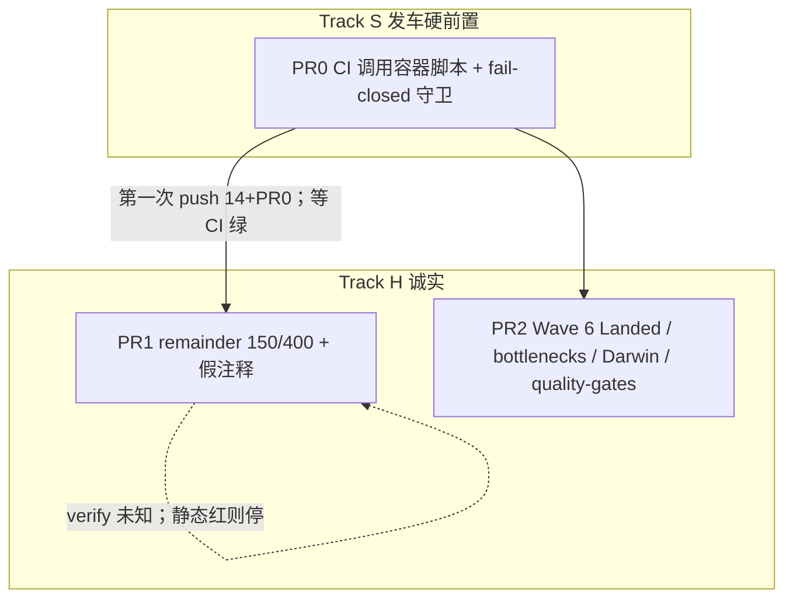
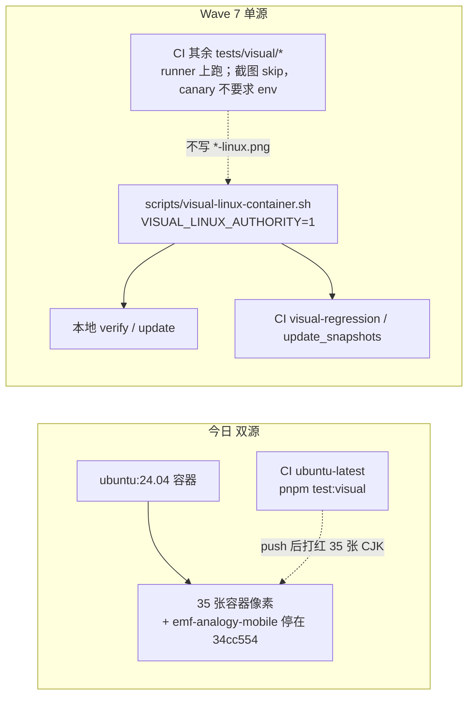
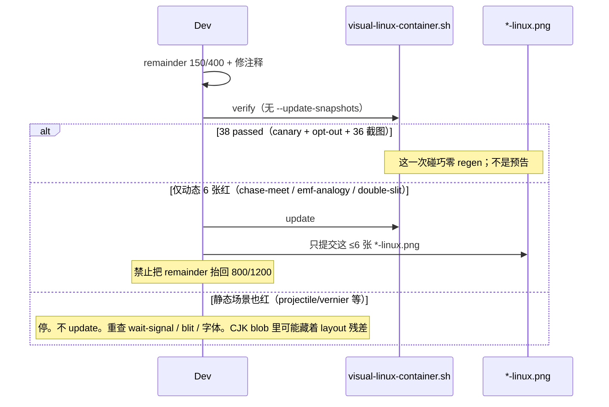

# Wave 7：发车加固（视觉单源 + remainder 诚实 + Darwin 政策）

| 字段           | 值                                                                                                         |
| -------------- | ---------------------------------------------------------------------------------------------------------- |
| 作者           | Kimi（与 Wave 6 同一作者口径；基于 HEAD `c3f84da` 实勘）                                                   |
| 日期           | 2026-09-09                                                                                                 |
| 状态           | Draft                                                                                                      |
| 基线提交       | `c3f84da4dc06cf20a82af252f17949d8d2f1caf2`（`main`，领先 origin 14 commits，**未 push**）                  |
| 产品           | Physics-2D-Demos 教学演示中心（18 场景 + 3 仪器），线上 <https://x.infinitas.fun>，push `origin/main` 即发 |
| 仓库内计划副本 | 落地时写入 `docs/plans/2026-09-09-wave7-ship-hardening-plan.md`（禁止把本机临时路径写进仓库文档）          |

本文是 **设计 + 可执行实施计划**。工程师或弱编码代理应按 PR 顺序落地，不必再做一遍审计。成功标准是：这 14 个未推送 commit **push 后 CI 不意外变红**、视觉 Linux 像素只有一个权威源、`visual-regression.spec.ts` 的 timeout-wait 总和回到 **< 20 s**、文档不再把 Wave 6 写成未完成、Darwin 基线有明确「本机做不到就不假装做了」的政策。**不为架构纯度优化。不重做 Waves 0–6。**

---

## Overview

Waves 0–6 已在本地 `main` 落地（工作区干净），**没有 push**。Wave 6 的 PR0–PR6 对应 `32fdeab`…`c3f84da` 共 10 个 commit，叠在 Waves 0–5 的 `d401ff0`…`91b343d` 之上，相对 `origin/main` 共 14 个 commit。`pnpm quality:core` 在 `7ea73f2` 绿（其后一笔是 PNG-only）；`PLAYWRIGHT_SKIP_BUILD=1 pnpm test:e2e` 97 passed；`scripts/visual-linux-container.sh` 在 `c3f84da` 之后 **37 passed**。宿主机 `pnpm test:visual` **不是权威**。Darwin 36 张仍是 2026-09-03 的 `9e2ec74` 像素，本 Linux 主机不能重生。

现场审计只剩三类会在 push 时咬人的问题，按「CI 会不会红 / 文档会不会把代理带进沟」排序：

1. **Linux 像素双源**：`9e2ec74` 把 **CI runner**（`ubuntu-latest` 裸跑）像素写成权威；`c3f84da` 又把 **ubuntu:24.04 容器**像素写成权威。两者对 CJK 字形差 ~1–3% 像素（约 0.01–0.02 的 pixel ratio）。35/36 `*-linux.png` 已是容器像素。`emf-analogy-mobile-linux.png` 最后一次重生在 `34cc554`（2026-08-26），blob 经 `9e2ec74` 与 `c3f84da` 都未改——当时它就已经同时匹配两套栈（动态阈值 3000 / 0.3）。**现在若只推这 14 个 commit，CI 仍在 runner 上跑 `pnpm test:visual`，会按 `9e2ec74` 同款光栅打红那 35 张。**
2. **remainder 谎言**：`7ea73f2` 把默认 150 ms / 动态 400 ms 抬到 800 / 1200，注释仍写「150 ms 不够 / 全场景 ~2% 像素差」。那次失败是 **对当时 CI-runner 基线** 的 ~2% CJK 差；`c3f84da` 在 800/1200 下拍了新容器基线。对旧 runner 像素「150 与 800 差同样大」**不能**推出 150 ms 截图 ≡ 现仓库 800 ms 截图。timeout-wait 总和 ≈ **31.2 s**，Wave 6 目标是 **< 20 s**。产品决定仍是回到 150/400；相对 `c3f84da` 是否零 regen **要容器 verify 才知道**。
3. **文档与 Darwin 政策缺口**：Wave 6 计划仍 `Status: Draft`（`docs/plans/README.md` 已标 ✅）；bottlenecks 页不提 remainder 残差和双源；`docs/quality-gates.md` 的更新流程仍是宿主机 `pnpm test:visual:update`（Linux 上会用**宿主机光栅覆盖 `*-linux.png`**，第三套 Linux 像素）。`{platform}` 是 `process.platform`，Linux 宿主 **不会**写出 `*-darwin.png`；Darwin 文件靠路径模板保护，不靠「别在 Linux 上跑 update」。本机无法重生 Darwin，也没有写成明确的「不挡 push」。

本波用 **3 个可独立合入的 PR** 关掉上述问题：先把 CI 的 Linux PNG 比对搬进**同一条容器 recipe**（这是 push 的硬前置），再收回 remainder 并修正注释，最后把 Wave 6 标为已落地、补 Darwin 政策、改掉宿主机更新脚枪。vanilla 首页、ganshe 主波 blit、vendor 预算 160→60、Vitest 4 全部排进 **Later waves**，不进本波 PR0。

---

## Background & Motivation

### 产品与栈（以代码为准，不重复 Wave 6 设计）

- 18 个 `src/scenes/<id>/`，3 个 `src/instruments/`。合并即上线。
- Vite 7 + TS 5.9 strict；首页生产构建经 `vite.config.ts:55-65` 完整 alias 到 Preact/compat，Vitest 仍走真 React（`process.env.VITEST` 清空 alias）。
- Runtime 依赖：`react` / `react-dom` / `preact`（后两者是 peer + 生产 alias）。
- 预算权威：`scripts/check-bundle-budget.ts`。实测 vendor **24589 B raw（24.01 kB）/ `gzip -9` 9599 B（9.37 kB）**（`dist/assets/vendor-CUoBorzI.js`）；门闩 `maxVendorJsKb` 仍 **160**。本波不棘轮。
- Playwright **1.58.2**（`pnpm-lock.yaml`），Chromium **145.0.7632.6**。`--update-snapshots` 默认 preset 是 `changed`：**写入后测试仍绿**，不能用 job 绿灯当「像素没变」。
- 72 张 PNG：`tests/visual/visual-regression.spec.ts-snapshots/*-{desktop,mobile}-{linux,darwin}.png`。`SNAPSHOT_OPT_OUT = []`。唯一 `toHaveScreenshot` 调用在 `tests/visual/visual-regression.spec.ts:46,60`。

### 质量门禁口径（本波必须分清，沿用 Wave 6）

| 名称                       | 实际命令                                                                                                    | 权威性                                            |
| -------------------------- | ----------------------------------------------------------------------------------------------------------- | ------------------------------------------------- |
| `pnpm quality:core`        | 结构 / scaffold / layouts / circular / audit / lint / format:check / typecheck / coverage / build / bundle  | 任何主机可跑；PR 合入最低集                       |
| `pnpm test:e2e`            | Playwright `tests/e2e/`                                                                                     | 行为契约；本波不改                                |
| 宿主机 `pnpm quality:full` | core + e2e + **宿主机** `test:visual`                                                                       | **Linux 宿主机 visual-regression 不是权威**       |
| **本波「权威 full」**      | `quality:core` + e2e + `scripts/visual-linux-container.sh`（Darwin 走 Mac / `update-darwin-snapshots.yml`） | Wave 关闭条件。**不是**开发机 `pnpm quality:full` |

### 上一波已落地（禁止重做）

相对 `91b343d` 的 10 个 Wave 6 commit：

| Commit    | 项                                                                                                      |
| --------- | ------------------------------------------------------------------------------------------------------- |
| `32fdeab` | chase-meet 页内布局切换 E2E                                                                             |
| `85a94eb` | `.layout-master[data-first-frame]`；helper 在 `tests/helpers/wait-first-frame.ts`                       |
| `78c358d` | 首页去 `mounted` 门闩；`src/app/data/featured-scenes.ts` 静态导入 6 个 meta                             |
| `c624925` | xt-graph / tortoise-hare 静态 blit                                                                      |
| `360f867` | 删除 `saveState` / `restoreState`（`rg` 在 src/tests 已为零）                                           |
| `c92c3af` | Preact/compat 生产 alias；Vitest 真 React                                                               |
| `85dccdb` | leftovers 页 + new-scene raw viewport                                                                   |
| `37d7c26` | `js-yaml` override；`pnpm-workspace.yaml` `ignoreGhsas: GHSA-82fw-gwwq-j7x9`                            |
| `7ea73f2` | remainder 150→800 / 400→1200（事后证明 **不是** 视觉失败原因）                                          |
| `c3f84da` | 容器重生 35/36 `*-linux.png`（Chromium 145 CJK）；未改 `emf-analogy-mobile-linux.png`（停在 `34cc554`） |

Waves 0–5（`d401ff0`…`91b343d`）也不重做。2026-08-26 的 Kimi 清单不是现行 TODO。不发明 `createCanvasViewBase`。不扩大 `LARGE_RENDER_LITERAL_EXEMPT`（仍 16 个，`tests/contract/scene-standard.spec.ts:54-71`）或 `SNAPSHOT_OPT_OUT`（空）。

### 痛点（量化，已复核）

| 痛点                        | 证据                                                                                                                                                                                                                                                                                                                                                                                                                   | 量级                                                                                                                                                                                                                                  |
| --------------------------- | ---------------------------------------------------------------------------------------------------------------------------------------------------------------------------------------------------------------------------------------------------------------------------------------------------------------------------------------------------------------------------------------------------------------------- | ------------------------------------------------------------------------------------------------------------------------------------------------------------------------------------------------------------------------------------- |
| 双源：容器 vs CI runner     | `9e2ec74` 提交说明：ubuntu:24.04 容器与 `ubuntu-latest` runner 差 **0.01–0.02 pixel ratio**，因此当时提交了 **CI-runner 像素**。`c3f84da` 又用 `scripts/visual-linux-container.sh update` 提交 **容器像素**（35 张）。`ci.yml:88-90` 仍是 runner 上 `PLAYWRIGHT_SKIP_BUILD=1 pnpm test:visual`。容器脚本头注释仍写「与 CI 同构」「CI-parity stack」（`scripts/visual-linux-container.sh:2,48`），与 `9e2ec74` 实测矛盾 | 35/36 Linux 测试会在 push 后按 CJK 字形边红；控制组 projectile、vernier-caliper 本波未改绘制，同样是 glyph-edge 红、canvas 几何灰                                                                                                     |
| remainder 不是 CJK 失败原因 | `7ea73f2` 说明：150 ms remainder 下容器 visual-regression 对**当时 CI-runner 基线** 35/36 ~2%，于是抬到 800/1200 且 **未**重生。`c3f84da` 才在 800/1200 下拍容器像素。审计里 wedge-mobile 4018 / xt-graph-desktop 13472 是对旧 runner 基线的差，**不在 git / 日志里**，不能当 150≡800 的证明                                                                                                                           | 对旧基线「150 与 800 一样红」只排除 remainder 是 CJK 因。相对 `c3f84da` 的 150 vs 800 **未知**（CJK blob 里可能藏着更小的 layout/读数残差）                                                                                           |
| timeout-wait 超标           | `visual-regression.spec.ts:44,58`：30 × 800 ms + 6 × 1200 ms（emf-analogy / double-slit / chase-meet × desktop/mobile）= **31.2 s**。helper 默认 `?? 800`（`wait-first-frame.ts:36`）。Wave 6 目标 < 20 s                                                                                                                                                                                                              | 超标 11.2 s；注释（`:34-35`）把 CJK 光栅误诊为「layout/读数尚未稳住」                                                                                                                                                                 |
| 新基线在 800/1200 下拍摄    | `c3f84da` 容器 update 时 remainder 已是 800/1200。仅 `double-slit` 设 `autoPlay: true`（`src/scenes/double-slit/page.ts:22`）；emf-analogy / chase-meet 的加长 remainder 是相位/布局，不是 autoplay。保守桶仍是这动态 6 张                                                                                                                                                                                             | 回 150/400 相对 `c3f84da` 是否零 diff **未知，以容器 verify 为准**。静态也红 → 停、不 update。只动态红 → 定向 ≤6 张 linux regen                                                                                                       |
| Darwin 未重生               | 36 张 `*-darwin.png` mtime **2026-09-03**（`9e2ec74`，当时 visual-regression 还是固定 2000 ms）。`snapshotPathTemplate` 的 `{platform}` = `process.platform`                                                                                                                                                                                                                                                           | CI job 是 `ubuntu-latest`，**从不比对 Darwin**。Linux 宿主 `test:visual:update` 覆盖的是 `*-linux.png`（第三套 Linux 光栅），**不会**写成 darwin 文件名。Darwin 陈旧 **不挡 push**；禁止 `cp`/`mv` 把 linux PNG 改名为 `*-darwin.png` |
| 宿主机更新脚枪              | `docs/quality-gates.md:62-66` 仍教 `pnpm test:visual` → `pnpm test:visual:update`。Linux 宿主机缺 `fonts-noto-cjk` ubuntu 栈                                                                                                                                                                                                                                                                                           | 一次错误 update 就会把 36 张 linux PNG 写成第三套光栅                                                                                                                                                                                 |
| 文档自相矛盾                | `docs/plans/2026-09-08-wave6-optimization-plan.md:7` `Status: Draft`；`docs/plans/README.md:11` 标 ✅ 已完成。bottlenecks 页不提 remainder、不提双源。AGENTS.md:265-267 仍写容器是「CI 同构」                                                                                                                                                                                                                          | 弱代理会按 Draft 重做 Wave 6，或在宿主机 update PNG                                                                                                                                                                                   |
| 未 push                     | `git status -sb`：`main...origin/main [ahead 14]`。CI 没见过这 14 个 commit（含 Preact alias、featured-scenes、容器 PNG）                                                                                                                                                                                                                                                                                              | 第一次 push 的 CI 是这些代码的唯一 GitHub 样本                                                                                                                                                                                        |

`featured-scenes.ts` 静态导入 6 个 meta；`saveState`/`restoreState`/`saveSceneState`/`restoreSceneState` 在 src/tests 零匹配。这两项本波只确认，不改。

---

## Goals & Non-Goals

### Goals

1. **Linux 像素单一权威源**：recipe = `scripts/visual-linux-container.sh`（`ubuntu:24.04` + `fonts-noto-cjk` + lockfile Playwright 1.58.2 Chromium 145）。CI 的 visual-regression 与 `update_snapshots` **必须调用这条脚本**，不再在 `ubuntu-latest` runner 上裸跑 PNG 比对。本地容器 verify 与 CI PNG 比对同栈。
2. **push 不意外红**：第一次推向 `origin/main` = 已有 14 个 commit **加上 PR0**。禁止「先推 14 个再改 CI」。**不要**把 PR1 remainder 实验绑进这次 push。
3. **remainder 诚实**：默认 **150 ms**，chase-meet + `isDynamic`（emf-analogy、double-slit）**400 ms**。保留 `7ea73f2` 的双 `requestAnimationFrame`。修正 `wait-first-frame.ts:34-35` 的假注释。timeout-wait 总和 **30×150 + 6×400 = 6.9 s < 20 s**。相对 `c3f84da` 是否零 regen **不是预告，是 PR1 容器 verify 的输出**。
4. **Linux 宿主机不再能用 `--update-snapshots` 覆盖 `*-linux.png`**：截图用例在未授权 linux 上 skip；**整文件不 skip**。容器内缺 env 必须 **失败**（canary + 脚本 fail-closed），不能「截图 skipped / exit 0」绿灯。Darwin（`process.platform === 'darwin'`）截图照跑。
5. **Darwin 政策写死**：本 Linux 主机不重生 Darwin；CI 不测 Darwin；不挡 push。合入后可选 `update-darwin-snapshots.yml`，不进本波硬路径。
6. **文档与 Wave 6 状态对齐**：计划标 Landed；bottlenecks 页补双源/remainder/后续波次；`quality-gates.md` 删除宿主机 update 流程；AGENTS.md / new-scene-agent-contract 去掉「CI 同构」假话。

### Non-Goals（沿用 + 本波明确）

- 重做 Waves 0–6 任何一项（含 wait-signal 机制、featured-scenes、blit、Preact alias、删 persist）。
- 把 2026-08-26 Kimi 清单当现行 TODO。
- 发明 `createCanvasViewBase`（已有 `src/scenes/view-base.ts` 的 `createCanvasViewport` + `createViewEnvironment`）。
- 扩大 `LARGE_RENDER_LITERAL_EXEMPT` 或 `SNAPSHOT_OPT_OUT`。
- vanilla 首页重写。
- ganshe 主波画布静态缓存（观察点 xt 图已缓存）。
- vendor 预算棘轮 160→60（Open Question 沿用 Wave 6 1A：本波不改）。
- Vitest 4（才能摘掉 `GHSA-82fw-gwwq-j7x9`）。
- 第 4 套布局、场景页 CSP、18-sim 刷新续播、contrast token、transport-bar DOM 合并。
- 把 16 个豁免渲染器一次性现代化。
- Git LFS 管快照。
- 为加速 CI 把容器 recipe 抽成 GHCR Dockerfile（墙钟痛再开后续波；本波接受脚本每次 apt ~5 min）。
- 用 `mcr.microsoft.com/playwright:v1.58.2-*` 换掉 `ubuntu:24.04`（会再换一套光栅，迫使 36 张 linux PNG 再 regen）。
- 在 Linux 主机上用 `cp`/`mv`/`pnpm test:visual:update` 制造 `*-darwin.png`（Playwright `{platform}` 本身不会这么做）。
- 下调覆盖率阈值或 `maxDiffPixels` / `threshold` 去吞 CJK 噪声。

---

## Key Decisions

1. **Linux 像素 SoT = 容器脚本；CI 迁就容器，而不是容器去模仿 `ubuntu-latest`。**
   `9e2ec74` 已经试过「容器宣称 CI-parity」——实测差 0.01–0.02 pixel ratio，于是把 runner 像素提交进仓库。Wave 6 末又用容器像素覆盖了 35 张。继续让两边各自为政，每次 regen 都要二选一。
   选 **B 的反方向**：单源是 `ubuntu:24.04` + `fonts-noto-cjk` + lockfile Chromium 145。CI 的 PNG 步骤调用 `scripts/visual-linux-container.sh`（verify / update），不在 runner 上 `pnpm test:visual` 里跑 `visual-regression.spec.ts`。不要试图把容器「钉成」会动的 `ubuntu-latest` runner 镜像（字体、fontconfig、预装包集合都不是 `ubuntu:24.04` 标签能钉住的）。

2. **拒绝用阈值吞 CJK 噪声（备选 D）。**
   控制组 projectile、vernier-caliper 本波未改 canvas 几何，diff 仍是 glyph-edge 红、几何灰。把 `maxDiffPixels` 800→几千或 `threshold` 0.2→0.3 会同时放掉真布局/blit 回归。`emf-analogy-mobile` 已经用 3000 / 0.3 处理动画，不能把这套动态阈值推广到静态场景。

3. **拒绝「只让 CI 生成 linux 基线」（备选 C）作为主路径。**
   Wave 6 关闭条件已经是本地容器。砍掉容器会让 Linux 开发机零预检，push 变成唯一视觉实验。C 只在 Docker 不可用时作为逃生口留在文档里，不是本波默认。

4. **拒绝「本地容器权威 + push 后 workflow_dispatch 换 runner 像素」（备选 A）作为稳态。**
   A 是今天文档已经在写的流程，也正是双源的来源：每次本地 `update` 之后必须再跑一次 CI 重生，否则下一轮容器 verify 又红。本波只把 A 留作 **PR0 回滚路径**（若 GHA 上 `docker run` 被拦），不是目标态。

5. **截图用例在未授权 linux 上 skip；canary 与脚本 fail-closed。禁止整文件 `test.skip`。**
   Playwright 1.58 整文件 skip → exit 0。`docker run -e VISUAL_LINUX_AUTHORITY=1` **不能**保证变量穿过 `su builder`（util-linux `su` 默认不 `--preserve-environment`）。漏 env 时若 canary 也被 skip，CI 假绿。
   实现：
   - **Canary 永不 skip**（`visual-regression.spec.ts` 里现有的 opt-out 清单测试旁边再加一条）：若 `existsSync('/.dockerenv')`（容器内），`expect(process.env.VISUAL_LINUX_AUTHORITY).toBe('1')`。缺 env = **失败**，不是 skip。
   - **截图用例**（`desktop ${id}` / `mobile ${id}` 循环）在 `platform === 'linux' && env !== '1'` 时 skip。宿主机与 GHA runner 上的 `pnpm test:visual` 因此不比对、不写入 `*-linux.png`。
   - **不要**写成「凡 linux 都 `expect(env).toBe('1')`」：那会把 runner 上保留的 `pnpm test:visual`（`ci-scripts.spec.ts:71`）和宿主机 `quality:full` 打红。fail-closed 的对象是 **容器 PNG 步骤**，不是 runner 非 PNG 套件。
   - 容器脚本：在 **每条** `su builder -s /bin/bash -c "…"` 的命令字符串里 `export VISUAL_LINUX_AUTHORITY=1`，不只依赖 `docker run -e`。`--shm-size=1g`。不传 `-e CI=true`（`playwright.shared.ts:16` `retries: process.env.CI ? 2 : 0`；SoT 与本地容器一致，retries = 0）。JSON：`--reporter=line --reporter=json` 且 `PLAYWRIGHT_JSON_OUTPUT_FILE` 指向临时文件（json reporter 无此变量会 `printsToStdio()`）。解析时 **递归** `suites[].suites` / `suites[].specs`，用 **`spec.title`** 匹配 `/^(desktop|mobile) /`（不要拼 `titlePath`）；这些 spec 若 `ok === false` 或任一 `tests[].results[].status === 'skipped'` → `exit 1`。canary 的 `spec.title` 必须存在且 `ok`。
   - `ci-scripts.spec.ts` 锁的是 `su builder` 命令串里的 `export VISUAL_LINUX_AUTHORITY=1` 与 `PLAYWRIGHT_JSON_OUTPUT_FILE` / 递归 `spec.title` 检查，**不是**源码里随便一个该字符串。另锁 `visual-regression.spec.ts`：canary 与 opt-out 在文件顶层；`test.skip` 只出现在包截图循环的 `test.describe` 内部。
     Darwin 截图不 skip。

6. **remainder 回到 150/400；保留双 rAF；相对 `c3f84da` 是否零 regen 未知。**
   产品决定不变：150/400 是 Wave 6 原目标，800/1200 是误诊，不把「新基线在 800/1200 拍的」当成留 800 的理由。
   对 **静态 30 张** 与 **动态 6 张**（emf-analogy / double-slit / chase-meet × 2 视口）：verify 之前都不得预告零 diff。动态 6 张更可能因相位/布局红（仅 double-slit `autoPlay: true`）。失败则只容器 regen 这 ≤6 张 linux PNG，**禁止**把 30 张静态拖回 800 ms。静态也红 → **停、不 update**，重查 wait-signal / blit / 字体。
   双 rAF（~2 帧，≈32 ms）便宜且诚实，留着。timeout-wait 口径仍只计 `waitForTimeout` 之和。

7. **Darwin 不挡 Linux push。路径模板已经按 `process.platform` 分文件。**
   `ci.yml` 只有 `ubuntu-latest` job，从不打开 Darwin 文件。陈旧的 2026-09-03 Darwin 基线（2000 ms 时代、blit 前）最多让 Mac 贡献者本地 visual 红。Linux 宿主 `--update-snapshots` 覆盖的是 `*-linux.png`。本机禁止用 `cp`/`mv` 制造 `*-darwin.png`（人工政策，不是 Playwright 行为）。本波只写政策 + 可选 `update-darwin-snapshots.yml`，不在 Linux 上跑 update。

8. **发车顺序：先 PR0 + 已有 14 个 commit，push，等 CI 容器 visual-regression 绿；再 PR1；再 PR2。**
   14 个 commit 已含容器 PNG。只推这 14 个 = CI 在 runner 上打红 35 张。PR0 是第一次 push 的硬前置。PR1 是 remainder 实验，**不得**绑进第一次 GitHub 样本——静态若红，回滚指令会砸在 14-commit 未验证栈上。本仓库 push `main` 即发：三次改动是三个可独立合入的 commit / PR；**第一次 push 只到 PR0**。PR2 可在 PR1 因静态红卡住时跟在 PR0 后面走（remainder 在 bottlenecks 里仍标开放）。

9. **Playwright `--update-snapshots` preset `changed`：job 绿 ≠ 像素没变。**
   `update_snapshots` 写入后测试通过。dispatch 之后必须把 artifact 与 HEAD 做二进制 diff，人工看完再提交。分诊表写明这一条。

10. **本波不棘轮 `maxVendorJsKb` 160，不摘 GHSA ignore。**
    vendor 已 24.01 kB raw / 9.37 kB gzip-9。棘轮和 Vitest 4 进 Later waves。

11. **Linux 像素 recipe 进 CODEOWNERS。**
    `.github/CODEOWNERS` 今日护 `tests/visual/`、`ci.yml`、若干 `scripts/check-*.ts`，**不护** `scripts/visual-linux-container.sh`。PR0 加上 `scripts/visual-linux-container.sh @tdcasual`。弱代理改 `ubuntu:24.04`、丢掉 `fonts-noto-cjk`、拆掉 env/`su` 导出，必须过 code owner。PNG 本身已在 `tests/visual/` 下，不必新规则。可选同时加上 `docs/quality-gates.md @tdcasual`（PR2 会改这份门禁说明）。

---

## Proposed Design

### 双轨道（本波短）



硬顺序：**第一次 push = 已有 14 个 commit + PR0**，然后等 CI 容器 visual-regression 绿。PR1 依赖这次绿灯（否则 remainder 实验与 SoT 切换缠在一起）。PR2 无代码依赖；默认在 PR1 之后以便 bottlenecks 能写 remainder 实测，若 PR1 卡住可跟在 PR0 后先合。合入顺序：`0 → push → CI 绿 → 1 → 2`。

### 今日双源 vs 目标单源



### Track S — PR0 关闭双源

**CI 改动**（`.github/workflows/ci.yml`，已有 CODEOWNERS `@tdcasual`）：

1. **保留** runner 上的 `PLAYWRIGHT_SKIP_BUILD=1 pnpm test:visual`（`tests/unit/ci-scripts.spec.ts:71` 锁了这行字符串）。截图用例在 runner 上 skip；**canary 在 runner 上不要求 env**（无 `/.dockerenv`），所以这一步仍绿。其余 visual 套件（layout-matrix、homepage、cross-browser、performance-audit、a11y、resizer、readout…）继续用 runner 的 `dist/`。
2. **新增一步**，`if: ${{ !inputs.update_snapshots }}`：`./scripts/visual-linux-container.sh`（verify）。GHA `ubuntu-latest` 是带 Docker 的 **VM**，脚本是宿主机上的 `docker run --rm`，**不是** job 级 `container:`（那种才会变成 DinD / 没有 docker.sock）。
3. **`update_snapshots` 分支**：把 `ci.yml:92-94` 的 runner `playwright test … --update-snapshots` 换成 `./scripts/visual-linux-container.sh update`。artifact 路径不变：`tests/visual/visual-regression.spec.ts-snapshots/*-linux.png`。
4. 不要删 runner 的 `playwright install --with-deps chromium firefox webkit` 或 `fonts-noto-cjk`——e2e 与非 PNG visual 仍要。

**CODEOWNERS**（`.github/CODEOWNERS`）：新增一行 `scripts/visual-linux-container.sh @tdcasual`。建议同时加 `docs/quality-gates.md @tdcasual`。不要给 PNG 再写一条——`tests/visual/` 已覆盖。

**容器脚本**（`scripts/visual-linux-container.sh`）：

- `docker run` 增加 `--shm-size=1g`（Chromium-in-Docker 防 SIGBUS；本地 37 passed 不能证明 GHA 不会炸）。
- **不**传 `-e CI=true`：权威栈 retries = 0，与今日本地容器一致。
- `-e VISUAL_LINUX_AUTHORITY=1` 可以留着，但 **不够**。每条 `su builder -s /bin/bash -c "…"` 的命令字符串必须以 `export VISUAL_LINUX_AUTHORITY=1;` 开头（pnpm install 那条可省略，playwright test / install chromium 那两条必须有）。
- 头注释改成：本脚本 **就是** Linux 像素权威；CI 调用它；**不再**写「与 CI 同构 / CI-parity」。对照对象是脚本自己，不是 `ubuntu-latest` 裸 runner。
- verify / update 行为保持：repo `:ro` 挂进容器，快照目录可写；内部 `pnpm install --frozen-lockfile` + `playwright install chromium`；**不**设 `PLAYWRIGHT_SKIP_BUILD`，webServer 走 `pnpm build && pnpm preview`（`tests/playwright.shared.ts:9-12`）。这与本地权威校验已经一致，不要改成复用 runner 的 `dist/`。
- verify / update 的 playwright 调用：`--reporter=line --reporter=json`，并 **先** `export PLAYWRIGHT_JSON_OUTPUT_FILE=/tmp/visual-regression.json`。Playwright 1.58 的 json reporter 无此变量（也无 `outputFile`）时 `printsToStdio()`，会跟 line 抢 stdout。有变量则 JSON 进文件、line 留终端。解析必须递归：

```bash
# 容器内，playwright 退出后（即使 exit 0 也要跑）
export VISUAL_LINUX_AUTHORITY=1
export PLAYWRIGHT_JSON_OUTPUT_FILE=/tmp/visual-regression.json
pnpm exec playwright test tests/visual/visual-regression.spec.ts --reporter=line --reporter=json
node -e '
const fs = require("fs");
const data = JSON.parse(fs.readFileSync(process.env.PLAYWRIGHT_JSON_OUTPUT_FILE, "utf8"));
const specs = [];
(function walk(s) {
  for (const spec of s.specs || []) specs.push(spec);
  for (const ch of s.suites || []) walk(ch);
})({ suites: data.suites || [] });
const shots = specs.filter((s) => /^(desktop|mobile) /.test(s.title));
const canary = specs.find((s) => s.title.includes("linux PNG authority"));
if (!canary || canary.ok !== true) { console.error("canary missing or not ok"); process.exit(1); }
if (shots.length < 36) { console.error("expected >=36 screenshot specs, got", shots.length); process.exit(1); }
const skipped = shots.filter((s) =>
  (s.tests || []).some((t) => (t.results || []).some((r) => r.status === "skipped"))
);
if (skipped.length) {
  console.error("screenshot specs skipped:", skipped.map((s) => s.title).join(", "));
  process.exit(1);
}
'
```

匹配的是 **`spec.title`**（`'desktop chase-meet'`），不是 describe 拼出来的 `titlePath`。canary / opt-out 的 title 不以 `desktop `/`mobile ` 开头，不会被当成截图。update 模式同样注入 env + JSON 检查（否则 skip 后写出 0 张还说成功）。

- 镜像继续 `ubuntu:24.04`，**不要**换成 Playwright 官方 `mcr.microsoft.com/playwright:v1.58.2-*`（光栅会变，36 张要重拍）。本波不 pin digest（浮动 tag + 未钉的 `fonts-noto-cjk` 见 R13）。

**spec 守卫**（`tests/visual/visual-regression.spec.ts`）。Playwright 1.58 文件顶 `test.skip(callback)` 会推进 `currentlyLoadingFileSuite()._modifiers`，worker 把**每个祖先 suite 的 modifier 套到每个 test**——声明顺序救不了 canary。下面这段是代理应复制的结构；**不要**把 `test.skip` 写回文件顶。

```ts
import { existsSync } from 'node:fs';

test('linux PNG authority env is fail-closed in the container', () => {
  if (process.platform !== 'linux') return;
  if (existsSync('/.dockerenv')) {
    expect(process.env.VISUAL_LINUX_AUTHORITY).toBe('1');
  }
});

test('snapshot opt-out list only references discovered scenes', () => {
  const unknown = SNAPSHOT_OPT_OUT.filter((id) => !sceneIds.includes(id));
  expect(unknown, 'snapshot opt-out list contains unknown scene ids').toEqual(
    []
  );
});

function linuxScreenshotsAuthorized(): boolean {
  return process.env.VISUAL_LINUX_AUTHORITY === '1';
}

test.describe('scene screenshots', () => {
  test.skip(
    () => process.platform === 'linux' && !linuxScreenshotsAuthorized(),
    'Linux PNG SoT is scripts/visual-linux-container.sh (CI invokes the same script)'
  );

  for (const scene of SCENES) {
    const isDynamic = scene.id === 'emf-analogy' || scene.id === 'double-slit';
    test(`desktop ${scene.id}`, async ({ page }) => {
      /* 现有 goto + waitForFirstFrame + toHaveScreenshot，不变 */
    });
    test(`mobile ${scene.id}`, async ({ page }) => {
      /* 同上 */
    });
  }
});
```

约束（写进 `ci-scripts.spec.ts`，读 `visual-regression.spec.ts` 源码）：

- canary 标题 `'linux PNG authority env is fail-closed in the container'` 与 opt-out 标题出现在任何 `test.describe(` **之前**（文件作用域）。
- `test.skip(` 的第一次出现必须在 `test.describe('scene screenshots'` 之后。
- 截图 `for (` 循环必须在该 describe 内。

文件头注释同步：`*-linux.png` 由该脚本维护；CI 不再是第二权威。禁止把 skip 写成 `SNAPSHOT_OPT_OUT` 条目。

**契约测试**（`tests/unit/ci-scripts.spec.ts`）：

- 继续断言 `ci.yml` 含 `PLAYWRIGHT_SKIP_BUILD=1 pnpm test:visual`。
- **新增**：`ci.yml` 含 `visual-linux-container.sh`（verify 与 update 两条路径都要出现）。
- **新增**：脚本源码在 `su builder` 的 playwright 调用字符串里含 `export VISUAL_LINUX_AUTHORITY=1`（断言匹配 `su builder[\\s\\S]*export VISUAL_LINUX_AUTHORITY=1`，单凭文件某处出现该字符串不够）。
- **新增**：脚本含 `PLAYWRIGHT_JSON_OUTPUT_FILE`、递归 walk `suites`/`specs`、对 `spec.title` `/^(desktop|mobile) /` 的 skipped → `exit 1`、以及 canary `ok`。
- **新增**：`.github/CODEOWNERS` 含 `scripts/visual-linux-container.sh`。
- **新增**：`visual-regression.spec.ts` 源码：canary / opt-out 在第一个 `test.describe` 之前；`test.skip(` 在 `test.describe('scene screenshots'` 之后。
- 不要把 `quality:full` 改成跳过 visual——未授权 linux 上截图 skip 已让宿主机 PNG 不再假红。

**AGENTS.md 视觉规则**（265-274 行）改三句话：

- Linux 权威 = 容器脚本；CI **调用同一脚本**，不是「或 CI runner 或容器」。
- 禁止在 Linux 宿主机 `--update-snapshots`（会覆盖 `*-linux.png`，不会写 darwin 文件名）。
- 仍要求 `fonts-noto-cjk` + `Noto Sans CJK SC`（`src/styles/design-tokens.css:47-52`）。

**分诊表**（`.github/ci-failure-triage.md` Visual tests 行）：PNG 红 → 先 `scripts/visual-linux-container.sh` 复现；禁止宿主机 update；dispatch `update_snapshots` 现在也走容器，artifact 绿不代表无 diff，必须与 HEAD 比 PNG。

**墙钟**：脚本每次 apt + pnpm + chromium ≈ 5 min（注释已写）。CI 会在已有 e2e 之后再付一次。本波接受。Dockerfile/GHCR 缓存是后续波，不进 PR0。

**回滚**：若 GHA 禁止 `docker run`（罕见），回退到备选 A：runner 继续裸跑 PNG，push 后立刻 `workflow_dispatch update_snapshots` 换成 runner 像素，并 **revert PR0 的 SoT 声明**。不要一边 runner 裸跑一边文档写容器是唯一权威。

### Track H1 — PR1 remainder 收回

**改动（测试 only）**：

| 文件                                               | 今日                                     | 目标                                                                                                                                                                 |
| -------------------------------------------------- | ---------------------------------------- | -------------------------------------------------------------------------------------------------------------------------------------------------------------------- |
| `tests/helpers/wait-first-frame.ts:34-36`          | 注释「150ms 不够 / ~2%」；`?? 800`       | 注释改为：`7ea73f2` 的 ~2% 是对当时 CI-runner 基线的 CJK 差，不是 settle 时间；150 ms 覆盖 fonts.ready + 双 rAF 之后的布局 settle。`?? 150`（回到 `85a94eb` 原默认） |
| `tests/visual/visual-regression.spec.ts:44,58`     | `isDynamic \|\| chase-meet ? 1200 : 800` | `? 400 : 150`                                                                                                                                                        |
| `tests/visual/cross-browser-firefox.spec.ts:21-27` | 1200 / 800                               | 400 / 150（非 PNG；与 helper 默认对齐）                                                                                                                              |
| `tests/visual/cross-browser-webkit.spec.ts:21-27`  | 同上                                     | 同上                                                                                                                                                                 |

保留 `wait-first-frame.ts:28-33` 双 rAF。保留 `document.fonts.ready`。不改 `maxDiffPixels` / `threshold`（动态 3000/0.3，静态 800/0.2）。不改生产 `scene-adapter.ts` 的 `_markFirstFrame`。

helper 无 `remainderMs` 的调用方：`resizer-controls-verify.spec.ts`（4 次）、`readout-panel-regression.spec.ts`（beforeEach 等）会从 800 → 150。这些 **不是** PNG 测试，跑在 **runner** 的 `pnpm test:visual` 上（firefox/webkit 交叉浏览器同样）。容器脚本只装 chromium、只跑 visual-regression。PR1 的 CI 信号因此是两截：容器 verify = PNG；runner `pnpm test:visual` = helper 副作用。不把 helper 默认留在 800——`85a94eb` 原本就是 `?? 150`。

**timeout-wait 算术**（仅 `visual-regression.spec.ts` 的 `waitForTimeout`，与 Wave 6 口径相同）：

- 今日：30 × 800 + 6 × 1200 = **31 200 ms**
- 目标：30 × 150 + 6 × 400 = **6 900 ms**
- 对照 Wave 6 目标 **< 20 000 ms**；对照更早的 36 × 2000 = 72 000 ms

**验证协议（必须按这个顺序，禁止「红了就 update 全套」）**：



可选预检（不提交）：在仍为 800/1200 的 HEAD 上，临时把 remainder 改成 150/400，容器跑一次截图落到临时目录，与 `c3f84da` PNG 做 pixelmatch，把计数写进 PR1 描述。这样 150 vs 800 的差是 artifact，不是口口相传的 4018/13472。无论预检结果如何，产品决定仍是回到 150/400。

「新基线在 800/1200 下拍的」**不是**留 800 的理由。仅 `double-slit` autoPlay；动态 6 张仍是保守桶。静态红说明 CJK 诊断没有覆盖全部残差，协议的「停」比「期望 none」承担更多。

**禁止**：PR1 里顺手改 `maxDiffPixels`、把 chase-meet 踢进 `SNAPSHOT_OPT_OUT`、或再 bump remainder。

### Track H2 — PR2 文档 + Darwin 政策

**Wave 6 计划**：`docs/plans/2026-09-08-wave6-optimization-plan.md` 状态 Draft → **Landed**（基线改为 `c3f84da`，加一行「remainder 150/400 的目标由 Wave 7 PR1 收口」）。不要改写 PR0–PR6 正文。

**bottlenecks 页** `docs/plans/2026-09-08-wave6-current-bottlenecks.md` 重写「仍开放」表，使其只含后续波次，并 **新开一节「视觉权威（Wave 7）」**：

- Linux SoT = 容器脚本；CI 调用它。
- 历史：`9e2ec74` runner 像素 vs `c3f84da` 容器像素，差在 CJK 字形 ~1–3%。
- remainder：150/400；800/1200 是误诊。
- Darwin：Mac 或 `update-darwin-snapshots.yml`；Linux 主机不写 `*-darwin.png`；CI 不测 Darwin。
- 宿主机 `pnpm test:visual` 在 Linux 上 skip **截图用例**（PR0 守卫）；canary 仅在 `/.dockerenv` 内要求 env。

**本波计划入库**：`docs/plans/2026-09-09-wave7-ship-hardening-plan.md`（本文副本）。`docs/plans/README.md` 加一行，状态 📌 现行；Wave 6 计划保持 ✅。

**`docs/quality-gates.md`**：

- 「合并或发布前 `pnpm quality:full`」改为：Linux 合并门闩 = `quality:core` + e2e + `scripts/visual-linux-container.sh`；Darwin 另走 Mac/workflow。宿主机 `quality:full` 在 Linux 上 skip 截图用例，不比对 PNG。
- 删除 62-66 行的宿主机 `pnpm test:visual:update` 流程，换成容器 update / Darwin workflow。点名 `--update-snapshots` preset `changed`：绿灯后仍要 diff PNG。

**`docs/new-scene-agent-contract.md:53-54`**：去掉「CI 同构容器」。Linux = 脚本；CI dispatch 也跑脚本。

**`playwright.config.ts:9-11`**：注释改为 linux 基线由容器脚本（CI 调用），不是「CI 或等价容器」这种把两者写成可互换权威的句子。

**Darwin 政策（只写文档，不碰 PNG）**：

- 36 张 `*-darwin.png` 停在 2026-09-03 / `9e2ec74`（固定 2000 ms 等待、xt-graph/tortoise-hare blit 之前）。
- Wave 6 blit 若 1:1，Darwin 几何应仍可过；若有 1 px AA，那是 Mac 侧残差，**本波不修**。
- 合入后可选：`workflow_dispatch` `update-darwin-snapshots.yml`（`macos-latest`，PingFang SC，见 `update-darwin-snapshots.yml:33-34`），一次 rebase 到 wait-signal + blit + 150/400。这是 follow-up，不进 PR0–PR2 的验证矩阵。
- 绝对禁止在本 Linux 主机执行 `pnpm test:visual:update`（覆盖 `*-linux.png`）。禁止把 linux PNG `cp`/`mv` 成 `*-darwin.png`。

**PR2 必改的脚枪入口**（不是可选）：

| 文件                                     | 今日问题                                                                      |
| ---------------------------------------- | ----------------------------------------------------------------------------- |
| `README.md:53`                           | 表行「更新视觉快照基线」无平台分流                                            |
| `docs/scene-modernization-guide.md:207`  | 教 `pnpm test:visual` / `test:visual:update`                                  |
| `scripts/verify-scene.ts:130`            | 「Linux 用容器 update，Mac 用 `pnpm test:visual:update`」——代理合同指向的脚本 |
| `scripts/new-scene.ts:425-427`           | Linux 容器「或 CI 重生成」；须去掉把 CI runner 写成可互换权威的口吻           |
| `docs/new-scene-agent-contract.md:53-54` | 「CI 同构容器」                                                               |
| `docs/quality-gates.md:62-66`            | 宿主机三行 update                                                             |

验证（**只扫 PR2 实际改的现行入口**，不要 `rg docs/` 整树——会打到冻结的 `docs/plans/2026-08-20-agent-safe-scene-quality-gates.md:326`「CI 同构」和 Wave 6 正文 `:290` 的 Darwin `test:visual:update`）：

```bash
rg 'CI 同构|test:visual:update' \
  README.md AGENTS.md \
  docs/quality-gates.md \
  docs/new-scene-agent-contract.md \
  docs/scene-modernization-guide.md \
  docs/plans/README.md \
  docs/plans/2026-09-08-wave6-current-bottlenecks.md \
  docs/plans/2026-09-09-wave7-ship-hardening-plan.md \
  scripts/verify-scene.ts \
  scripts/new-scene.ts
```

允许：上述文件里 Darwin 语境的 `pnpm test:visual:update`（Mac / `update-darwin-snapshots.yml`）。不允许：`CI 同构`、无平台分流的宿主 `test:visual:update`。不扫 `docs/plans/2026-09-08-wave6-optimization-plan.md` 正文（只改状态 Landed，不改写 PR0–PR6）。历史 `docs/plans/2026-08-*` 不改、不扫。

不改 `LARGE_RENDER_LITERAL_EXEMPT`。不改场景生产代码。

### 后续波次（明确排序，不进本波 PR0）

| 波次    | 主题                              | 为何现在不做                                                                        | 依赖                                                                      |
| ------- | --------------------------------- | ----------------------------------------------------------------------------------- | ------------------------------------------------------------------------- |
| Wave 8  | vanilla 首页（去掉 React/Preact） | FCP 已修，gzip 已到 9.37 kB；重写 App/ExperimentsSection/测试链是新产品             | Wave 7 已发车                                                             |
| Wave 9  | ganshe 主波画布静态 blit          | 观察点 xt 图已缓存（`ganshe/xt-graph-renderer.ts`）；主波是像素 PR，需容器 SoT 先稳 | Wave 7 PR0                                                                |
| Wave 10 | `maxVendorJsKb` 160→60            | Wave 6 OQ 1A 已决本波不动；vanilla 之后 vendor chunk 可能从首页消失，棘轮口径会变   | 建议 Wave 8 之后；若 vanilla 延期，可按实测 24 kB 单独棘轮，仍不是 Wave 7 |
| Wave 11 | Vitest 4                          | `GHSA-82fw-gwwq-j7x9` 要求 ≥4.1.11；3.x 无补丁。与视觉无关                          | 独立                                                                      |

Wave 8–11 共同 Non-Goals（除非产品点名）：第 4 布局、场景页 CSP、18-sim restore、contrast tokens、transport-bar DOM 合并、`createCanvasViewBase`、扩大豁免清单。

---

## API / Interface Changes

无公开 TypeScript API 变化。运行时：

| 项                                 | 变化                                                                                                     |
| ---------------------------------- | -------------------------------------------------------------------------------------------------------- |
| `VISUAL_LINUX_AUTHORITY`           | 新环境变量。容器内 `su builder` 命令串 `export`。linux 截图用例无此变量则 skip；容器内 canary 缺它则失败 |
| `SceneAdapter` first-frame         | **不改**（已写在 `.layout-master`，reattach 先清后写，`scene-adapter.ts:90-111,337,426`）                |
| `waitForFirstFrame` 默认 remainder | 800 → 150；调用方可覆盖                                                                                  |
| CI visual-regression               | 从 runner `pnpm test:visual` 内嵌，改为独立一步调用容器脚本                                              |

### 无数据模型迁移

主题 schema、布局 localStorage 键、场景 URL 参数均不动。

---

## Data Model Changes

无。72 张 PNG 仍按 `{arg}-{platform}`（`playwright.config.ts:12-13`）。PR1 **可能**替换 0–36 张 `*-linux.png`（期望偏动态 ≤6；静态红则零提交、停）。不改命名、不合并平台。`{platform}` 在 Linux 上只产生 `*-linux.png`。

---

## Alternatives Considered

### 视觉双源

**A. 本地容器权威；push 后 `workflow_dispatch update_snapshots` 用 runner 像素覆盖。**

- 优点：零 CI yaml 改动；`c3f84da` 可先推，红了再 dispatch。
- 缺点：这就是 `9e2ec74`→`c3f84da` 循环。下一次本地 update 又与 CI 分叉。Playwright `changed` preset 让 dispatch job 总是绿。弱代理会提交 runner 像素而不跑容器 verify。
- **不选作稳态。** 仅作 PR0 若 GHA VM 上 `docker run` 被拦时的逃生口。

**B. 钉容器去「像 CI」：pin ubuntu 镜像 / Playwright 浏览器 / 字体包，一次 regen 两边通用。**

- 按字面做：容器已经是 `ubuntu:24.04` + `fonts-noto-cjk` + lockfile Chromium 145，CI runner 也装同一套字体和同一份 Playwright。`9e2ec74` 证明这 **不够**：差的是 runner 镜像 vs 最小 docker 的 fontconfig / 光栅环境，不是包名没钉住。
- **本波采用的 B 变体**：不钉容器去追会动的 `ubuntu-latest`，而是 **让 CI PNG 步骤进入容器**。一边动、一边不动，差分为零。
- 不采用官方 `mcr.microsoft.com/playwright:v1.58.2-noble`：那是第三套栈，36 张要再拍。

**C. 停用容器；只让 CI 生成 linux 基线。**

- 优点：真正的单源（GitHub runner）。
- 缺点：Linux 开发机没有预检；Wave 6 关闭条件作废；每次 PNG 改动都要 round-trip artifact。Darwin 已经是这种模式（因为本机不是 Mac），Linux 没有理由再丢本地权威。
- **不选。**

**D. 提高 `maxDiffPixels` / `threshold` 吞掉 CJK 噪声。**

- 35 张、约 1–3% 像素、几乎全是 UI 字形边。审计口头数量级（wedge-mobile ~4k / 移动视口 ~1%；xt-graph-desktop ~13k / 桌面视口 ~1%）是对 **旧 runner 基线** 的 CJK 差，不是 150 vs 800 的两两差。看起来「只差一点点」。
- 控制组证明 canvas 几何是灰的、红的是 glyph。阈值无法区分「字体 hinting」和「blit 把网格挪了 1 px」。动态场景已经用 3000/0.3，再抬静态阈值等于拆掉视觉门闩。
- **拒绝。**

### remainder

**保持 800/1200。** 放弃 Wave 6 <20 s 目标，留下假注释。不选。

**折中 200/400。** 没有数据支持 200 比 150 更稳；双 rAF 已覆盖一帧绘制。不选。默认 150/400，动态失败再拍动态。

**回 150 之前先把 36 张在 150 ms 下重拍并提交。** 可能整批都是噪音，也可能静态也红。先 verify，红了再按协议定向 regen / 停。不预提交 36 张。

---

## Security & Privacy Considerations

- 容器脚本继续 `docker run --rm`，repo `:ro`，不把宿主机 `node_modules` 打进镜像。CI 调用同一脚本，不新增密钥、不改 CSP。
- `VISUAL_LINUX_AUTHORITY` 不是秘密，只是「我在权威栈里」的标记。不要在文档里鼓励 Linux 宿主机 export 它来绕过 skip——那会重新打开脚枪。
- `ignoreGhsas: GHSA-82fw-gwwq-j7x9` 保持（Vitest 3 mocker 路径穿越，不进生产 bundle）。本波不升级 Vitest。
- 无用户数据、无遥测变化。

---

## Observability

- 容器 verify 失败 = Linux PNG 回归。漏 env 的分诊：canary 红（`/.dockerenv` 内 `expect(env).toBe('1')` 失败）或脚本读 `PLAYWRIGHT_JSON_OUTPUT_FILE`、按 `spec.title` `/^(desktop|mobile) /` 发现 skipped → `exit 1`。禁止再出现「截图 skipped / 0 failed / exit 0」。
- `update_snapshots` job 绿：必须下载 `visual-baselines-linux` artifact，与 HEAD 做 PNG diff。preset `changed` 不会让 job 变红。
- PR1 容器 verify 的失败列表直接决定要不要定向 regen（静态 vs 动态）。
- 无生产 APM。`PerformanceMonitor` 不动。

---

## Rollout Plan

合并即上线。本地已有 14 个未推送 commit。三次改动是三个可独立审的 commit（若走 GitHub PR 就是三个 PR）；**不要**一次把 PR1 也推进第一次 `origin/main`。

| 步骤 | 动作                                                                                                                                              | 回滚                                                          |
| ---- | ------------------------------------------------------------------------------------------------------------------------------------------------- | ------------------------------------------------------------- |
| 0    | 在 `c3f84da` 上落 PR0。**第一次 push `origin/main` = 14 + PR0**。等 CI 容器 visual-regression 绿（canary passed，36 张截图 passed，不是 skipped） | revert PR0；CI 回到 runner 裸跑（然后必须走逃生口 A）         |
| 1    | CI 绿之后：PR1 remainder；容器 verify（未知是否零 diff）；静态红则停；仅动态红则定向 update。再 push                                              | revert helper；PNG 若已改则 **代码 + 那几张 PNG 一起 revert** |
| 2    | PR2 文档。默认在 PR1 之后；若 PR1 卡住可紧跟步骤 0                                                                                                | revert docs                                                   |
| 3    | 可选：Mac/`update-darwin-snapshots.yml` rebase Darwin。不挡课堂、不挡步骤 0                                                                       | 不提交就当没发生                                              |

PR0 零像素。PR1 像素影响 **未知**（verify 输出）。PR2 零像素。

---

## Risk Table

| ID  | 风险                                                                                   | 严重度 | 缓解                                                                                                                  |
| --- | -------------------------------------------------------------------------------------- | ------ | --------------------------------------------------------------------------------------------------------------------- |
| R1  | 只推 14 个 commit、PR0 未合入 → CI 35/36 CJK 红                                        | **高** | PR0 与 `c3f84da` 同一次 push；本文 Goals 第 2 条                                                                      |
| R2  | GHA VM 上 `docker run` 失败（权限 / 无 docker）                                        | 中     | `ubuntu-latest` 默认有 docker。失败则逃生口 A，并 revert SoT 声明。不要改成 job `container:`（那才是 DinD）           |
| R3  | 容器漏设 `VISUAL_LINUX_AUTHORITY`（`docker run -e` 被 `su` 丢掉）→ 截图 skip、job 假绿 | **高** | `su -c` 内 `export`；`/.dockerenv` canary 失败而非 skip；JSON skipped → 脚本 `exit 1`；契约锁的是 `su builder` 调用串 |
| R4  | 宿主机 export 该变量后 `--update-snapshots` 写入错误 **linux** 光栅                    | 中     | 文档禁止；不在 `.env` 示例里出现该变量；canary 不给宿主开绿灯写 PNG 的额外保护是「截图仍会跑、像素会红」——不要靠它    |
| R5  | PR1 静态场景也红（CJK blob 里藏 layout 残差）                                          | 中     | 协议：停、不 update、不抬阈值。第一次 push 已不含 PR1，回滚面小                                                       |
| R6  | PR1 动态 6 张红被误当成要全量 36 regen                                                 | 中     | 协议写死：静态红则停；只动态红才 ≤6；PR 描述列出文件名                                                                |
| R7  | Linux 宿主 `test:visual:update` 用错误光栅覆盖 `*-linux.png`                           | **高** | 未授权 linux 截图 skip（写不进）；文档禁止宿主 update。路径模板不会把文件写成 `*-darwin.png`                          |
| R8  | Darwin 陈旧导致 Mac 贡献者 visual 红                                                   | 低     | 政策：不挡 push；可选 workflow。CI 不测 Darwin                                                                        |
| R9  | 代理按 Wave 6 Draft 重做 PR0–PR6                                                       | 低     | PR2 标 Landed；README 已是 ✅                                                                                         |
| R10 | 容器步骤 +5 min 让 CI 超时                                                             | 低     | 默认 job 无短 timeout；痛了再开 Dockerfile 波次                                                                       |
| R11 | `ci-scripts.spec.ts` 未改导致 PR0 quality:core 红                                      | 低     | PR0 必改该文件                                                                                                        |
| R12 | 把 maxDiffPixels 当「关闭双源」的快捷方式                                              | 中     | Non-Goals + 备选 D 拒绝；CODEOWNERS 护 `tests/visual/`                                                                |
| R13 | 浮动 `ubuntu:24.04` + 未钉 `apt-get install fonts-noto-cjk` 无代码变更就漂光栅         | 低     | 本波接受（拒绝 mcr 镜像以免 36 regen）。若漂：容器 `update_snapshots` 重生 linux PNG。不 pin digest                   |
| R14 | 容器不传 `CI=true` → retries 0；GHA 负载偶发 flake。缺 `--shm-size` → Chromium SIGBUS  | 中     | retries 0 是 SoT 与本地容器的校验一致性，不靠重试藏 flake。PR0 `docker run --shm-size=1g`                             |

---

## Verification Matrix

| PR  | 命令                                                                                                                                                                                                                                                                                                                                                                | 视觉基线                                                                                                 |
| --- | ------------------------------------------------------------------------------------------------------------------------------------------------------------------------------------------------------------------------------------------------------------------------------------------------------------------------------------------------------------------- | -------------------------------------------------------------------------------------------------------- | ---- |
| 0   | `pnpm quality:core`（含 `ci-scripts.spec.ts`：`su builder` 导出、JSON fail-closed、CODEOWNERS 行、ci.yml 调脚本）；`scripts/visual-linux-container.sh` **38 passed**（canary + opt-out 清单 + 36 截图；像素与 `c3f84da` 相同）。人为 unset 脚本内 export 时：canary 失败或脚本因 skipped 非零退出。宿主机跑 visual-regression：canary 过（无 dockerenv）、截图 skip | **none**。禁止 `--update-snapshots`                                                                      |
| 1   | `pnpm quality:core`；容器 verify（**未知**是否零 diff）；timeout-wait 源码重算 = 6900 ms；**runner** `PLAYWRIGHT_SKIP_BUILD=1 pnpm test:visual`（截图 skip + resizer/readout/cross-browser 吃到 150 ms 默认）                                                                                                                                                       | **unknown until verify**。静态红 → 停、不 update。仅动态红 → 容器 `update` 只提交那些 `*-linux.png`      |
| 2   | `pnpm quality:core`；对 PR2 文件列表跑 `rg 'CI 同构                                                                                                                                                                                                                                                                                                                 | test:visual:update'`（见 Track H2 命令，**不要** `docs/`整树）；只允许 Darwin 语境的`test:visual:update` | none |

**Wave 关闭**：`quality:core` + `PLAYWRIGHT_SKIP_BUILD=1 pnpm test:e2e` + `scripts/visual-linux-container.sh`。Darwin 不在关闭条件里（本机做不到）。**宿主机 `pnpm quality:full` 的 visual 不是权威**——PR0 之后它在 Linux 上甚至不会比对 PNG。

---

## What "Done" Looks Like（可测）

| 指标                                 | 今日（HEAD `c3f84da`）                                                           | Wave 7 完成                                                                           |
| ------------------------------------ | -------------------------------------------------------------------------------- | ------------------------------------------------------------------------------------- |
| Linux PNG 权威                       | 文档写「容器 **或** CI runner」；`ci.yml:90` runner 裸跑；`c3f84da` 提交容器像素 | **唯一** recipe = 容器脚本；CI verify/update 都调用它；脚本在 CODEOWNERS              |
| 第一次 push                          | 14 个 commit 未推；CI 未见容器像素                                               | **14 + PR0**；CI 容器 visual-regression 绿后再开 PR1                                  |
| 宿主机 Linux `--update-snapshots`    | 可覆盖 `*-linux.png`                                                             | 截图用例 skip，写不进；canary 在无 dockerenv 时不要求 env                             |
| `VISUAL_LINUX_AUTHORITY`             | 不存在                                                                           | `su builder` 命令串 `export`；`/.dockerenv` canary fail-closed；JSON skipped → exit 1 |
| timeout-wait 总和                    | 31.2 s                                                                           | **6.9 s**（< 20 s）——这是源码目标，不是「零 regen」预告                               |
| `wait-first-frame.ts` 注释           | 「150ms 不够 / ~2%」                                                             | 删除该诊断；写明 ~2% 是对当时 runner 基线的 CJK 差                                    |
| remainder 默认                       | 800 / 1200                                                                       | 150 / 400；双 rAF 保留；相对 `c3f84da` 是否零 diff **未知直到 verify**                |
| Wave 6 计划状态                      | Draft（README 已 ✅）                                                            | Landed                                                                                |
| bottlenecks 页                       | 不提 remainder、不提双源                                                         | 写明 SoT、误诊、后续波次                                                              |
| `quality-gates.md` 更新流程          | 宿主机 `test:visual:update`                                                      | 容器 / Darwin workflow；点名 `changed` preset                                         |
| Darwin                               | 36 张 2026-09-03；无政策                                                         | 政策：CI 不测、不挡 push；`{platform}` 在 Linux 只写 `*-linux.png`；禁止 cp/rename    |
| `emf-analogy-mobile-linux`           | 停在 `34cc554`                                                                   | 不因「纯度」重拍                                                                      |
| CODEOWNERS                           | 不含容器脚本                                                                     | `scripts/visual-linux-container.sh @tdcasual`                                         |
| `LARGE_RENDER_LITERAL_EXEMPT`        | 16                                                                               | 16                                                                                    |
| `SNAPSHOT_OPT_OUT`                   | `[]`                                                                             | `[]`                                                                                  |
| `maxVendorJsKb`                      | 160（实测 24.01 kB）                                                             | 160                                                                                   |
| persist `rg saveState\|restoreState` | 零                                                                               | 零（不改）                                                                            |
| featured meta preload                | 6                                                                                | 6（不改）                                                                             |

---

## What Not To Touch

- `src/scenes/**` 生产绘制、`src/app/scene-adapter.ts` first-frame 实现、`src/app/data/featured-scenes.ts`。
- `src/app/layouts/container.ts`、URL 管线、`view-base.ts`。
- 16 个 `LARGE_RENDER_LITERAL_EXEMPT` 渲染器；空的 `SNAPSHOT_OPT_OUT`。
- `vite.config.ts` Preact alias / `manualChunks` / 覆盖率阈值。
- `pnpm-workspace.yaml` 的 `ignoreGhsas`（Wave 11 再摘）。
- `scripts/check-bundle-budget.ts` 的 160 kB vendor 上限。
- `src/pages/*.html`（虚拟生成）。
- transport-bar DOM、contrast tokens、第 4 布局。
- 任何 `*-darwin.png`（本波、本机）。
- 把 `attachStageSlot` 改成搬迁 DOM。
- 为 CI 加速重写容器为 GHCR 镜像（后续波）。

---

## Open Questions

只留两个，均带默认，**不阻塞开工**。

1. **CI 跑容器的方式：GHA VM 上 `docker run` 调现有脚本 vs job 级 `container: ubuntu:24.04` 复刻 apt？**
   - **已决：A** — `./scripts/visual-linux-container.sh`（`runs-on: ubuntu-latest` 这台 VM 上的 `docker run`，**不是** DinD）。recipe 单点，与本地 verify 相同。
   - B（job `container:`）会把 apt/node/pnpm 再写一遍进 yaml，双源立刻以第三种形式回来，而且那才需要 DinD / docker.sock。仅当 GHA 拒绝 VM 上 `docker run` 时考虑，且必须抽公共 recipe，不能手抄。

2. **本波是否抽出 Dockerfile + GHCR 来省掉每次 5 min apt？**
   - **已决：A**（不抽）。发车优先。墙钟若在 CI 成为真实痛点，进 Wave 8 之前的chore，不进 PR0。

Darwin「本波是否强制 workflow regen」不是开放问题——Key Decision 7 已决：不挡 push，可选 follow-up。

产品级「刷新后续播」、vendor 棘轮、Vitest 4 不在本波提问。

---

## References

- `AGENTS.md` — 视觉基线规则（PR0/PR2 纠「CI 同构」）
- `docs/quality-gates.md` — core vs full（PR2 删宿主机 update 脚枪）
- `docs/new-scene-agent-contract.md` — 代理加场景的 Linux 基线步骤
- `docs/plans/2026-09-08-wave6-optimization-plan.md` — 已落地设计（PR2 标 Landed）
- `docs/plans/2026-09-08-wave6-current-bottlenecks.md` — 一页现行瓶颈（PR2 补双源/remainder）
- `scripts/visual-linux-container.sh` — Linux SoT recipe
- `.github/CODEOWNERS` — PR0 加上容器脚本
- `.github/workflows/ci.yml` — `update_snapshots`、`ubuntu-latest`、`fonts-noto-cjk`
- `.github/workflows/update-darwin-snapshots.yml` — Darwin 重生（macos-latest，PingFang SC）
- `.github/ci-failure-triage.md` — Visual tests 分诊
- `tests/unit/ci-scripts.spec.ts:64-71` — 锁 ci.yml 字符串
- `tests/helpers/wait-first-frame.ts` — remainder 默认与假注释
- `tests/visual/visual-regression.spec.ts` — 800/1200、maxDiffPixels、空 OPT_OUT
- `src/styles/design-tokens.css:47-52` — `Noto Sans CJK SC` 字体栈
- `src/app/scene-adapter.ts:90-111,337,426` — first-frame 写在 `.layout-master`
- `playwright.config.ts:8-13` — `{arg}-{platform}` 分文件
- `pnpm-workspace.yaml:19-23` — GHSA-82fw-gwwq-j7x9
- `scripts/check-bundle-budget.ts:50-59` — vendor 160 kB
- 提交：`34cc554`（`emf-analogy-mobile-linux` 最后一次重生）、`9e2ec74`（CI-runner 像素 + 0.01–0.02 ratio 说明）、`7ea73f2`（remainder 误诊）、`c3f84da`（容器 35/36 CJK regen）

---

## PR Plan

以下每个 PR 独立可审、可合。依赖只表达硬顺序。**禁止在 PR0 之前把本地 14 个 commit 单独推向 `origin/main`。禁止把 PR1 绑进第一次 push。**

发车顺序：**(1) PR0 + 已有 14 个 commit，push，等 CI 容器 visual-regression 绿；(2) PR1 remainder + 容器 verify；(3) PR2 文档**。PR2 允许在 PR1 因静态红卡住时跟在 PR0 后面走。

### PR0 — ci: linux visual SoT is the ubuntu:24.04 container

- **PR title**: `ci: run linux visual-regression in the ubuntu:24.04 container`
- **Files/components**: `.github/workflows/ci.yml`；`scripts/visual-linux-container.sh`（`su` 内 export、`--shm-size=1g`、`PLAYWRIGHT_JSON_OUTPUT_FILE` + 递归 `spec.title` fail-closed、去 CI-parity 措辞）；`tests/visual/visual-regression.spec.ts`（canary + opt-out 文件顶层；`test.describe('scene screenshots')` **内部**才 `test.skip`）；`tests/unit/ci-scripts.spec.ts`（锁 `su builder` 调用串、JSON 变量、describe 相对 skip 的源码位置）；`.github/CODEOWNERS`（`scripts/visual-linux-container.sh @tdcasual`，建议 `docs/quality-gates.md`）；`AGENTS.md` 视觉规则中「CI 同构」三句；`.github/ci-failure-triage.md` Visual tests 行。
- **Depends on**: 无代码依赖。**发布依赖**：必须与已存在的 `c3f84da` 容器像素出现在**第一次** push 里。
- **Changes**: CI 在 runner 上继续 `pnpm test:visual`（linux 截图 skip，canary 不要求 env，其余 visual 套件照跑）；新增一步 `./scripts/visual-linux-container.sh`；`update_snapshots` 改为脚本 `update`，artifact 路径不变。不传 `CI=true`。不改 PNG、不改 remainder、不改生产绘制。
- **Verification**: `pnpm quality:core`；容器 verify **38 passed**（canary + opt-out + 36 截图，非 skipped）；拆掉 `su` 内 export 时非零退出。宿主机 visual-regression：canary 过、截图 skip。
- **Visual baseline impact**: **none**。禁止 `--update-snapshots`。

### PR1 — test: restore first-frame remainder 150/400

- **PR title**: `test: restore 150ms first-frame remainder (CJK was not settle time)`
- **Files/components**: `tests/helpers/wait-first-frame.ts`；`tests/visual/visual-regression.spec.ts`；`tests/visual/cross-browser-firefox.spec.ts`；`tests/visual/cross-browser-webkit.spec.ts`。resizer / readout 吃 helper 默认，不改文件但必须跑。verify 之后若只动态红：对应 `*-linux.png`。
- **Depends on**: **PR0 已 push 且 CI 容器 visual-regression 绿**。
- **Changes**: 默认 remainder 150 ms（`85a94eb` 原值），chase-meet + emf-analogy + double-slit 400 ms。保留双 rAF 与 `fonts.ready`。删除「150ms 不够 / ~2%」注释，改为：该 ~2% 是对当时 CI-runner 基线的 CJK 差，不能证明 150≡现仓库 800。timeout-wait 6.9 s。不改 `maxDiffPixels` / `threshold`，不改 `scene-adapter.ts`。
- **Verification**: 源码重算 30×150+6×400=6900 ms；`pnpm quality:core`；容器 verify（未知是否零 diff）；**runner** `PLAYWRIGHT_SKIP_BUILD=1 pnpm test:visual`（helper 副作用：resizer / readout / firefox / webkit）。静态红 → 停。仅动态红 → 容器 update **只提交那些 linux PNG**，不抬 remainder。
- **Visual baseline impact**: **unknown until container verify against `c3f84da`**。可能 none；可能 ≤6 张动态 `*-linux.png`；静态红则本 PR 不改 PNG、不合并。不动 Darwin。

### PR2 — docs: mark Wave 6 landed; visual SoT; Darwin policy

- **PR title**: `docs: land Wave 6 and document linux container as pixel SoT`
- **Files/components**（全部必改，无「可选」）：`docs/plans/2026-09-08-wave6-optimization-plan.md`（状态 Landed）；`docs/plans/2026-09-08-wave6-current-bottlenecks.md`；`docs/plans/2026-09-09-wave7-ship-hardening-plan.md`（本文入库）；`docs/plans/README.md`；`docs/quality-gates.md`；`docs/new-scene-agent-contract.md`；`docs/scene-modernization-guide.md`；`README.md`（`test:visual:update` 表行加平台分流）；`playwright.config.ts` 顶部注释；`scripts/verify-scene.ts`；`scripts/new-scene.ts`。
- **Depends on**: 建议 **PR1 之后**（bottlenecks 能写 remainder 实测）。与 PR0 无代码冲突；若 PR1 因静态红延期，跟在 PR0 后合入并把 remainder 标为开放。
- **Changes**: Wave 6 标 Landed。bottlenecks 写清双源历史、150/400 与「相对 c3f84da 以 verify 为准」、Darwin「路径模板分文件 / CI 不测 / 不挡 push」、Later waves。quality-gates 删除宿主机 `test:visual:update` 三行，改为容器与 Darwin workflow，并写明 `--update-snapshots=changed` 时 job 绿仍要 diff PNG。PR2 文件列表里 `CI 同构` 清零。禁止把本机临时路径写进仓库文档。不现代化 16 个豁免渲染器。不改 PNG。不改写 `docs/plans/2026-08-*` 或 Wave 6 计划正文。
- **Verification**: `pnpm quality:core`；对 Track H2 列出的现行入口跑 `rg 'CI 同构|test:visual:update'`（**不要** `docs/` 整树）；只允许 Darwin 语境的 `test:visual:update`。
- **Visual baseline impact**: **none**

---

_Wave 7 结束条件：上表「What Done Looks Like」全部满足，且 `quality:core` + e2e + `scripts/visual-linux-container.sh` 绿。Darwin 走 Mac 或 `update-darwin-snapshots.yml`，不是本 Linux 主机、也不是关闭门闩。之后若要 vanilla 首页、ganshe 主波缓存、vendor 棘轮或 Vitest 4，另开波次，不要回填本计划。_
