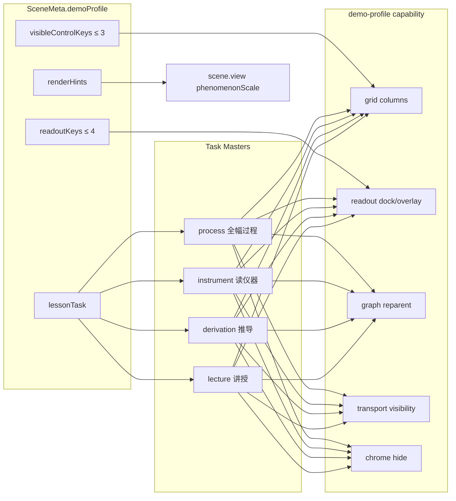
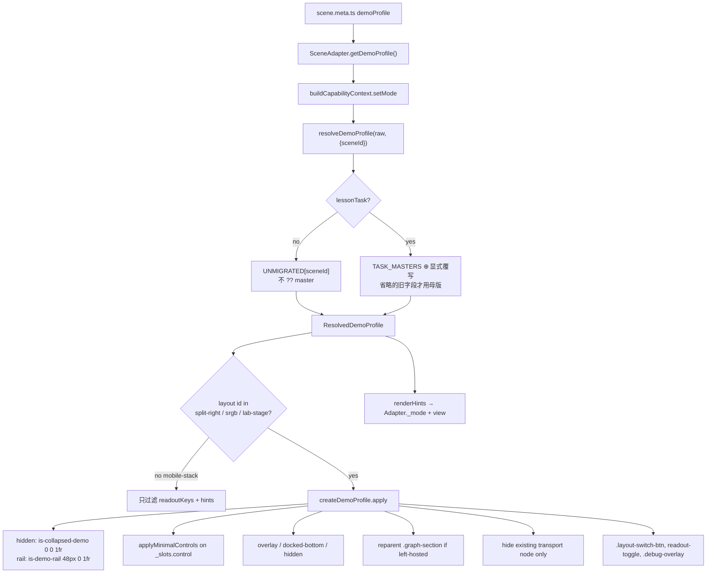

# Physics-2D-Demos — 1080P 课堂演示模式（Presentation Mode）完整设计

| 字段     | 值                                                                             |
| -------- | ------------------------------------------------------------------------------ |
| 作者     | TBD                                                                            |
| 日期     | 2026-09-11                                                                     |
| 状态     | Draft                                                                          |
| 仓库     | `/home/tdcasual/codework/physics-2d-demos`                                     |
| 线上     | https://x.infinitas.fun                                                        |
| 本地 dev | http://127.0.0.1:5177/                                                         |
| 技术栈   | Vite 7 + TypeScript 5.9 strict + React 首页 + 场景 vanilla DOM/Canvas          |
| 范围     | 设计文档与审计对照；本回合不改产品代码、不 commit、不 push                     |
| 约束     | 不跑 `scripts/visual-linux-container.sh`；Darwin 视觉基线无法在本机 Linux 生成 |

---

## Overview

演示模式（`TeachingMode = 'presentation'`）的产品目标是 **1920×1080 投影**：后排能看清现象，老师用不超过 3 个旋钮上课，HUD 不超过 4 个数字。现状却是一套 4×4 面板策略笛卡尔积（`controlPanel × readoutPanel × graphPanel × renderHints`），外加 CSS 特异性把 `docked-bottom` 钉到顶部、`collapsed` 实现成 `hidden`、`getReadoutItems()` 标准/演示同一份、仪器把答案写成最大字。

本设计把 19 个场景收成 **四种上课任务母版**（讲授 / 推导 / 读仪器 / 全幅过程）+ ganshe 特例，而不是继续堆策略组合。平台契约增加 `lessonTask`、`readoutKeys`、运输条 opt-in、现象缩放语义；布局层负责舞台几何与铬；场景 view 负责把 `contentScale` 花在现象上而不是字号上。兼容期保留旧 `controlPanel` / `readoutPanel` 字段，由母版填默认、场景只覆写键名。

---

## Background & Motivation

### 当前架构（必须基于实码，不是口号）

三层分离已经写在 `src/platform/demo-profile.ts` 文件头：

1. 场景声明「我想要什么」→ `SceneMeta.demoProfile`（`src/scenes/*/scene.meta.ts`）
2. 布局决定「怎么给空间」→ `createDemoProfile()`（`src/app/layouts/capabilities/demo-profile.ts`）
3. 场景 view 决定「怎么放大内容」→ `createViewEnvironment().contentScale()`（`src/scenes/view-base.ts`）+ 各 `scene.view.ts`

模式切换主路径：

```
ModeToggle click
  → CapabilityContext.setMode (capability-context.ts)
    → container[data-mode]
    → scene.getDemoProfile()
    → emit('layout:mode') + CustomEvent('layout:modechange')
    → updateCapabilityInstances('demo-profile')
    → SceneAdapter.setMode(mode)          // 再派一次缺 profile 的事件
      → inner scene.setMode(mode, renderHints)
      → resize() + render()
```

`BASE_VIEWPORT` 已是 `{ width: 1920, height: 1080 }`（`src/platform/standards.ts`）。`getRenderTokens(scale)` 只放大字号/线宽/标记半径，**不改变舞台几何**。

布局侧已有的演示策略实现：

| 策略                            | 实现（`demo-profile.ts` + `responsive-demo.css`）                        | 实际效果                                     |
| ------------------------------- | ------------------------------------------------------------------------ | -------------------------------------------- |
| `controlPanel: 'hidden'`        | `sidebar.style.display='none'` + `gridTemplateColumns='0px 0px 1fr'`     | 真·消失                                      |
| `controlPanel: 'collapsed'`     | 加 `is-collapsed-demo` + **同样** `0px 0px 1fr` + `pointer-events: none` | 与 hidden 等价；注释写「标题栏可展开」是假的 |
| `controlPanel: 'minimal'`       | `minmax(260px, 22rem) 8px 1fr` + 按 `[data-control-key]` 过滤            | 只对 SchemaRenderer 字段生效                 |
| `readoutPanel: 'overlay'`       | 加 `*-is-overlay` + `*-readout-enlarged`                                 | 半透明浮层                                   |
| `readoutPanel: 'docked-bottom'` | 加 `*-is-docked-bottom`（`bottom:0; top:auto`）                          | **被演示 CSS `top-4` 盖掉，钉在顶部**        |
| `graphPanel: 'visible'`         | 去掉 `is-collapsed-demo`                                                 | 图若住在左栏，收栏时一起没                   |

SchemaRenderer（`src/ui/components/SchemaRenderer.ts:81`）给每个字段打 `dataset.controlKey = field.key`。ganshe / spring-oscillator 的 imperative 卡片（`createControlCard` / `createWaveSourceCard`）**没有**这个属性。

读数：`SceneAdapter.getReadoutItems()` 原样转发场景函数，**没有投影子集**。读数面板默认 `position:'top-right'`、`top: 60px`（`readout-panel.ts:266-270`）。

运输条：布局默认挂 `transport-bar`，除非 `page.ts` 的 `layoutConfig.hideTransport`。目前只有 `double-slit`、`interference-formula`、`vt-integral` 显式关掉。

### 1080P 视图审计（19/19，1920×1080 点「演示」）

舞台占比 = 主 canvas 面积 / (1920×1080)。网格列如 `352px 8px 1560px` 来自 minimal 的 `22rem` 压缩。

#### 策略现状

| 场景                 | 布局                     | control    | readout       | graph        | visibleControlKeys                                   | scale          | 实测舞台                                                                                                      |
| -------------------- | ------------------------ | ---------- | ------------- | ------------ | ---------------------------------------------------- | -------------- | ------------------------------------------------------------------------------------------------------------- |
| projectile           | split-right              | minimal    | overlay       | —            | v0, theta, preset                                    | 1.5            | grid `352/8/1560`，canvas 1560×1080，share **0.813**，overlay ~240×250–374 @ y=60                             |
| mechanical-wave      | split-right              | minimal    | overlay       | —            | wavelength, amplitude, direction                     | 1.5            | 同上 0.813                                                                                                    |
| field-lines          | split-right              | minimal    | overlay       | —            | scene, charge, density, q1, q2（**5 键**）           | 1.6            | 同上 0.813                                                                                                    |
| doppler-effect       | split-right              | minimal    | overlay       | —            | preset, sourceSpeed, observerSpeed, mode（**4 键**） | 1.5            | 同上 0.813                                                                                                    |
| vt-integral          | split-right              | minimal    | overlay       | —            | scene, preset, n                                     | 1.5            | 同上 0.813（刚从 collapsed+docked-bottom 改来）                                                               |
| double-slit          | split-right              | minimal    | overlay       | —            | step, lightMode, lambda                              | 1.5            | 0.813；`hideTransport: true`                                                                                  |
| interference-formula | split-right              | minimal    | overlay       | visible      | step, lambda                                         | 1.5            | 0.813；`hideTransport: true`；图在左栏                                                                        |
| thin-film            | split-right              | minimal    | overlay       | visible      | step, lambda, whiteLight                             | 1.5            | 0.813；运输条仍在；overlay 与画布公式重复                                                                     |
| wedge                | split-right              | minimal    | overlay       | visible      | step, lambda, theta                                  | 1.5            | 同上                                                                                                          |
| vernier-caliper      | split-right              | minimal    | overlay       | —            | objectType, precision                                | 1.5            | 0.813；画布巨型「5.24 mm」                                                                                    |
| micrometer           | split-right              | minimal    | overlay       | —            | preset, **reading**（答案滑块）                      | 1.5            | 0.813；画布写最终读数                                                                                         |
| ganshe               | split-right-graph-bottom | minimal    | overlay       | 舞台底图     | mode, preset                                         | 1.2            | canvas 1560×783 share **0.589**；imperative 控件全在，overlay 挤爆                                            |
| chase-meet           | split-right              | **hidden** | docked-bottom | visible      | —                                                    | 1.8 / font 2.0 | left 0，canvas 1904×637 share **0.585**，readout 1920×176 **@ y=60（顶栏）**                                  |
| tortoise-hare        | split-right              | collapsed  | docked-bottom | —            | —                                                    | 1.6            | canvas 1920×1080，readout 1920×176 @ y=60；预设丢失                                                           |
| xt-graph             | split-right              | collapsed  | docked-bottom | —            | —                                                    | 1.6            | 同上                                                                                                          |
| electrification      | split-right              | hidden     | docked-bottom | —            | —                                                    | 1.6            | 同上；步骤按钮丢失                                                                                            |
| emf-analogy          | split-right              | collapsed  | docked-bottom | —            | —                                                    | 1.5            | 同上；开关/阀门丢失                                                                                           |
| spring-oscillator    | split-right              | collapsed  | **hidden**    | **visible**  | —                                                    | 1.5            | canvas 1920×1080；**图在左栏被 collapsed 一起收掉**；`demoHints` 在 view 里是 reserved                        |
| ticker-tape          | **lab-stage**            | minimal    | docked-bottom | 浮窗收标题条 | preset, countEvery                                   | 1.3            | canvas 1920×944 share **0.874**，底栏 1920×136；lab-stage **无 readout-panel capability**，读数面板实际不存在 |

#### 问题分级（设计必须消化，不是待办清单上的口号）

**Critical**

1. **`docked-bottom` 被钉在顶部。**
   `responsive-demo.css:54-57`：

   ```css
   .teaching-demo[data-mode='presentation'] .teaching-readout-panel {
     @apply right-4 top-4;
   }
   ```

   特异性 `(0, 3, 0)`（`.teaching-demo` + `[data-mode]` + `.teaching-readout-panel`）。
   dock 规则是 `:is(.teaching-readout-panel):is(.teaching-is-docked-bottom)` → `(0, 2, 0)`。
   `top-4` 赢，`top: auto; bottom: 0` 失效。chase-meet / 龟兔 / x-t / 静电 / 水路全部顶栏化。srgb 前缀的 ganshe 读数面板不受这条 teaching 选择器影响，但是 overlay 自己挤。

2. **`getReadoutItems()` 无投影子集。** 标准模式与演示模式返回同一数组。后果：chase-meet 出现「显示模式=演示模式」、`T/Δt`；interference-formula 的 `sinθ`/`tanθ` 科学计数法；doppler 7–8 行；field-lines 含「显示模式」+ 电荷 1/2；vt-integral 同样回显教学模式。投影后排读不完，也没有 `ReadoutItem.key` 可供过滤。

3. **仪器类把答案写最大、尺画最小。**
   - 游标卡尺：`caliper-render.ts` 几何 `s = min(w,h)/320` cap 1.5，**`contentScale` 只乘进 `fs`（字号）**；`showReading: true` 写死（`scene.view.ts:66`）。主尺高度 `26*s ≈ 39px`，答案面板 `34*fs` 才是视觉重心。preset 文案直接写「小球直径 (5.24 mm)」。
   - 螺旋测微仪：`showReading: true` 写死；`visibleControlKeys` 含 `reading` 滑块（0–10 mm，即答案本身）；preset 标签是 `4.593 mm`。
   - 打点计时器是**反例**：尺 `rulerMmPxGain = 5`、表/图收成标题条、`showA` 默认关、不替学生算。C 类应对齐这个教学姿态。

**High**

4. **`collapsed` 注释是「标题栏可展开」，实现是 `0 0 1fr` + `pointer-events: none`。** 老师在龟兔 / x-t / 振子 / 水路丢预设。要消失必须用 `hidden`；要可展开必须真的留 48px 可点轨。

5. **`contentScale` 放大字不放大现象。** 卡尺/测微器如上。多普勒注释写明「几何坐标不变，字号/线宽/关键点按 contentScale 放大」（`doppler-effect/scene.view.ts:110`），t=0 波面半径不涨。弹簧振子 `scene.view.ts:50`：`demoHints reserved for future`，`contentScale: 1.5` 是空操作。

6. **`graphPanel: 'visible'` 住在左栏。** `buildSplitLayoutDOM` 默认 `hasGraphInLeft: true`。`collapsed`/`hidden` 把左栏（含图）收成 0。弹簧振子声明图可见，演示时图消失。

7. **`minimal` 只认 schema 的 `data-control-key`。** ganshe 的波源卡片、相位卡片、观察点管理没有该属性，过滤器看不见它们，最小策略失效，左栏塞满，overlay 与控件互挤（share 0.589）。

8. **运输条默认出现在静态仪器/步骤推导上。** 薄膜、劈尖、卡尺、测微器、静电仍挂 `transport-bar`。双缝/公式/微元法已 `hideTransport: true`，说明意图存在，但开关在 `page.ts` 而不是 demoProfile，演示/标准无法区分。

**Medium**

9. **演示铬过多。** 布局切换、侧栏折叠（CSS 已藏）、主题按钮（CSS 已藏）、FPS debug overlay、读数「展开/折叠」、lab-stage 第二份隐藏控制面板标题。投影只应留下回到「标准」的按钮。

#### 好的对照（母版应对齐这些，而不是重发明）

- **实验课**：打点计时器 `lab-stage` — 舞台 87%，底栏短，尺大，表收起，不替学生算。
- **讲授 HUD**：抛体 / 机械波 / 微元法 / 电场 — 左栏 22rem + overlay，舞台 81%。缺的是 HUD 行数和旋钮数纪律。
- **信息密度**：薄膜 / 劈尖适合投影，但 overlay 与画布公式重复，运输条多余。

### 痛点一句话

老师在 1080P 点「演示」后：该在底的读数跑到顶，该留下的预设被折叠成 0 宽，该藏的答案写成最大号，该放大的尺/波面/电荷还是标准尺寸。根因不是缺一个 `contentScale`，而是 **任务模型没进契约**。

---

## Goals & Non-Goals

### Goals

1. 1920×1080 点「演示」后，**舞台占比**按任务分层（见 Observability `stageShare`）：A/B ≥ 0.75；C lab-stage 保持 ≈ 0.87；D 画布宽度 / 视口宽度 ≥ 0.98（读数为绝对定位 overlay，不挤占高度）。ganshe 用「主 canvas ∪ 右栏底图」而不是单 canvas ≥ 0.70。
2. 投影数字 **≤ 4**，由 `demoProfile.readoutKeys` 过滤；禁止「显示模式=演示模式」这类元数据行。
3. 老师旋钮 **≤ 3**，`visibleControlKeys` 对 schema **和** imperative DOM 都生效。
4. `collapsed` = 48px 可点开的轨；要消失用 `hidden`。
5. `docked-bottom` 必须在底；`top-4` 只作用于 overlay。
6. 图若不在舞台，收左栏时必须迁图到舞台。
7. 运输条演示期 **opt-in**。未迁移场景 **不** 从母版填 `transport`（保持当前是否已挂载）；迁移后 A/D 默认 visible、B/C 默认 hidden。已 `hideTransport: true` 的场景永不复活一条未挂载的条。
8. `contentScale` 放大现象（仪器短边、t=0 波面、振子像素）；卡尺 1080P 仪器 bbox 短边 **≥ ~280px**。电场电荷半径 **已经** `26 * contentScale`（`field-lines/scene.view.ts` `getVisuals`），演示只做 1.6 视觉确认，并让 `pickCharge` 的 `radiusNorm` 随视觉半径变。
9. 读仪器母版禁止画布写最终读数，除非老师点「揭示」。
10. 演示铬只留「标准」（模式切换）；主题/布局/FPS/展开折叠默认隐藏。键盘快捷键保留。

### Non-Goals

- 不改物理公式、不改 sim 数值积分。
- 不在本回合改产品代码（本文只设计）。
- 不合并 Darwin/Linux 像素基线，不跑 `visual-linux-container.sh`，不在 Linux 宿主机 `--update-snapshots`。
- 不新增第四种桌面布局 id 来「专供演示」（母版是 capability + CSS 策略，不是新 `ILayout`）。lab-stage 已存在，C 类打点计时器继续用它。
- 不把移动端（`<768`）演示模式一并重做；手机仍走 `mobile-stack`。演示契约的验收视口是 **1920×1080**。`MobileStackLayout` 已挂 `demo-profile` + `mode-toggle`：几何类 apply（grid / 迁图 / 底栏 / docked 改位 / 运输条 display）必须 **按布局 id 门禁**，mobile-stack 上只允许读数 key 过滤与 `renderHints` 下发。
- 不改 `tests/visual/visual-regression.spec.ts` 的 PNG 基线，不把本设计绑到 `visual-linux-container.sh`。现有 `tests/visual/demo-mode.spec.ts` 是 **行为/class** 冒烟（`is-docked-bottom` 不等价于几何在底），几何用 e2e 度量补上。
- 不强制 19 场景同一 PR 落地。
- 场景批 PR **禁止**「只加 `lessonTask`、旧 `controlPanel` 原样双写」。未迁移窗口用冻结的 19 行表，不用 `?? master`。

---

## Key Decisions

1. **上课任务母版，而不是策略笛卡尔积。**
   `lessonTask: 'lecture' | 'derivation' | 'instrument' | 'process'` 决定控制栏/读数/图/运输条的默认几何。旧 `controlPanel`/`readoutPanel`/`graphPanel` 降为覆写项，兼容一期后由契约测试标 deprecated。理由：19 场景的失败模式按课型聚类，不按 4×4 格子聚类。

2. **单一模式切换入口：`CapabilityContext.setMode`。**
   `SceneAdapter.setMode` 不再派发 `layout:modechange`，只把 `renderHints` 传给 inner scene 并 `resize+render`。新增 `ScenePageOptions.onSetMode?: (mode) => void`，bootstrapper 接到 `ctx.setMode`。Esc：`onSetMode?.('normal') ?? this.setMode('normal')`。`f` 全屏正交。理由：今天双派发，第二次 `detail` 没有 `profile`（`scene-adapter.ts:562-567`）。`tests/unit/layout-dom-contracts.spec.ts:120` 合成的 `{ mode }` 事件仍合法（lab-stage 只读 `detail.mode`），但生产路径只派一次带 profile 的包。

3. **读数过滤放在适配器，不复制 `getReadoutItems`。**
   `ReadoutItem.key` 迁移期 **可选**（PR 16 才必填）。Adapter 在 `setMode` 里存 `_mode`；`getReadoutItems()` 读该字段（不读 DOM 注释）。Adapter **与** capability 都调用同一 `resolveDemoProfile(profile, { sceneId })`。未迁移：丢弃 denylist 行（「显示模式」「主题」「T / Δt」），**禁止** `slice(0,4)`。场景批必须 **同一 PR** 写 `ReadoutItem.key` 和 `readoutKeys`；keys 是新英文 id，与中文 label 并存，fallback `it.label` **匹配不到** 英文 keys。

4. **`visibleControlKeys` 过滤根是 `_slots.control`（`.control-slot`），不是 sidebar。**
   unmarked = slot **children** 既无自身 `data-control-key` 也无后代 key。显式排除 `.graph-section`。button-grid **内钮** 另打 `data-control-key={button.key}`：父字段在集合中则整组保留；只列内钮 key 则隐藏未列的兄弟（静电 `step` 留、`reset` 藏）。不采用 `SchemaRenderer.setVisible` 作为主路径（它管不到 imperative 卡）。

5. **`collapsed` 与 `hidden` 语义劈开，CSS 替换而非叠 `!important`。**
   hidden → 类 `is-collapsed-demo` → 现有 `0 0 1fr !important`。真 collapsed → **只** 类 `is-demo-rail`（**不加** `is-collapsed-demo`）→ `48px 0 1fr !important` + `pointer-events: auto`。删除/收窄「凡 is-collapsed-demo 都 0 宽」对 rail 的误伤。过程母版用 hidden，不用 collapsed。srgb 左栏同样带 `layout-left-panel`，同一套 `:has` 覆盖 ganshe。

6. **运输条：有节点才改 `display`，从不新挂载。**
   `page.ts` `hideTransport` = 标准模式也不要（双缝/公式/微元法 **从未** mount 浮动条；lecture 默认 visible **不得** 把它们变出来）。split-right 选择器 `.stage-floating-controls`；lab-stage / mobile 是另一套 DOM，几何门禁下 mobile 不改；lab-stage 播放留在底栏，不套 split 选择器。未迁移不从母版填 `transport`。

7. **现象缩放与字号缩放拆开。**
   `contentScale` = 现象几何。`fontScale`/`strokeScale`/`markerScale` 覆盖字与描边。`fontScale()` **不得** 默认等于 `phenomenonScale()`（C 类 s≥3.1 会把刻度字炸开）。C 类 meta 显式 `fontScale: 1.0–1.3`，`fs` 只用 `fontScale`。电场半径已乘 contentScale；弹簧振子必须开始消费 demoHints。

8. **C 类答案默认关闭，唯一字段 `renderHints.revealAnswer`。**
   `scene.setRevealAnswer(v)` 更新 hints 并 `render()`，**不**走 `setMode`。画布 `showReading` 绑该字段。`presentationLabel` 只改按钮文案；测微器 preset **id** 今天就是毫米数（`?preset=4.593`），必须改成不透明 id。`reveal` 不进 `urlSyncKeys`。

9. **回归用 Playwright 几何度量，不用像素基线。**
   断言 `stageShare`、readout 盒子、可见 keys、运输条。扩展 `tests/visual/demo-mode.spec.ts`（行为，非 PNG）。不碰 `visual-regression.spec.ts` 快照。

10. **分批落地：未迁移走 19 行冻结表，禁止 `?? master`。resolve 发生在 `CapabilityContext.setMode`（PR 5 必改该文件），apply 只吃 `ResolvedDemoProfile`。**
    两态：(1) **无** `lessonTask` → `UNMIGRATED[sceneId]`；未知 id **warn + raw 回落，不 throw**（脚手架窗口）。(2) **有** `lessonTask` → 母版默认，省略的字段才 overlay。instrument 母版省略 `graphPanel`。场景批禁止双写现值。`apply` 读扁平 `visibleControlKeys`/`transport`，不是 `interactionHints`。

---

## Proposed Design

### 1. 四种上课任务母版

母版是 **布局 capability 的默认策略包**，不是新的 `ILayout` id。场景只声明任务 + 键名。



| 母版                      | 课型                               | 舞台                                                 | 控制                                                                | 读数                               | 图                                                             | 运输条                             | 铬                    |
| ------------------------- | ---------------------------------- | ---------------------------------------------------- | ------------------------------------------------------------------- | ---------------------------------- | -------------------------------------------------------------- | ---------------------------------- | --------------------- |
| **A lecture** 讲授现象    | 抛体、机械波、电场、多普勒、微元法 | ≥ 75%（minimal 22rem 左栏 ≈ 81%）                    | minimal，≤ 3 keys                                                   | overlay，≤ 4 keys                  | 无（或已在画布内）                                             | visible                            | 只留「标准」          |
| **B derivation** 逐步推导 | 双缝、公式、薄膜、劈尖             | ≥ 75%                                                | minimal：步骤条 + ≤ 2 参数                                          | overlay 瘦身；画布公式不再重复 HUD | 左栏图若在，随 minimal 留在 22rem 底；不要 collapsed           | **hidden**                         | 只留「标准」          |
| **C instrument** 读仪器   | 打点计时器、卡尺、测微器           | 最大化现象；卡尺短边 ≥ 280px                         | minimal：样品/精度/揭示                                             | **hidden**（答案不进 HUD）         | 打点：浮窗保持收标题条                                         | 打点 visible；卡尺/测微 **hidden** | 只留「标准」+「揭示」 |
| **D process** 全幅过程    | 追及、龟兔、x-t、振子、水路、静电  | 宽度 ≥ 98%；读数 **绝对定位** 贴底，不挤 canvas 高度 | **hidden**；芯片 **插入现有** docked-bottom 面板，不另造 in-flow 条 | docked-bottom，≤ 3 个数            | 左栏图迁到舞台：**flex 压缩** animation 高度，禁止绝对覆盖振子 | visible（静电 hidden）             | 只留「标准」          |

ganshe 不进四母版笛卡尔积：先补 `data-control-key`，再按 **A 的几何 + 只留 mode/preset** 收。图已在 `split-right-graph-bottom` 舞台底，不要迁回左栏。

硬规则（投影 HUD，契约测试可执行）：

1. 1080P `stageShare` 按任务分层（A/B ≥ 0.75，不是全局 0.70）。
2. 投影数字 ≤ 4 = `readoutKeys.length`。
3. 老师旋钮 ≤ 3 = `visibleControlKeys.length`（芯片条上的 preset 算 1 个控件，不是每个 preset 按钮算 1）。
4. collapsed 真是 48px 可点开的轨；要消失用 hidden。
5. docked-bottom 必须在底；top-4 只作用于 overlay。
6. 图若不在舞台，收左栏时必须迁图。
7. 运输条 opt-in。
8. contentScale 放大现象。
9. C 类禁止画布写最终读数，除非揭示。
10. 演示铬只留「标准」。

### 2. 模式切换序列（目标态）

```mermaid
sequenceDiagram
  actor Teacher
  participant Toggle as mode-toggle.ts
  participant Ctx as capability-context.setMode
  participant Cap as demo-profile capability
  participant Adapter as SceneAdapter.setMode
  participant View as scene.view
  participant HUD as readout-panel

  Teacher->>Toggle: 点击「演示」
  Toggle->>Ctx: setMode('presentation')
  Ctx->>Ctx: data-mode=presentation
  Ctx->>Ctx: raw = scene.getDemoProfile()
  Note over Ctx: PR 5：setMode 内 resolve，禁止把 raw 交给 apply
  Ctx->>Ctx: resolved = resolveDemoProfile(raw, {sceneId: scene.id})
  Ctx->>Cap: update({mode, profile: resolved})  DemoProfileUpdateData.profile: ResolvedDemoProfile | null
  Note over Cap: 仅 desktop 三布局做 grid/迁图/dock；mobile-stack 跳过几何
  Ctx->>Adapter: setMode('presentation')  via scene.setMode
  Note over Adapter: 存 _mode；不再 dispatch layout:modechange
  Adapter->>View: setMode(mode, resolved.renderHints)
  Adapter->>View: resize(); render()
  Adapter->>HUD: getReadoutItems() 按 resolved.readoutKeys 或 denylist
  Teacher->>Toggle: 点击「标准」或 Esc
  Note over Teacher,Toggle: Esc → onSetMode('normal') → 同一 Ctx.setMode
  Toggle->>Ctx: setMode('normal')
  Ctx->>Cap: reset() 恢复 grid/图父节点/display
  Ctx->>Adapter: setMode('normal')
```

键盘：Esc 走 `ScenePageOptions.onSetMode`（bootstrapper 赋值为 `ctx.setMode`）；缺省才 `this.setMode`。`f` 全屏正交。

**PR 5 接线（禁止只改 platform 文件）：** 今天 `buildCapabilityContext.setMode`（`capability-context.ts:56-69`）把 `scene.getDemoProfile()` **原样**放进 `updateDemoProfileInstances`。龟兔等 meta 仍是 `controlPanel: 'collapsed'`。若 PR 5 只改 `case 'collapsed' → is-demo-rail` 而不在 Context 里 resolve，R2 轨泄漏立刻回来。

```typescript
// capability-context.ts setMode — PR 5 必改，不依赖 PR 2
setMode: (mode: Mode) => {
  container.setAttribute('data-mode', mode);
  const raw =
    mode === 'presentation' ? (scene?.getDemoProfile?.() ?? null) : null;
  const profile =
    raw && scene ? resolveDemoProfile(raw, { sceneId: scene.id }) : null;
  const payload = { mode, profile }; // profile: ResolvedDemoProfile | null
  emit('layout:mode', payload);
  container.dispatchEvent(
    new CustomEvent('layout:modechange', { detail: payload, bubbles: true })
  );
  updateDemoProfileInstances(payload);
  scene?.setMode?.(mode);
};
```

`CapabilityEvents['modechange'].profile` 与 `DemoProfileUpdateData.profile` 都改成 `ResolvedDemoProfile | null`。`apply` **只**吃 resolved，不再看见 `interactionHints`。Adapter `getReadoutItems` / hints 继续自己 `resolveDemoProfile(..., { sceneId: this.id })`（它有 id）。不要在 apply 里再 resolve 一次（Context 已解析；单测直接喂 `ResolvedDemoProfile`）。

### 3. 布局应用 demo profile 的数据流



`resolveDemoProfile` 放 `src/platform/demo-profile.ts`（纯函数，无 app 依赖）。**Adapter 与 capability 都必须调用它**，禁止 capability 解析、Adapter 读 raw meta。

### 4. 平台契约：TypeScript before / after

**Before**（`src/platform/demo-profile.ts` 现状）：

```typescript
export type DemoControlStrategy = 'hidden' | 'collapsed' | 'minimal' | 'full';
export type DemoReadoutStrategy =
  | 'hidden'
  | 'overlay'
  | 'docked-top'
  | 'docked-bottom';
export type DemoGraphStrategy = 'hidden' | 'collapsed' | 'visible';

export interface DemoRenderHints {
  contentScale: number;
  fontScale?: number;
  strokeScale?: number;
  markerScale?: number;
  custom?: Record<string, unknown>;
}

export interface DemoInteractionHints {
  touchTargetMinSize?: number;
  visibleControlKeys?: string[];
}

export interface SceneDemoProfile {
  controlPanel: DemoControlStrategy;
  readoutPanel: DemoReadoutStrategy;
  graphPanel?: DemoGraphStrategy;
  renderHints: DemoRenderHints;
  interactionHints?: DemoInteractionHints;
}
```

**After**（加字段；**禁止** `controlPanel ?? master` 这种双写合并）：

```typescript
export type LessonTask = 'lecture' | 'derivation' | 'instrument' | 'process';
export type DemoTransportStrategy = 'hidden' | 'visible';

export interface DemoRenderHints {
  contentScale: number;
  fontScale?: number;
  strokeScale?: number;
  markerScale?: number;
  /** C 类唯一揭示开关。默认 false。不放 custom。 */
  revealAnswer?: boolean;
  custom?: Record<string, unknown>;
}

export interface SceneDemoProfile {
  lessonTask?: LessonTask;
  /** 有 lessonTask 时：省略 = 用母版；写出 = 显式覆写。无 lessonTask 时本字段被 UNMIGRATED 表忽略。 */
  controlPanel?: DemoControlStrategy;
  readoutPanel?: DemoReadoutStrategy;
  graphPanel?: DemoGraphStrategy;
  transport?: DemoTransportStrategy;
  readoutKeys?: string[];
  renderHints: DemoRenderHints;
  interactionHints?: DemoInteractionHints;
}

export interface ResolveDemoProfileContext {
  sceneId: string;
}

export interface ResolvedDemoProfile {
  lessonTask: LessonTask | 'unmigrated';
  controlPanel: DemoControlStrategy;
  readoutPanel: DemoReadoutStrategy;
  /** undefined = capability 跳过 graph 分支（今日 `if (profile.graphPanel)` ） */
  graphPanel?: DemoGraphStrategy;
  /** undefined = 不改运输条 display（保持已挂载与否） */
  transport?: DemoTransportStrategy;
  readoutKeys: string[];
  visibleControlKeys: string[];
  renderHints: DemoRenderHints;
  touchTargetMinSize: number;
}

export const TASK_MASTERS: Record<
  LessonTask,
  {
    controlPanel: DemoControlStrategy;
    readoutPanel: DemoReadoutStrategy;
    /** 省略 = 不填 graphPanel（capability skip）。instrument 必须省略：lab-stage 浮窗不是 .graph-section */
    graphPanel?: DemoGraphStrategy;
    transport: DemoTransportStrategy;
  }
> = {
  lecture: {
    controlPanel: 'minimal',
    readoutPanel: 'overlay',
    graphPanel: 'hidden',
    transport: 'visible'
  },
  derivation: {
    controlPanel: 'minimal',
    readoutPanel: 'overlay',
    graphPanel: 'visible',
    transport: 'hidden'
  },
  instrument: {
    controlPanel: 'minimal',
    readoutPanel: 'hidden',
    /* graphPanel 省略 */ transport: 'hidden'
  },
  process: {
    controlPanel: 'hidden',
    readoutPanel: 'docked-bottom',
    graphPanel: 'visible',
    transport: 'visible'
  }
};

/** 未迁移窗口冻结表。不是启发式。改一行必须附单测。 */
export const UNMIGRATED: Record<
  string,
  Pick<
    ResolvedDemoProfile,
    'controlPanel' | 'readoutPanel' | 'graphPanel' | 'transport'
  >
> = {
  projectile: {
    controlPanel: 'minimal',
    readoutPanel: 'overlay',
    graphPanel: undefined,
    transport: undefined
  },
  'mechanical-wave': {
    controlPanel: 'minimal',
    readoutPanel: 'overlay',
    graphPanel: undefined,
    transport: undefined
  },
  'field-lines': {
    controlPanel: 'minimal',
    readoutPanel: 'overlay',
    graphPanel: undefined,
    transport: undefined
  },
  'doppler-effect': {
    controlPanel: 'minimal',
    readoutPanel: 'overlay',
    graphPanel: undefined,
    transport: undefined
  },
  'vt-integral': {
    controlPanel: 'minimal',
    readoutPanel: 'overlay',
    graphPanel: undefined,
    transport: undefined
  },
  'double-slit': {
    controlPanel: 'minimal',
    readoutPanel: 'overlay',
    graphPanel: undefined,
    transport: undefined
  },
  'interference-formula': {
    controlPanel: 'minimal',
    readoutPanel: 'overlay',
    graphPanel: 'visible',
    transport: undefined
  },
  'thin-film': {
    controlPanel: 'minimal',
    readoutPanel: 'overlay',
    graphPanel: 'visible',
    transport: undefined
  },
  wedge: {
    controlPanel: 'minimal',
    readoutPanel: 'overlay',
    graphPanel: 'visible',
    transport: undefined
  },
  'vernier-caliper': {
    controlPanel: 'minimal',
    readoutPanel: 'overlay',
    graphPanel: undefined,
    transport: undefined
  },
  micrometer: {
    controlPanel: 'minimal',
    readoutPanel: 'overlay',
    graphPanel: undefined,
    transport: undefined
  },
  ganshe: {
    controlPanel: 'minimal',
    readoutPanel: 'overlay',
    graphPanel: undefined,
    transport: undefined
  },
  'chase-meet': {
    controlPanel: 'hidden',
    readoutPanel: 'docked-bottom',
    graphPanel: 'visible',
    transport: undefined
  },
  'tortoise-hare': {
    controlPanel: 'hidden',
    readoutPanel: 'docked-bottom',
    graphPanel: undefined,
    transport: undefined
  },
  'xt-graph': {
    controlPanel: 'hidden',
    readoutPanel: 'docked-bottom',
    graphPanel: undefined,
    transport: undefined
  },
  electrification: {
    controlPanel: 'hidden',
    readoutPanel: 'docked-bottom',
    graphPanel: undefined,
    transport: undefined
  },
  'emf-analogy': {
    controlPanel: 'hidden',
    readoutPanel: 'docked-bottom',
    graphPanel: undefined,
    transport: undefined
  },
  'spring-oscillator': {
    controlPanel: 'hidden',
    readoutPanel: 'hidden',
    graphPanel: 'visible',
    transport: undefined
  },
  'ticker-tape': {
    controlPanel: 'minimal',
    readoutPanel: 'docked-bottom',
    graphPanel: undefined,
    transport: undefined
  }
};

export function resolveDemoProfile(
  input: SceneDemoProfile,
  ctx: ResolveDemoProfileContext
): ResolvedDemoProfile {
  const hints = {
    contentScale: input.renderHints.contentScale,
    fontScale: input.renderHints.fontScale,
    strokeScale: input.renderHints.strokeScale,
    markerScale: input.renderHints.markerScale,
    revealAnswer: input.renderHints.revealAnswer ?? false,
    custom: input.renderHints.custom
  };
  const keys = {
    readoutKeys: input.readoutKeys ?? [],
    visibleControlKeys: input.interactionHints?.visibleControlKeys ?? [],
    touchTargetMinSize: input.interactionHints?.touchTargetMinSize ?? 48,
    renderHints: hints
  };

  if (!input.lessonTask) {
    const row = UNMIGRATED[ctx.sceneId];
    if (!row) {
      // PR 5：禁止 throw。scripts/new-scene.ts 模板仍是旧四元组、无 lessonTask。
      console.warn(
        `[demo-profile] unknown unmigrated scene "${ctx.sceneId}"; using raw control/readout`
      );
      return {
        lessonTask: 'unmigrated',
        controlPanel: input.controlPanel ?? 'minimal',
        readoutPanel: input.readoutPanel ?? 'overlay',
        graphPanel: input.graphPanel,
        transport: input.transport,
        ...keys
      };
    }
    return { lessonTask: 'unmigrated', ...row, ...keys };
  }

  const master = TASK_MASTERS[input.lessonTask];
  return {
    lessonTask: input.lessonTask,
    controlPanel: input.controlPanel ?? master.controlPanel,
    readoutPanel: input.readoutPanel ?? master.readoutPanel,
    graphPanel: input.graphPanel ?? master.graphPanel, // instrument 母版省略 → undefined
    transport: input.transport ?? master.transport,
    ...keys
  };
}
```

**为什么不能 `?? master` 吃旧字段：** 19 个 `scene.meta.ts` 都已经写了 `controlPanel`/`readoutPanel`（`scene-standard.spec.ts` 强制）。若 unmigrated 还 `input.controlPanel ?? master`，龟兔的 `'collapsed'` 永远盖掉 process 的 `'hidden'`，48px 轨泄漏（R2）无法成立。

**场景批硬规则：** 写入 `lessonTask` 的同一 PR 必须把与母版相同的 `controlPanel`/`readoutPanel` **删掉**；只保留真正覆写（ganshe `graphPanel: 'visible'`、ticker-tape **只**覆写 `transport: 'visible'` 且 **省略 `graphPanel`**、vt-integral `transport: 'hidden'`）。禁止「lessonTask + 原样双写」。禁止把 `graphSel` 扩成 `.lab-float-graph`（打点浮窗由 `applyPresentationFloats` 收标题条，不是 `graphPanel: 'hidden'`）。

`ReadoutItem`（迁移期 `key` 可选，PR 16 必填）：

```typescript
export interface ReadoutItem {
  key?: string;
  label: string;
  value: string | number;
  unit?: string;
  layout?: 'half' | 'full';
}
```

`view-base.ts`：

```typescript
phenomenonScale(): number {
  return this.mode === 'presentation'
    ? (this.demoHints?.contentScale ?? 1.5)
    : 1;
}
fontScale(): number {
  if (this.mode !== 'presentation') return 1;
  return this.demoHints?.fontScale ?? 1; // 不回落到 phenomenonScale
}
```

C 类 meta 必须带 `fontScale: 1.2`（或 1.0–1.3）。`fs` 只用 `fontScale`，仪器 `s` 只用拟合/`contentScale`。

#### 未迁移 vs 场景批后：19 行 resolved 元组

`graphPanel`/`transport` 列：`—` = `undefined`（跳过 apply 分支 / 不改 display）。

| id                   | 未迁移 control / readout / graph / transport              | 批后 lessonTask + 显式覆写                                                                     | 批后 resolved                              |
| -------------------- | --------------------------------------------------------- | ---------------------------------------------------------------------------------------------- | ------------------------------------------ |
| projectile           | minimal / overlay / — / —                                 | lecture；删旧面板字段                                                                          | minimal / overlay / hidden / visible       |
| mechanical-wave      | 同上                                                      | lecture                                                                                        | 同上                                       |
| field-lines          | 同上                                                      | lecture                                                                                        | 同上                                       |
| doppler-effect       | 同上                                                      | lecture                                                                                        | 同上                                       |
| vt-integral          | 同上                                                      | lecture；**覆写 `transport: 'hidden'`**（page 已 hideTransport，条未挂载）                     | minimal / overlay / hidden / **hidden**    |
| double-slit          | 同上                                                      | derivation；`transport: 'hidden'`                                                              | minimal / overlay / visible / hidden       |
| interference-formula | minimal / overlay / visible / —                           | derivation                                                                                     | minimal / overlay / visible / hidden       |
| thin-film            | 同上                                                      | derivation                                                                                     | 同上                                       |
| wedge                | 同上                                                      | derivation                                                                                     | 同上                                       |
| vernier-caliper      | minimal / overlay / — / —                                 | instrument（母版无 graphPanel）                                                                | minimal / hidden / **—** / hidden          |
| micrometer           | 同上                                                      | instrument                                                                                     | 同上                                       |
| ticker-tape          | minimal / docked-bottom / — / —                           | instrument；**覆写 `transport: 'visible'`**；**省略 graphPanel**（禁止 `?? master` 填 hidden） | minimal / hidden / **—** / **visible**     |
| ganshe               | minimal / overlay / **—** / —                             | lecture；**覆写 `graphPanel: 'visible'`**                                                      | minimal / overlay / **visible** / visible  |
| chase-meet           | hidden / docked-bottom / visible / —                      | process                                                                                        | hidden / docked-bottom / visible / visible |
| tortoise-hare        | **hidden**（由 collapsed 规范化） / docked-bottom / — / — | process                                                                                        | hidden / docked-bottom / visible / visible |
| xt-graph             | 同上                                                      | process                                                                                        | 同上                                       |
| electrification      | hidden / docked-bottom / — / —                            | process；覆写 `transport: 'hidden'`                                                            | hidden / docked-bottom / visible / hidden  |
| emf-analogy          | **hidden**（由 collapsed 规范化） / docked-bottom / — / — | process                                                                                        | hidden / docked-bottom / visible / visible |
| spring-oscillator    | **hidden** / hidden / **visible** / —                     | process                                                                                        | hidden / docked-bottom / visible / visible |

未迁移 **不** 给 ganshe 填 `graphPanel: 'hidden'`，否则 PR 5 会 `display:none` 掉 `.srgb-graph-section`（已在右栏舞台，`hasGraphInLeft: false`）。未迁移 **不** 给 ticker-tape 填 `transport: 'hidden'` 或 `graphPanel: 'hidden'`。批后同样 **省略** ticker-tape 的 `graphPanel`：instrument 母版不再带 `graphPanel: 'hidden'`。lab 浮窗 class 是 `lab-float lab-float-graph` / slot `lab-graph-slot graph-slot`，**不是** `.graph-section`。`graphSel` 保持 `.graph-section, .layout-graph-section`；**禁止**扩到 `.lab-float-graph`。标题条仍只由 `lab-stage.ts applyPresentationFloats` 负责。

弹簧振子未迁移：control 已规范化 hidden，`graphPanel: 'visible'` 保留；迁图（PR 6）才能把左栏图救到舞台。未迁移 readout 仍 hidden，直到 D 批改成 docked-bottom。

### 5. 布局如何实现

#### 5.1 CSS：docked-bottom 与 overlay 解耦（Critical-1）

`src/styles/shared/responsive-demo.css` 把 `top-4` 收窄到 overlay：

```css
/* 只钉 overlay，不要碰 docked-* */
.teaching-demo[data-mode='presentation']
  .teaching-readout-panel.teaching-is-overlay {
  right: 1rem;
  top: 1rem;
}

.teaching-demo[data-mode='presentation'] .srgb-readout-panel.srgb-is-overlay {
  right: 1rem;
  top: 1rem;
}
```

删除（或不再匹配 docked）现有：

```css
.teaching-demo[data-mode='presentation'] .teaching-readout-panel {
  @apply right-4 top-4;
}
```

docked-bottom 规则已是 `bottom: 0; top: auto; left: 0; right: 0`。为防再被盖，演示期补一条同等或更高特异：

```css
.teaching-demo[data-mode='presentation']
  .teaching-readout-panel.teaching-is-docked-bottom {
  top: auto;
  right: 0;
  left: 0;
  bottom: 0;
}
```

契约测试读 CSS 源：presentation 的 `top-4` 选择器必须包含 `is-overlay`。Playwright 几何：`readout.getBoundingClientRect().y > 800`（PR 1）。`tests/visual/demo-mode.spec.ts` 只断言 `is-docked-bottom` **class**，CSS 钉顶时它仍绿——**不是**几何替代；仅当选择器变更时才改该文件，不刷 PNG。

#### 5.1.1 几何 apply 的布局门禁

`apply()` 里 grid / 迁图 / docked-overlay 改位 / 底栏芯片 / 运输条 display / 铬 仅当：

```
const DESKTOP_DEMO_LAYOUTS = new Set([
  'split-right',
  'split-right-graph-bottom',
  'lab-stage'
]);
const layoutId = ctx.getCurrentLayoutId();
const geometry = DESKTOP_DEMO_LAYOUTS.has(layoutId);
```

`mobile-stack`（`dataset.testid` / `mobile-stack-layout`）：只跑 readoutKeys 过滤（Adapter 侧）和 `scene.setMode(hints)`。禁止把 `.graph-section` 从 `display:none` 的 `.mobile-tab-panel` 迁到 animation（布局矩阵要求跳过未激活 tab 的 0 尺寸 canvas）。`collapseGridSidebar` 在 flex 上本就是 no-op，但 readout class 与 unmarked-hide 不是——必须跳过。

该 `geometry` 门禁 **PR 4 就要写上**（`ctx.getCurrentLayoutId()` 已在 `CapabilityContext` 上），不能等 PR 5。PR 4 的 unmarked-hide 包在 `if (geometry)` 里。

#### 5.2 collapsed = 48px 轨；hidden 继续 0 宽（High-4）

**删除（一字不留）** 现有：

```css
.teaching-demo.split-right-shell:has(.layout-left-panel.is-collapsed-demo) {
  grid-template-columns: 0 0 1fr !important;
}
.layout-left-panel.is-collapsed-demo {
  min-width: 0;
  overflow: hidden;
  pointer-events: none;
}
```

**换成两条互斥规则**（不要叠在 `is-collapsed-demo` 上再加 `is-demo-rail`，同等特异谁后谁赢，JS `gridTemplateColumns` 打不赢 `!important`）：

```css
/* hidden：0 宽。类名沿用 is-collapsed-demo（与现单测/注释兼容「折叠=没」的历史名） */
.teaching-demo.split-right-shell:has(.layout-left-panel.is-collapsed-demo) {
  grid-template-columns: 0 0 1fr !important;
}
.layout-left-panel.is-collapsed-demo {
  min-width: 0;
  overflow: hidden;
  pointer-events: none;
}

/* 真 collapsed 轨：只有 is-demo-rail，没有 is-collapsed-demo */
.teaching-demo.split-right-shell:has(.layout-left-panel.is-demo-rail) {
  grid-template-columns: 48px 0 1fr !important;
}
.layout-left-panel.is-demo-rail {
  min-width: 48px;
  overflow: hidden;
  pointer-events: auto;
}
.layout-left-panel.is-demo-rail .control-slot {
  display: none;
}
```

JS：

```typescript
case 'hidden':
  sidebar.classList.remove('is-demo-rail');
  sidebar.classList.add('is-collapsed-demo');
  sidebar.style.display = 'none';
  collapseGridSidebar(); // 0 0 1fr（可被 !important 盖成同样结果）
  break;
case 'collapsed':
  sidebar.classList.remove('is-collapsed-demo');
  sidebar.classList.add('is-demo-rail');
  sidebar.style.display = savedSidebarDisplay ?? '';
  break;
```

srgb 左栏 class 是 `srgb-left-panel layout-left-panel`（`split-right-graph-bottom.ts:147`），同一 `:has(.layout-left-panel…)` 覆盖 ganshe。

过程母版用 hidden，**不**用 collapsed。未迁移表已把龟兔/x-t/水路/振子的 collapsed 写成 hidden，因此 **PR 3 的 CSS 可以先合，JS 的 `case 'collapsed' → is-demo-rail` 必须与 UNMIGRATED 表同 PR**，否则未迁移 collapsed 会露 48px 轨。

`capability-system.spec.ts`：hidden / 未迁移规范化 → `0 0 1fr`；**仅**当 profile.controlPanel 真是 `'collapsed'` 才断言 `48px`。

#### 5.3 minimal：根是 `_slots.control`（High-7）

今天 `apply()` 读 **raw** `profile.interactionHints?.visibleControlKeys` 且把 sidebar 当 root（`demo-profile.ts:190-194`）。`ResolvedDemoProfile` **没有** `interactionHints`，keys / transport 在顶层。若 Context 已传 resolved 而 apply 仍读 `interactionHints`，minimal 永远走 `resetMinimalControls()`，抛体/ganshe 演示会露出全部 schema 字段。

**`apply(profile: ResolvedDemoProfile)` 只认扁平字段：**

```typescript
function apply(profile: ResolvedDemoProfile): void {
  if (!geometry) return; // 5.1.1；PR 4 起
  switch (profile.controlPanel /* hidden / collapsed / minimal / full */) {
  }
  if (profile.controlPanel === 'minimal') {
    const keys = profile.visibleControlKeys; // 不是 interactionHints.visibleControlKeys
    if (keys.length) applyMinimalControls(_slots.control, keys);
    else resetMinimalControls();
  }
  if (profile.graphPanel) {
    /* hidden | collapsed | visible；undefined 整段 skip */
  }
  if (profile.readoutPanel) {
    /* overlay | docked-* | hidden */
  }
  if (profile.transport === 'hidden') {
    /* 只 hide 已有节点 */
  }
  if (profile.touchTargetMinSize) {
    /* --demo-touch-min */
  }
}
```

单测喂 `ResolvedDemoProfile`，不要喂 meta 形 `{ interactionHints: { visibleControlKeys } }`。

**根必须是 `_slots.control`**（class `${prefix}-control-slot control-slot`，`split-helpers.ts:79`）。sidebar children = header + control-section（+ 左栏 graph）；ganshe 波源卡在 slot **里面**（`ganshe/page.ts:165-168`）。

```typescript
const root = _slots.control; // 不要 sidebar
const unmarked = [...root.children].filter((el) => {
  if (!(el instanceof HTMLElement)) return false;
  if (el.classList.contains('graph-section')) return false;
  return !el.dataset.controlKey && !el.querySelector('[data-control-key]');
});
```

button-grid：SchemaRenderer 在字段节点保留 `data-control-key={field.key}`，**每个内钮**再打 `data-control-key={button.key}`（改 `createButtonGrid` 或 render 后 query `button`）。过滤：

1. 节点 key ∈ visible → 显示。
2. 祖先字段 key ∈ visible → 整组内钮显示（电场 `charge` = +/−/移除算 1 旋钮）。
3. 仅内钮 key ∈ visible → 包装器留下（有可见后代），**未列**的兄弟内钮 `display:none`（静电 `step` 留、`reset` 藏）。

单测 fixture：control-slot 内一张 schema 卡（`data-control-key=mode`）+ 两张无 key 的 `createControlCard` 兄弟；minimal `['mode']` 后只有 schema 卡可见。再加 button-grid `action` 含 `step`/`reset`，keys `['step']` 时 reset 隐藏。

**ticker-tape：** lab-stage 有 `[data-lab-data-slot]`，实验表进浮窗，不进 control-slot（`ticker-tape/page.ts:85-95`）。无 dataSlot 的回退卡「实验数据」是 unmarked 兄弟，演示会藏——**预期**：表属于浮窗，不是投影旋钮。PR 4 写明。

不把 `SchemaRenderer.setVisible` 当主路径（只覆盖 schema 字段，ganshe imperative 仍漏）。

#### 5.4 迁图（High-6）

仅当 `geometry` 门禁通过、`graphPanel === 'visible'`、且 `controlPanel ∈ {hidden, collapsed}`：

1. `querySelector('.graph-section')`（`.layout-graph-section` 未使用）。
2. **仅当** `section.parentElement?.closest('.layout-left-panel')`（ganshe `hasGraphInLeft: false` → skip）。
3. 保存 `parent`、`nextSibling`、**以及** `section.style.height`（srgb 段有像素高度）。
4. 把 section 移到 **right panel 的 flex 列**（animation 的兄弟，不是 `position:absolute` 盖在 canvas 上）。class `is-demo-stage-graph`：`flex: 0 0 min(28vh, 220px)`。animation 保持 `flex: 1; min-height: 0`。弹簧振子底端质量必须仍可见——绝对定位 + `z-index:20` + 不透明背景会盖住现象，**禁止**。
5. 调用 `scene.resize()`（不只 `window.dispatchEvent('resize')`）。Adapter 的 `_observeGraphSlotVisibility` 挂在 **slot** 上，随 section 一起走，尺寸变化会触发。
6. reset：插回原位，恢复 `style.height`。

chase-meet 图在舞台 canvas 内（`trackHeight ≈ min(380*scale, max(190*scale, stageHeight*0.42))`，`chase-meet/scene.view.ts:135-138`）。迁图 no-op。**CSS 把 readout 从顶挪到底不会把运动带从 637 拉到 900+**：readout 已是 `position:absolute`，不参与 layout 高度。内部分割改到 PR 13。

lab-stage：`applyPresentationFloats()` 收标题条，**保持**。`graphPanel: undefined` 时 capability 不 `display:none` 浮窗。`graphSel` **禁止**加入 `.lab-float-graph` / `.lab-graph-slot`。

#### 5.5 过程底栏：扩展现有 docked-bottom，不另造 in-flow 条

**选定 A：** 芯片 reparent 进现有 docked-bottom **面板**，槽 `.demo-chip-slot`。

`readout-panel.ts` `update()` 只改 `ul.readout-slot` 的 item pool，**不** `panel.replaceChildren`。因此：

```typescript
const panel = ctx.container.querySelector('[class*="-readout-panel"]');
const list = panel.querySelector('ul.readout-slot');
const chipSlot = document.createElement('div');
chipSlot.className = 'demo-chip-slot';
panel.appendChild(chipSlot); // ul 与 header 的兄弟，禁止塞进 ul
```

插进 `ul` 会在下一帧 readout tick 被 item pool 挤掉。reset 时 `chipSlot.remove()` 并把芯片插回 control-slot。

绝对定位贴底（现 CSS `bottom:0; max-height: min(22vh, 11rem); overflow: auto`），**不缩小 canvas**。芯片 + 3 个数可能让面板滚动——可接受；有 `.demo-chip-slot` 时把 max-height 提到 `min(28vh, 14rem)` 可选。**不**插入 `.demo-bottom-rail` 到 animation。

D 的 share SLO = `canvas.width / 1920 ≥ 0.98`，不再用 `0.84` 高度占比（那是误把 overlay 当 in-flow）。

静电芯片：`scene` + 内钮 `step`（见 5.3）。不是 `action`（会带上重置）。
龟兔 / x-t：`preset`。
水路：`switch` + `view`。`tap` 默认不进（Open Question 冻结为 1a）。

reset 时芯片插回 control-slot。

#### 5.6 运输条 opt-in（High-8）

```typescript
if (resolved.transport === undefined) {
  /* 未迁移：不动 */
} else if (resolved.transport === 'hidden') {
  ctx.container
    .querySelectorAll(
      '.stage-floating-controls, .teaching-stage-floating-controls'
    )
    .forEach((el) => {
      (el as HTMLElement).style.display = 'none';
    });
}
// visible：只恢复曾被本 capability 藏过的节点。从不 createFloatingControls / 从不在 hideTransport 场景新挂一条。
```

lab-stage 播放在 `.lab-control-section` / 非 `stage-floating-controls`。几何门禁下 lab-stage 不跑这条 split 选择器；打点的播放留在 8.5rem 底栏。mobile-stack 的 `.mobile-transport-controls` 同样不碰。

vt-integral / double-slit / interference-formula：`hideTransport: true` → 条未挂载。批后必须显式 `transport: 'hidden'`，以免 lecture 母版 `visible` 被理解成「去造一条」。

#### 5.7 铬（Medium-9）

`apply()` **按选择器全局 query**（lab-stage 工具栏没有 `teaching-stage-toolbar` 包层，`lab-stage.ts:230-235` 自己有 `.layout-switch-btn`）：

`createDebugOverlay`（`debug-overlay.ts:38-46`）今天 append 一个 **裸 `div`**，repo 里没有 `data-debug-overlay`。`querySelectorAll('[data-debug-overlay]')` 是空操作，DEV 下 FPS（`z-index:9999; left:8px; bottom:8px`）会盖住 process 底栏。

**同一 PR（PR 5）必须先打标再藏：**

```typescript
// debug-overlay.ts mount
el.className = 'debug-overlay';
el.dataset.debugOverlay = 'fps';

// demo-profile apply chrome
ctx.container
  .querySelectorAll(
    '.layout-switch-btn, .teaching-readout-toggle, .srgb-readout-toggle, .debug-overlay'
  )
  .forEach(hide);
```

不要文档一个 mount 路径没写的属性。reset 恢复 overlay `display`。

| 元素                       | 现状                                                                                                                    | 目标                                                                                         |
| -------------------------- | ----------------------------------------------------------------------------------------------------------------------- | -------------------------------------------------------------------------------------------- |
| `.layout-switch-btn`       | 可见                                                                                                                    | JS hide。键盘 `l` 对 `display:none` 节点 `dispatchEvent(click)` 仍可用                       |
| `.shell-theme-toggle`      | presentation CSS 已 `@apply hidden`                                                                                     | 保持                                                                                         |
| `.teaching-sidebar-toggle` | 同上                                                                                                                    | 保持                                                                                         |
| readout 展开/折叠          | 可见                                                                                                                    | JS hide；演示强制展开                                                                        |
| `.debug-overlay`           | **DEV 构建默认开**（`shouldEnableDebugOverlay`：`import.meta.env.DEV` **或** `?debug=1\|true\|fps`）。节点无 class/data | mount 时打 `class="debug-overlay"` + `data-debug-overlay="fps"`；演示 hide。不是「生产才有」 |
| lab-stage 「控制区」h2     | 占一行                                                                                                                  | 演示藏 `.lab-section-header`                                                                 |

`.mode-toggle-btn` 保留，文本「标准」。`layout-interactions.spec.ts` 在 **标准模式** 点布局按钮，演示 hide 不伤它。

### 6. view / token：放大现象

`getRenderTokens` 继续只管字号线宽，不负责仪器长度。现象倍率走 `contentScale`。

| 场景                   | 今天                                                                                                               | 目标                                                                                                        |
| ---------------------- | ------------------------------------------------------------------------------------------------------------------ | ----------------------------------------------------------------------------------------------------------- |
| 卡尺                   | `s` cap 1.5；`fs = s * contentScale`；`showReading: true` 写死                                                     | 拟合 `s`（短边 ≥ 280px）；`fs` **只用** `fontScale`（meta 1.2）；`showReading = renderHints.revealAnswer`   |
| 测微器                 | 同结构                                                                                                             | 同卡尺                                                                                                      |
| 打点计时器             | 尺 `rulerMmPxGain = 5`                                                                                             | **保持**                                                                                                    |
| 多普勒                 | 几何不变，cs 乘线宽字号                                                                                            | t=0 波面半径 × contentScale                                                                                 |
| 电场                   | **已做**：`getVisuals(getScale())` → `chargeRadius: 26 * contentScale`（`field-lines/scene.view.ts:21-25, 80-91`） | 1.6 视觉确认。`pickCharge(..., radiusNorm = 0.045)`（`scene.sim.ts:122`）须随视觉半径放大，否则大电荷点不中 |
| 弹簧振子               | demoHints reserved                                                                                                 | 消费 contentScale                                                                                           |
| 抛体 / 机械波 / 微元法 | 已乘                                                                                                               | 保持；微元法 cap 1.6 可提到 2.0                                                                             |

卡尺拟合算法（C 类核心）：

```
available = region
if (!revealAnswer) 垂直中心上移（今天 showReading 时主尺在 0.3h，关掉后用 0.45h）
targetShort = max(280, min(w,h) * 0.42)
s = clamp(targetShort / 320, 0.3, 3.0)   // 取消 1.5 cap
mmToPx = 8 * s
fs 用 fontScale（1.2），不用 s
```

`setRevealAnswer(v)`：场景保存 `hints.revealAnswer = v` 后 `render()`。page `onAction('reveal')` 调它。hints **不只**在 `setMode` 时推一次。

1080P 舞台若 1560×1080，`min=1080`，`targetShort=max(280, 454)=454`，`s≈1.42`，主尺高 `26*1.42≈37` 仍偏瘦——所以要用 **bbox 短边** 而不是主尺厚度：整把尺（主尺+游标+钳口）高度约 `26+24+28+间隙 ≈ 90*s`。要求 90\*s ≥ 280 → s ≥ 3.1。必须放开 1.5 cap。这与 `getResponsiveScale` 的 `[0.3, 1.5]` **不是同一数量**：后者是 canvas dataset，前者是仪器局部倍率。契约测试量的是画出来的仪器像素，不是 dataset。

### 7. 读数 HUD

Adapter 存 `private _mode: TeachingMode = 'normal'`，在 `setMode` 写入。**不**从 `.layout-master` dataset 读（避免与 capability 时序打架）。

```typescript
const READOUT_DENYLIST = new Set(['显示模式', '主题', 'T / Δt']);

getReadoutItems(): ReadoutItem[] {
  const items = this.scene?.getReadoutItems?.() ?? this._readoutItems;
  if (this._mode !== 'presentation') return items;
  const resolved = resolveDemoProfile(
    this.getDemoProfile() ?? { renderHints: { contentScale: 1 } },
    { sceneId: this.id }
  );
  if (resolved.readoutKeys.length) {
    const set = new Set(resolved.readoutKeys);
    return items.filter((it) => it.key != null && set.has(it.key));
    // 禁止 it.label fallback：英文 key 对不上「时间 t」
  }
  return items.filter((it) => !READOUT_DENYLIST.has(it.label));
}
```

**禁止 `slice(0,4)`**：会把 chase-meet 的「显示模式」和 field-lines 的「主题」留在 HUD 里直到场景批。场景批必须 **同一 PR** 加 `ReadoutItem.key` 与 meta `readoutKeys`；缺 key 的项在已声明 keys 时被丢掉（空 HUD = 漏改，单测会红）。

禁止投影的行（审计点名）：

- 「显示模式」/ `modeLabel(currentMode)`（chase-meet、field-lines、vt-integral）
- `T / Δt`（chase-meet 内部步长）
- `sinθ` / `tanθ` 科学计数法（interference-formula，推导画布上已有）
- 多普勒 7–8 行全量
- 卡尺「测量读数」「真实尺寸」
- 测微器「测量读数」

读数面板演示期：去掉「展开/折叠」；`is-collapsed` 强制 false（capability 已 `classList.remove('is-collapsed')`）。overlay 继续 `readout-enlarged`。docked-bottom 用大号数字 CSS（已有 enlarged 类，dock 时也加上）。

### 8. 每个场景的母版归属与键清单

键名全部来自现有 `controls-schema.ts` / imperative spec / `getReadoutItems` 标签，不发明未出现的 schema key。新增的只是 `ReadoutItem.key`（英文 id）以及 C 类 `reveal` 按钮 key。

#### A. lecture 讲授现象

**projectile（抛体运动）** — 已接近母版，收 HUD。

| 项                 | 现值                    | 目标                                                                                                |
| ------------------ | ----------------------- | --------------------------------------------------------------------------------------------------- |
| lessonTask         | （无）                  | `lecture`                                                                                           |
| controlPanel       | minimal                 | minimal（母版）                                                                                     |
| visibleControlKeys | `v0`, `theta`, `preset` | **保持**（正好 3）                                                                                  |
| readoutPanel       | overlay                 | overlay                                                                                             |
| readoutKeys        | 8 行无 key              | **唯一清单** `t`, `x`, `y`, `v0-theta`（对应 时间 t / 位移 x / 高度 y / 参数 v0/θ）。不发明 `speed` |
| transport          | 默认可见                | `visible`                                                                                           |
| contentScale       | 1.5                     | 1.5                                                                                                 |

其余 4 项加 key `vx`,`vy`,`g-h0`,`wind-drag` 但不进 `readoutKeys`。entry+meta 同一 PR。

**mechanical-wave（机械波）**

| 项                 | 现值                                   | 目标                                                                         |
| ------------------ | -------------------------------------- | ---------------------------------------------------------------------------- |
| visibleControlKeys | `wavelength`, `amplitude`, `direction` | **保持**（3）。`waveSpeed`/`period` 有约束关系，演示不露，避免老师拧爆 v=λ/T |
| readoutKeys        | 5 行                                   | `wave-speed`（波速 v = λ/T）、`t`（当前时刻 t）、`p-y`（P 点位移）           |
| transport          | visible                                | visible                                                                      |
| contentScale       | 1.5                                    | 1.5                                                                          |

**field-lines（电场线演化）** — 5 键超标。

| 项                 | 现值                                     | 目标                                                                    |
| ------------------ | ---------------------------------------- | ----------------------------------------------------------------------- |
| visibleControlKeys | `scene`, `charge`, `density`, `q1`, `q2` | `scene`, `charge`, `density`（3）。`q1`/`q2`/`apply-charges` 回标准模式 |
| readoutKeys        | 7 行                                     | `scene`（场景）、`count`（电荷数量）、`q1`（电荷1）                     |
| 现象               | **已乘** `26 * contentScale`             | 1.6 视觉确认；放大 `pickCharge` 的 `radiusNorm`                         |
| `charge` 网格      | +/−/移除                                 | 算 **1** 旋钮（祖先 key `charge` ∈ 集合 → 内钮全留）                    |
| 禁止               | 「显示模式」「主题」                     | denylist + 批后 keys                                                    |

**doppler-effect（多普勒效应）** — 4 键超标，7 行 HUD。

| 项                 | 现值                                             | 目标                                                                             |
| ------------------ | ------------------------------------------------ | -------------------------------------------------------------------------------- |
| visibleControlKeys | `preset`, `sourceSpeed`, `observerSpeed`, `mode` | `preset`, `sourceSpeed`, `observerSpeed`。`mode` 与 preset（静止/接近/远离）重叠 |
| readoutKeys        | 7 行                                             | `f-emit`（发射频率）、`f-receive`（接收频率）、`delta-pct`（频率变化）           |
| 现象               | 几何不变                                         | 波面半径 × contentScale（High-5）                                                |
| 音频               | `audioEnabled`/`audioVolume` 演示隐藏            | 保持隐藏（教室外放不可控）                                                       |

**vt-integral（微元法）**

| 项                 | 现值                             | 目标                                                                                                                                                                   |
| ------------------ | -------------------------------- | ---------------------------------------------------------------------------------------------------------------------------------------------------------------------- |
| visibleControlKeys | `scene`, `preset`, `n`           | **保持**（3）                                                                                                                                                          |
| readoutKeys        | 含「显示模式」+ 面积/误差 4–5 行 | scene1: `scene`, `rect-area`, `true-area`；scene2: `scene`, `line`, `curve`；scene3: `scene`, `poly`, `circle`。实现：`getReadoutItems` 仍按子场景分支，过滤后自然 ≤ 3 |
| transport          | page 已 hideTransport            | 标准/演示都 hidden（静态推导偏 A 但无时间轴）                                                                                                                          |
| contentScale       | 1.5，view 里 cap 1.6             | 保持；可把 cap 提到 2.0                                                                                                                                                |

#### B. derivation 逐步推导

共同：`visibleControlKeys` 以 `step` 为首；`transport: 'hidden'`；overlay 不重复画布公式。

**double-slit（双缝干涉）** — page 已 `hideTransport: true`。

| 项                 | 现值                          | 目标                                                           |
| ------------------ | ----------------------------- | -------------------------------------------------------------- |
| visibleControlKeys | `step`, `lightMode`, `lambda` | **保持**                                                       |
| readoutKeys        | 当前步骤, 光源, d, L, …       | `step`（当前步骤）、`light`（光源）、`d`（双缝间距 d）。保持 3 |
| graph              | 无                            | hidden                                                         |

**interference-formula（双缝干涉公式推导）** — 已 hideTransport。

| 项                 | 现值             | 目标                                                             |
| ------------------ | ---------------- | ---------------------------------------------------------------- |
| visibleControlKeys | `step`, `lambda` | **保持**（2）。L/d 回标准                                        |
| readoutKeys        | 8 行             | `lambda`（波长 λ）、`delta-x`（条纹间距 Δx）。θ/sin/tan 只留画布 |
| graphPanel         | visible（左栏）  | visible，minimal 左栏 22rem 底部可放图，不迁                     |

**thin-film（薄膜干涉）**

| 项                 | 现值                           | 目标                                                           |
| ------------------ | ------------------------------ | -------------------------------------------------------------- |
| visibleControlKeys | `step`, `lambda`, `whiteLight` | **保持**                                                       |
| readoutKeys        | 9 行                           | `lambda`（波长）、`d-local`（观察点厚度 d）、`order`（级次 m） |
| transport          | 仍可见                         | **hidden**                                                     |
| 画布               | 公式与 overlay 重复            | 演示期 view 若已画 Δ/m，HUD 只留数字                           |

**wedge（劈尖干涉）**

| 项                 | 现值                      | 目标                                                              |
| ------------------ | ------------------------- | ----------------------------------------------------------------- |
| visibleControlKeys | `step`, `lambda`, `theta` | **保持**                                                          |
| readoutKeys        | 9 行                      | `lambda`（波长 λ）、`theta`（劈尖角 θ）、`fringe-l`（条纹间距 l） |
| transport          | 仍可见                    | **hidden**                                                        |

#### C. instrument 读仪器

**ticker-tape（打点计时器纸带）** — 对齐现状，微收。

| 项                 | 现值                                        | 目标                                                                         |
| ------------------ | ------------------------------------------- | ---------------------------------------------------------------------------- |
| preferredLayout    | lab-stage                                   | **保持**                                                                     |
| lessonTask         | —                                           | `instrument`                                                                 |
| visibleControlKeys | `preset`, `countEvery`                      | `preset`, `countEvery`, `fillRuler`（3；「按尺填入 x」是实验动作，不是答案） |
| 隐藏               | `showA`, `noise`                            | 演示不替学生算 a，不强调噪声                                                 |
| readoutPanel       | docked-bottom 但 lab-stage 无 readout-panel | **hidden**（保持无 HUD 答案）                                                |
| transport          | 底栏播放合理                                | `visible`（覆写母版默认 hidden）                                             |
| graphPanel         | 无                                          | **省略**。禁止写 `'hidden'`，禁止把 `graphSel` 扩到 `.lab-float-graph`       |
| 浮窗               | 演示收标题条                                | **保持** `applyPresentationFloats`                                           |
| contentScale       | 1.3                                         | 1.3                                                                          |

**vernier-caliper（游标卡尺）**

| 项                 | 现值                               | 目标                                                                         |
| ------------------ | ---------------------------------- | ---------------------------------------------------------------------------- |
| visibleControlKeys | `objectType`, `precision`          | `objectType`, `precision`, `reveal`                                          |
| `reveal`           | 无                                 | 新 button key，onAction → `scene.setRevealAnswer(true)` / hints.revealAnswer |
| readoutPanel       | overlay 含「测量读数」「真实尺寸」 | **hidden**                                                                   |
| 画布               | `showReading: true`，巨型 5.24 mm  | `showReading = revealAnswer`                                                 |
| preset 文案        | `小球直径 (5.24 mm)`               | 增加 `presentationLabel: '小球'` 等，演示渲染用它                            |
| 现象               | s cap 1.5，scale 只进字            | s 拟合，bbox 短边 ≥ 280px                                                    |
| transport          | 可见                               | hidden                                                                       |

**micrometer（螺旋测微仪）**

| 项                 | 现值                                   | 目标                                                                                                                                                 |
| ------------------ | -------------------------------------- | ---------------------------------------------------------------------------------------------------------------------------------------------------- |
| visibleControlKeys | `preset`, `reading`                    | `preset`, `reveal`。拿掉 `reading` 滑块                                                                                                              |
| preset **id**      | `'4.593'` 等（`?preset=4.593` 即答案） | 不透明 id：`zero`, `sample-a` … `sample-h`。page 用映射表代替 `parseFloat`。标准 `label` 仍可写毫米；演示 `presentationLabel`。**只改 caption 不够** |
| 画布 / HUD         | 写最终读数                             | 同卡尺；`fontScale: 1.2`                                                                                                                             |
| transport          | 可见                                   | hidden                                                                                                                                               |
| contentScale       | 1.5                                    | 用于仪器几何                                                                                                                                         |

`reveal` 不进 schema 的场景可用 `custom` 字段或 page.ts onAction 插入的按钮，打 `data-control-key="reveal"`。

#### D. process 全幅过程

共同：`controlPanel: 'hidden'`，底栏芯片 + 3 个数，`docked-bottom` 真在底。

**chase-meet（追及相遇）**

| 项                 | 现值                                            | 目标                                                                                             |
| ------------------ | ----------------------------------------------- | ------------------------------------------------------------------------------------------------ |
| controlPanel       | hidden                                          | hidden                                                                                           |
| visibleControlKeys | 无 → 老师丢预设                                 | `preset`（button-grid: `uniform` / `accelerated`）迁底栏芯片                                     |
| readoutKeys        | 8 行                                            | `t`（当前时间）、`distance`（当前距离）、`meet`（相遇信息）。denylist 先砍「显示模式」「T / Δt」 |
| graph              | 画在舞台内；运动带 `trackHeight ≈ 0.42 * stage` | **不**指望 dock CSS 把 637 变 900。内部分割改到 PR 13（60/40 或底 220px，不阻塞平台）            |
| transport          | 可见                                            | visible                                                                                          |
| scale              | 1.8 / font 2.0                                  | 保持                                                                                             |

**tortoise-hare（龟兔赛跑）**

| 项           | 现值                 | 目标                                                     |
| ------------ | -------------------- | -------------------------------------------------------- |
| controlPanel | collapsed（=hidden） | hidden + 芯片 `preset`                                   |
| readoutKeys  | 4 行                 | **唯一清单** `t`, `xa`, `xb`（时间 t / 乌龟 x / 兔子 x） |
| 图           | 画在主 canvas        | 保持                                                     |

**xt-graph（位置时间图像）**

| 项          | 现值      | 目标                                      |
| ----------- | --------- | ----------------------------------------- |
| 同龟兔      | collapsed | hidden + `preset` 芯片                    |
| readoutKeys | 已 3 行   | `t`, `x`, `v`（时间 t / 位置 x / 速度 v） |

**spring-oscillator（弹簧振子）**

| 项                 | 现值                | 目标                                                                                                         |
| ------------------ | ------------------- | ------------------------------------------------------------------------------------------------------------ |
| controlPanel       | collapsed，图被收掉 | hidden；**迁图**到舞台底                                                                                     |
| readoutPanel       | hidden              | docked-bottom                                                                                                |
| readoutKeys        | 变长                | `t`（全局时间）、`count`（振子数量）、`phase-diff`（相位差 φ₂-φ₁；不足两个运行中则该项不存在，HUD 2 行合法） |
| visibleControlKeys | 无（imperative）    | 底栏不放「+添加」。芯片可空，靠画布点击播放（已有）。若要预设相位，后续再加                                  |
| contentScale       | 1.5 空操作          | view 消费 demoHints                                                                                          |
| transport          | 可见                | visible                                                                                                      |

振子列表卡片打 `data-control-key="oscillators"`，演示 hidden 左栏后无所谓；回标准仍在。

**emf-analogy（电磁感应-水路类比）**

| 项           | 现值                             | 目标                                                                                                                                                                                                      |
| ------------ | -------------------------------- | --------------------------------------------------------------------------------------------------------------------------------------------------------------------------------------------------------- |
| controlPanel | collapsed                        | hidden + 芯片 `switch`, `view`                                                                                                                                                                            |
| readoutKeys  | 5 行                             | `I`（电流 I）、`U`（路端电压 U）、`R`（外电阻 R）                                                                                                                                                         |
| transport    | schema 内还有一份 transport 字段 | 演示藏 schema 运输，用浮动条 `visible` 或只用底栏播放。避免双运输。建议：演示藏 `.stage-floating-controls` 也藏 schema `transport`，底栏不放播放（老师用空格）。`transport: 'visible'` 仍可只留浮动条左上 |
| tap 滑块     | 上课常用                         | 不进 ≤3 芯片；回标准或 48px 轨展开。若产品坚持，用 hidden 改 collapsed 轨（Open Question）                                                                                                                |

**electrification（静电起电）**

| 项           | 现值                                      | 目标                                                                                                                                                                              |
| ------------ | ----------------------------------------- | --------------------------------------------------------------------------------------------------------------------------------------------------------------------------------- |
| controlPanel | hidden，步骤丢失                          | hidden + 芯片 `scene` + **`step`**（内钮 key，不是字段 `action`）                                                                                                                 |
| readoutKeys  | 场景, 下一步动作, 说明                    | `scene`（场景）、`next`（下一步动作）                                                                                                                                             |
| schema       | `button-grid key: 'action'` 含 step/reset | SchemaRenderer 给内钮打 `data-control-key`。`visibleControlKeys: ['scene','step']` 隐藏 reset。也可把 grid 拆成两个 `button` 字段；两种等价，场景批选内钮方案以免改 onAction 路由 |
| transport    | hasTransport true                         | `hidden`（步进场景，空格可绑 step，不需要播放条）                                                                                                                                 |

#### ganshe（波的干涉）特例

| 项                 | 现值                     | 目标                                                                                                        |
| ------------------ | ------------------------ | ----------------------------------------------------------------------------------------------------------- |
| 布局               | split-right-graph-bottom | **保持**，图已在舞台底                                                                                      |
| controlPanel       | minimal 失效             | 先打 key，再 minimal                                                                                        |
| 打 key             | 无                       | `mode`,`preset`（schema 已有）；`freq1`,`amp1`,`freq2`,`amp2`,`phaseDiff`（滑块行）；观察点卡片 `observers` |
| visibleControlKeys | mode, preset             | **保持**，此时才生效                                                                                        |
| readoutKeys        | 变长                     | `t`（时间 t）、`dphase`（相对相位差）、`intensity`（干涉强度）                                              |
| overlay            | 挤爆                     | 3 行 + enlarged                                                                                             |
| contentScale       | 1.2                      | 1.2（舞台已含底图，不宜再放大到 1.5 导致裁切）                                                              |
| transport          | 可见                     | visible                                                                                                     |
| lessonTask         | —                        | `lecture` + **覆写 `graphPanel: 'visible'`**（未迁移 graphPanel 保持 undefined，避免 PR 5 藏底图）          |
| stageShare         | 单 canvas 0.589          | canvas ∪ 右栏 `.srgb-graph-section` ≥ 0.70；单 canvas ~0.647 不算失败                                       |

实施顺序：PR「imperative data-control-key」必须先于 ganshe 的 demoProfile 验收。

### 9. `page.ts` / schema 附带改动（非 sim）

- 薄膜、劈尖：`layoutConfig.hideTransport` 可继续 false（标准模式有播放）；演示靠 profile.transport。
- 卡尺/测微器 preset：扩展 **inline** 对象（`controls-schema.ts` **没有** 导出的 `PresetItem`）：

```typescript
presets: Array<{
  id: string;
  label: string;
  desc?: string;
  presentationLabel?: string;
}>;
```

`button` 同理可选 `presentationLabel`。

**禁止** `document.documentElement.closest(...)`（`<html>` 无 parent，恒 null）。`data-mode` 在 `.layout-master`（`split-layout-base.ts:98`），不在 `<html>`。

判定：`mount.closest('.layout-master')?.dataset.mode === 'presentation'`。

模式切换 **不会** rebuild `createControls`（只跑 capability `apply()`）。因此：

1. SchemaRenderer 把 `label` 与 `presentationLabel` 都写到按钮 `dataset`。
2. `apply()` / `reset()` 调用 `syncPresentationLabels(root, mode)` 扫 `[data-presentation-label]` 换 `textContent`。
3. 不给 `renderSchema` 增加必填 `mode` 参数（createControls 时可能还是 normal）。

- C 类 `reveal`：`button` 字段，label「揭示读数」，演示可见。
- 测微器：演示隐藏 `reading` 滑块；preset **id** 不透明，onChange 查表得到 mm 再 `setParams({ reading })`。

### 10. 模式与布局的职责边界

| 职责                    | 归属                                    | 不归属                        |
| ----------------------- | --------------------------------------- | ----------------------------- |
| 任务默认几何            | platform `TASK_MASTERS`                 | 各 scene.view                 |
| grid / dock / 迁图 / 铬 | `capabilities/demo-profile.ts` + CSS    | scene.meta 里写像素           |
| keys 名单               | scene.meta demoProfile                  | capability 猜                 |
| 读数过滤                | SceneAdapter                            | readout-panel（它只渲染数组） |
| 现象倍率                | view + renderHints                      | getRenderTokens（只做字/线）  |
| 揭示答案                | view `showReading` ← hints.revealAnswer | 读数面板                      |

---

## API / Interface Changes

### 调用方可见

- `SceneDemoProfile` 新增可选字段：`lessonTask`, `transport`, `readoutKeys`；`DemoRenderHints.revealAnswer`。
- `ReadoutItem.key?: string`（PR 16 才必填）。
- preset/button 可选 `presentationLabel`；测微器 preset **id** 改为不透明字符串。
- `ViewEnvironment.phenomenonScale()` / `fontScale()`（fontScale 不回落到 phenomenonScale）。
- `createControlCard(title, { key })`；button-grid 内钮打 key。
- `ScenePageOptions.onSetMode`；`scene.setRevealAnswer(v)`。
- `CapabilityContext.setMode` 唯一派发 `layout:modechange`。**PR 5 在 setMode 内 `resolveDemoProfile(raw, { sceneId: scene.id })`**，payload.profile 类型为 `ResolvedDemoProfile | null`（`DemoProfileUpdateData` 与 `CapabilityEvents.modechange` 同步改）。
- `apply(profile: ResolvedDemoProfile)` 读顶层 `visibleControlKeys` / `transport` / `graphPanel?`，禁止 `interactionHints`。

### 行为变化（老师可感知）

- 点「演示」：顶栏读数沉底；龟兔等出现底栏预设芯片；卡尺不再提前报 5.24 mm；ganshe 左栏只剩模式/预设；运输条在推导/仪器上消失；布局按钮消失。
- 点「标准」：完全回到现在的标准模式（reset 已保存 grid/display/图父节点）。

### 内部测试 API

- `resolveDemoProfile()` 纯函数，单测覆盖 `UNMIGRATED` 表、未知 id warn 回落、migrated 覆写。`capability-context.spec.ts` 断言 payload 是 resolved（龟兔 `hidden` 不是 raw `collapsed`）。
- Playwright fixture `enterPresentation(page)`：点演示或 `evaluate` 点（toolbar 可能被 CSS 藏，e2e 已有 evaluate 先例，`layout-interactions.spec.ts:368`）。

---

## Data Model Changes

无后端、无持久化 schema。唯一可能进 `localStorage` 的是 container 的 `preferredLayout` / theme（`container-persistence.ts`），**不**持久化 `data-mode`。每次进入场景默认 `normal`（`split-layout-base.ts` 写 `dataset.mode = 'normal'`）。

URL：`reveal` 不进 `urlSyncKeys`（`resolveUrlSyncKeys` 只并 `defaultParams ∪ urlSyncKeys ∪ {preset}`）。`writeParam` 对未知键 no-op。这 **挡不住** `?preset=4.593`——必须改测微器 preset id。卡尺 `objectType=0` 不泄露毫米数，可保留。

迁移：无后端。meta **禁止** 双写现值。未迁移走 `UNMIGRATED` 表；场景批写 `lessonTask` 并删掉与母版重复的面板字段。PR 16 再要求 `lessonTask` 必填。

---

## Alternatives Considered

### 替代 1：继续 4×4 策略笛卡尔积，只修 bug

把 docked-bottom CSS、collapsed 轨、data-control-key、readoutKeys 当作互不相干的修补。

- 优点：diff 小，不引进 `lessonTask`。
- 缺点：老师仍会把龟兔设成 collapsed+overlay+无 keys；新场景作者面对 4 个枚举没有课型指导；审计里的失败正是组合爆炸的产物。
- **不采用** 作为主模型；修补会作为母版的底层机制留下来。

### 替代 2：为演示新建 `ILayout`（如 `presentation-stage`）

演示切换 = `switchLayout`。

- 优点：几何干净，不必和 split-right 抢 grid。
- 缺点：布局注册、惰性加载、layout 矩阵、`layoutTestProfile`、视觉矩阵都要加一条；场景 `preferredLayout` 与演示布局分叉；ganshe 已用 graph-bottom、打点已用 lab-stage，演示布局无法一个 id 覆盖；`switchLayout` 会走 `_reattachLiveScene`，多一次槽位重绑。
- **不采用。** 母版是 capability 策略包，复用现有 split-right / lab-stage / split-right-graph-bottom。

### 替代 3：每个场景一份 presentation `controls-schema`

演示直接 `renderSchema(demoSchema)`。

- 优点：可见控件绝对精确。
- 缺点：19×2 份 schema；preset 逻辑分叉；URL 同步键两套；ganshe 动态观察点无法声明式复制。
- **不采用** 作为主路径。C 类 `presentationLabel` 是局部例外。

### 替代 4：`getReadoutItems(mode)` 由各场景返回不同数组

- 优点：场景最清楚哪些数重要。
- 缺点：19 处 if (presentation)；契约难以断言 ≤4；适配器无法做安全网 slice。
- **不采用。** 一份数组 + `key` + meta `readoutKeys`。

### 替代 5：`SchemaRenderer.setVisible` 做 minimal

`setVisible` 已存在（`SchemaRenderer.ts:42`）。只覆盖 schema 字段 map，ganshe/振子 imperative 卡不在 map 里。

- **不采用** 作为唯一路径。schema 字段仍可用它作辅助；unmarked 与内钮必须走 control-slot DOM 过滤。

### 替代 6：`lessonTask` 只当文档标签、运行时仍用四元组

会回到 Issue 1 的 `?? master` 失败。**不采用。**

---

## Security & Privacy Considerations

- 无账号、无 PII。威胁模型限于教室误操作与 URL 剧透。
- **答案剧透：** `reveal` 不进 URL。`presentationLabel` **不够**：测微器 preset id 即毫米，必须改不透明 id。sim 内仍存真实读数。
- **XSS：** 读数 `textContent` 赋值（readout-panel.ts:385-390），保持禁止 `innerHTML` 插读数。ganshe 观察点行今天有 `innerHTML` 色点（`controls.ts:117`），不在本设计扩大。
- 全屏 API（键盘 `f`）保持 user-gesture 调用，不自动 requestFullscreen。

---

## Observability

### 为什么不用 visual-linux-container / 像素基线

- 像素基线按平台分文件（`*-darwin.png` / `*-linux.png`），CJK 光栅化不可跨平台（AGENTS.md 视觉规则）。
- 本机是 Linux，**不能**生成 Darwin 基线；本回合约束 **禁止**跑 `scripts/visual-linux-container.sh`。
- 本设计验收的是 **几何与 DOM 契约**（占比、top/bottom、key 集合），不是抗锯齿后的 PNG。用像素回归会把字体 hinting 噪声当成失败，也会逼着在错误平台刷基线。

像素基线仍服务「标准模式 UI 没裂」。**不要改** `tests/visual/visual-regression.spec.ts`（`SNAPSHOT_OPT_OUT = []`）；任何 PNG 触摸都要 Darwin+Linux 两套基线，本环境不能生成。布局矩阵必须继续绿。

已有 **`tests/visual/demo-mode.spec.ts`**（行为，非 PNG）：chase-meet 藏侧栏 + `is-docked-bottom` class；field-lines minimal + overlay class。PR 1 **扩展它加几何** `y > 800`，不要只信 class。

### `stageShare` 定义（禁止单公式 0.70）

```
stageShare = unionArea(
  visible .stage-canvas (skip .mobile-tab-panel:not(.active)),
  on-stage .graph-section.is-demo-stage-graph,
  右栏 .srgb-graph-section 若祖先不是 .layout-left-panel
) / (1920 * 1080)
排除 overlay / docked readout（绝对定位）
```

| 任务                     | 地板                                                                                          |
| ------------------------ | --------------------------------------------------------------------------------------------- |
| A lecture / B derivation | `stageShare ≥ 0.75`（1560×1080 = 0.813）                                                      |
| C ticker-tape lab-stage  | 保持 ≈ 0.87；不强制 0.75                                                                      |
| C 卡尺/测微              | 与 A 相同 ≥ 0.75，另断言仪器 bbox 短边 ≥ 280                                                  |
| D process                | `canvas.width / 1920 ≥ 0.98`；**不**用高度 0.84（overlay 不挤高）                             |
| ganshe                   | 主 canvas ∪ 右栏底图 ≥ 0.70；单 canvas 在 22rem+220px 后约 0.647，**不要**用 0.70 卡单 canvas |

### Playwright 1080P 度量套件（`tests/e2e/presentation-1080.spec.ts`）

```
viewport 1920×1080
click 演示
assert stageShare per 上表
docked-bottom: readout.y > 800
overlay: readout.width < 480
visible data-control-key ≤ 3 且等于名单（含芯片槽；内钮按 inner key）
hud items ≤ 4
.layout-switch-btn hidden
C: evaluate revealAnswer === false
mobile-stack 不在本套件跑迁图断言
```

性能：模式切换目标 **< 100ms** 到下一帧（一次 apply DOM + 一次 rAF resize）。`notifyResize` 已 rAF。迁图不要 dispose scene。

日志：现有 `console.warn`（无 subscribe 的 getReadoutItems）保留。演示过滤 keys 找不到时 `console.warn('[demo-profile] readout key not found', key)`，便于场景漏改 key。

---

## Rollout Plan

功能开关：不需要远程 flag。`data-mode` 本身就是开关。

### 兼容策略

未迁移：**只**查 `UNMIGRATED[sceneId]`，旧 `controlPanel` 不是覆写，`graphPanel`/`transport` 保持 `undefined`。未知 id（`pnpm new-scene` 脚手架在改模板前）**不 throw**：回落 raw `controlPanel`/`readoutPanel` + `console.warn`。PR 5 同时把 `scripts/new-scene.ts` / `docs/new-scene-agent-contract.md` 改成发出 `lessonTask: 'lecture'`（省略重复面板字段），新场景走 migrated 路径。PR 16 再对无 lessonTask 且不在表内的 id 改为测试失败。
已迁移：`TASK_MASTERS` ⊕ **写出的** 字段。instrument 母版 **省略** `graphPanel`。场景批必须删掉与母版重复的旧字段。

CSS 钉顶修复立即让 docked-bottom 沉底（bugfix）。过程类 collapsed → 表内 hidden，**不会**因 48px 轨泄漏。

### 分批

见 PR Plan。顺序约束：UNMIGRATED 表与 `case 'collapsed' → is-demo-rail` 必须同 PR；迁图在 hidden 规范化之后或同时；ganshe 验收依赖 control-slot unmarked-hide + 打 key。

回滚：CSS 钉顶不回滚。Adapter 在无 `readoutKeys` 时走 denylist，不 slice，回滚 meta 不会空 HUD。

### 风险与回滚关系

见下节。线上 https://x.infinitas.fun 随 `main` 自动发。合并前 `pnpm quality:core`；场景 PR 用 `pnpm verify:scene <id>`。

---

## Risks

| ID  | 严重度 | 风险                                                     | 缓解                                                                                                                                             |
| --- | ------ | -------------------------------------------------------- | ------------------------------------------------------------------------------------------------------------------------------------------------ |
| R1  | High   | 迁图导致 graph canvas 失去 RO / 尺寸 0 / 盖住振子        | 只迁左栏 `.graph-section`；flex 压缩而非 absolute；迁后 `scene.resize()`；保存 `style.height`                                                    |
| R2  | High   | collapsed 改 48px 使未迁移过程类露轨                     | `UNMIGRATED` 写成 hidden。**PR 5 必须在 `capability-context.setMode` 里 resolve** 再交给 apply；只改 `case 'collapsed'` 而传 raw meta 会立刻露轨 |
| R3  | Med    | 底栏 reparent 控件丢失事件或 schema setActive 找不到节点 | 演示期不 clone，reparent 原节点；reset 插回；setActive 仍按 key query 全局                                                                       |
| R4  | Med    | 卡尺 s 提到 3+ 后钳口画出 canvas                         | clip 已有 `ctx.rect(ox,oy,w,h)`；拟合以 width 为约束：`50 * 8 * s ≤ 0.9 w`                                                                       |
| R5  | Med    | 双重 setMode 清理时漏掉 lab-stage 浮窗                   | lab-stage 继续听 `layout:modechange`，但只由 context 派一次且带 profile                                                                          |
| R6  | Low    | overlay 与运输条重叠                                     | 运输左上、overlay 右上，已是现状                                                                                                                 |
| R7  | Low    | 未迁移 HUD 仍偏长                                        | denylist 去掉「显示模式」「主题」「T / Δt」；**不用** slice(0,4)                                                                                 |
| R8  | Med    | ganshe 若先改 meta 再打 key，minimal 仍失败              | PR 4 根改为 control-slot 后，未打 key 的卡也会藏；PR 14 仍依赖 PR 7 打 key                                                                       |
| R9  | High   | PR 5 `?? master` 把 ganshe 图 / 打点运输条藏掉           | 未迁移不填 graphPanel/transport。ganshe 覆写 visible 在 PR 14；ticker-tape transport visible 在 PR 12                                            |
| R10 | Med    | mobile-stack 点演示迁图拆 tab                            | 几何 apply 门禁三桌面布局                                                                                                                        |

---

## Open Questions

下列推荐项 **即实施默认**。只有改默认才需要产品再拍板。

1. **水路 `tap`：** **冻结 (a)** — 回标准再拧。不把 process 改成 collapsed 轨（那是 (b)，会改母版）。
2. **测微器投影文案：** **冻结 (a)** — 「零点 / 样品 A–H」，按钮不露数字。id 仍须不透明（与文案独立）。
3. **卡尺 objectType：** **冻结** 标准模式保留「(5.24 mm)」；演示 `presentationLabel: '小球'` 等。
4. **弹簧振子 +添加：** **冻结不要。**
5. **演示主题按钮：** **冻结不留**；快捷键 `t`。
6. **ganshe 第五 enum：** **冻结不要**；`lecture` + `graphPanel: 'visible'`。
7. **chase-meet 内部分割：** **不阻塞平台 PR**。PR 13 若改，选项 60/40 或底 220px；**不**承诺 CSS dock 修复带来 900px 运动带。

---

## References

- `src/platform/demo-profile.ts` — 现行 SceneDemoProfile
- `src/platform/standards.ts` — TeachingMode, BASE_VIEWPORT 1920×1080, getRenderTokens
- `src/platform/scene-contract.ts` — SceneMeta.demoProfile
- `src/app/layouts/capabilities/demo-profile.ts` — grid collapse / compact 22rem / minimal keys
- `src/app/layouts/capability-context.ts` — setMode 主路径；PR 5 在此 resolve
- `src/app/layouts/capabilities/debug-overlay.ts` — 裸 div，PR 5 打 `.debug-overlay`
- `src/app/scene-adapter.ts` — 二次 dispatch、getReadoutItems 直通、getDemoProfile
- `src/styles/shared/responsive-demo.css` — presentation `top-4` 与 docked-bottom 冲突
- `src/styles/layout/lab-stage.css` + `src/app/layouts/layouts/lab-stage/lab-stage.ts`
- `src/app/layouts/layouts/split-right/split-right.ts` + `_shared/split-layout-base.ts`
- `src/ui/components/SchemaRenderer.ts` — `dataset.controlKey`
- `src/scenes/ganshe/controls.ts` — imperative，无 key
- `src/scenes/view-base.ts` — contentScale
- `src/scenes/vernier-caliper/caliper-render.ts` — showReading、fs vs s
- `src/scenes/ticker-tape/scene.view.ts` — 尺增益 5×（C 类对照）
- `tests/unit/capability-system.spec.ts` — hidden/collapsed ⇒ 0 0 1fr
- `tests/visual/demo-mode.spec.ts` — presentation 行为冒烟（class，非几何）
- `tests/contract/scene-standard.spec.ts` — demoProfile 必挂
- `src/scenes/field-lines/scene.view.ts` — `chargeRadius: 26 * contentScale` 已做
- `docs/new-scene-agent-contract.md` / `scripts/new-scene.ts` — PR 5 起脚手架带 `lessonTask`
- AGENTS.md — 视觉基线分平台、不在 Linux 宿主机刷 PNG

---

## PR Plan

每个 PR 独立可审。**PR 3 的 JS 轨行为与 PR 5 的 UNMIGRATED 表必须同合并**（可做成一个 PR，或 PR 3 只加 CSS 类、JS 放到 PR 5）。场景批可在 PR 5 后并行。

### PR 1 — overlay 与 docked-bottom 解耦

- **标题：** `fix(presentation): pin top-4 to overlay only so docked-bottom stays at bottom`
- **文件：** `src/styles/shared/responsive-demo.css`；`tests/contract/scene-standard.spec.ts`（CSS 源必须含 `is-overlay`）；`tests/e2e/presentation-1080.spec.ts`（chase-meet `readout.y > 800`）；可选扩展 `tests/visual/demo-mode.spec.ts` 加几何（**仅当**还要 class 断言；不刷 PNG）
- **依赖：** 无
- **简述：** 收窄 teaching `top-4`。class 测试不够。不改 TS。

### PR 2 — setMode 单入口 + `onSetMode`

- **标题：** `fix(presentation): dispatch layout:modechange only from CapabilityContext`
- **文件：** `src/app/scene-adapter.ts`；`src/app/scene-bootstrapper-types.ts`（`onSetMode`）；`src/app/scene-bootstrapper.ts`；`capability-context.ts`；Esc；`tests/unit/capability-context.spec.ts`；`scene-adapter-edge-cases.spec.ts`；`layout-dom-contracts.spec.ts`（合成 `{mode}` 仍覆盖 lab-stage 监听）
- **依赖：** 无（可与 PR 1 并行）
- **简述：** Adapter 不再派事件；Esc → `onSetMode?.('normal') ?? this.setMode`。hints 仍由 Adapter 转发。

### PR 3 — rail CSS only（JS 进 PR 5）

- **标题：** `fix(presentation): add is-demo-rail 48px grid rule without stacking on is-collapsed-demo`
- **文件：** `src/styles/shared/responsive-demo.css`
- **依赖：** 无
- **简述：** **替换**而非叠 `!important`。`is-collapsed-demo` 仍 0 宽；新 `is-demo-rail` → 48px + `pointer-events: auto`。本 PR **不**改 JS `case 'collapsed'`（否则未迁移龟兔露轨）。

### PR 4 — minimal 根改为 `_slots.control`（自带布局门禁）

- **标题：** `fix(presentation): filter minimal controls on the control slot, hide unmarked siblings`
- **文件：** `src/app/layouts/capabilities/demo-profile.ts`；`SchemaRenderer`/`button-grid` 内钮 key；`tests/unit/capability-system.spec.ts`（ganshe 形 fixture + button-grid step/reset；mobile-stack id 不跑 hide）
- **依赖：** 无（**本 PR 自己写** `getCurrentLayoutId() ∈ {split-right, split-right-graph-bottom, lab-stage}`，不依赖 PR 5 的门禁落地）
- **简述：** 根 = `_slots.control`。排除 `.graph-section`。unmarked-hide **仅** desktop 三布局。ticker-tape「实验数据」无 dataSlot 时藏是预期。此 PR 仍读 raw `interactionHints`（与今日 apply 同形）；扁平字段切换在 PR 5。

### PR 5 — Context 内 resolve + 扁平 apply + UNMIGRATED + 铬/运输 + collapsed JS

- **标题：** `feat(presentation): resolveDemoProfile in CapabilityContext.setMode; flattened apply()`
- **文件：** `src/platform/demo-profile.ts`；`src/app/layouts/capability-context.ts`（**必改**：`resolveDemoProfile(raw, { sceneId: scene.id })`）；`src/app/layouts/types.ts`（`CapabilityEvents.modechange.profile`）；`src/app/layouts/capabilities/demo-profile.ts`（`DemoProfileUpdateData.profile: ResolvedDemoProfile \| null`；`apply` 读 `visibleControlKeys`/`transport`，禁止 `interactionHints`；`case collapsed` → `is-demo-rail`；layout 门禁与 PR 4 共用）；`src/app/layouts/capabilities/debug-overlay.ts`（`class="debug-overlay"` + `data-debug-overlay="fps"`）；`src/app/scene-adapter.ts`（`_mode` + 同一 resolve）；`scripts/new-scene.ts` + `docs/new-scene-agent-contract.md`（脚手架 `lessonTask: 'lecture'`）；`tests/unit/demo-profile-resolve.spec.ts`；`tests/unit/capability-context.spec.ts`（payload 是 resolved，龟兔 raw collapsed → hidden）；`tests/unit/capability-system.spec.ts`（喂 ResolvedDemoProfile）
- **依赖：** PR 2, PR 3（PR 4 可先可后；若后合，unmarked 已有门禁）
- **简述：** 未知 id 不 throw，warn + raw 回落。instrument 母版省略 graphPanel。无 readoutKeys 时 denylist。铬藏 `.debug-overlay`（先 stamp 再 hide）。

### PR 6 — 迁图 flex，不 absolute

- **标题：** `feat(presentation): reparent left-hosted graphs into a flex stage sibling`
- **文件：** `demo-profile.ts`；CSS `is-demo-stage-graph` flex 高度；单测 parent+height 恢复
- **依赖：** PR 5（振子未迁移已是 hidden+graph visible，本 PR 即可救图）
- **简述：** 仅 `closest('.layout-left-panel')`。`scene.resize()`。禁止盖住 canvas。

### PR 7 — ganshe / 振子 `data-control-key`

- **标题：** `feat(controls): stamp data-control-key on ganshe and spring-oscillator cards`
- **文件：** `ControlCard.ts`；`ganshe/controls.ts`；`ganshe/page.ts`；`spring-oscillator/controls.ts`
- **依赖：** PR 4 之后（bisect）
- **简述：** 滑块 freq1…；观察点 `observers`；振子 `oscillators`。

### PR 8 — 芯片进现有 docked-bottom 面板

- **标题：** `feat(presentation): reparent process chips into the docked-bottom readout panel`
- **文件：** `demo-profile.ts`；readout-panel 槽 `.demo-chip-slot`；单测（chipSlot 是 `ul.readout-slot` **兄弟**；`update()` 后芯片仍在）
- **依赖：** PR 1, PR 5
- **简述：** `panel.appendChild(chipSlot)`，禁止插入 ul。不新建 in-flow `.demo-bottom-rail`。

### PR 9 — presentationLabel + revealAnswer + live label sync

- **标题：** `feat(presentation): presentationLabel dataset sync and revealAnswer hint`
- **文件：** `controls-schema.ts`（inline preset 对象）；`SchemaRenderer.ts`；`view-base.ts`（fontScale 不回落）；capability `syncPresentationLabels`
- **依赖：** PR 5
- **简述：** `mount.closest('.layout-master')`。模式切换靠 apply 换文案，不 rebuild controls。

### PR 10 — 任务 A（entry+meta 同 PR）

- **标题：** `feat(presentation): lecture-task profiles for projectile, wave, field, doppler, vt-integral`
- **文件：** 五个 meta（`lessonTask`，**删除**重复的 controlPanel/readoutPanel）；entry 加 `ReadoutItem.key`；vt-integral 显式 `transport: 'hidden'`；doppler 波面；field-lines `pickCharge` 半径；`*.entry.spec.ts`
- **依赖：** PR 5
- **简述：** 文档 §8 唯一 key 清单。不发明 projectile `speed`。

### PR 11 — 任务 B

- **标题：** `feat(presentation): derivation-task profiles for slits, formula, film, wedge`
- **文件：** 四套 meta+entry keys 同 PR
- **依赖：** PR 5
- **简述：** `transport: 'hidden'` 覆写；步骤条保留。

### PR 12 — 任务 C

- **标题：** `feat(presentation): instrument-task — big ruler, opaque preset ids, reveal`
- **文件：** 卡尺/测微器 view+render+schema+entry+meta；ticker-tape meta（`lessonTask: 'instrument'`，覆写 `transport: 'visible'`，**省略 graphPanel**）；测微器 page 映射表
- **依赖：** PR 9
- **简述：** `showReading = revealAnswer`；`fontScale: 1.2`；preset id `zero`/`sample-a`；bbox ≥ 280px。打点几何保持。

### PR 13 — 任务 D

- **标题：** `feat(presentation): process-task profiles with docked chips`
- **文件：** 六个 meta+entry（静电 `visibleControlKeys: ['scene','step']`）；振子 view 消费 contentScale；可选 chase-meet 内部分割（不承诺 900px）
- **依赖：** PR 6, PR 8, PR 7
- **简述：** 删掉与 process 母版重复的旧字段。芯片进 docked 面板。

### PR 14 — ganshe

- **标题：** `feat(presentation): ganshe lecture profile with graphPanel visible override`
- **文件：** `ganshe/scene.meta.ts`（`lessonTask: 'lecture'`, `graphPanel: 'visible'`）；entry keys `t`,`dphase`,`intensity`
- **依赖：** PR 4, PR 5, PR 7
- **简述：** `stageShare` = canvas ∪ 右栏底图 ≥ 0.70；单 canvas 0.647 不作为失败。

### PR 15 — 1080 几何棘轮

- **标题：** `test(presentation): 1920x1080 stageShare, dock geometry, and keys`
- **文件：** `tests/e2e/presentation-1080.spec.ts`；扩展 `tests/visual/demo-mode.spec.ts` 几何（非 PNG）
- **依赖：** PR 1 起可加 case；全绿依赖 10–14
- **简述：** 不跑 visual-linux-container。不碰 `visual-regression.spec.ts`。分层地板见 Observability。

### PR 16 — 要求 lessonTask

- **标题：** `refactor(presentation): require lessonTask; drop UNMIGRATED table`
- **文件：** `demo-profile.ts`；`scene-standard.spec.ts`；`ReadoutItem.key` 必填
- **依赖：** PR 10–14 至少一个发布周期
- **简述：** 删 `UNMIGRATED`。无 `lessonTask` 的未知 id 契约测试失败（脚手架已在 PR 5 发出 lessonTask）。`ReadoutItem.key` 必填。未知 id 运行时 throw 可在本 PR 再打开。

---

_本文件为设计与审计对照。不包含产品代码 diff。实施以 PR Plan 为准，验收以 1920×1080 几何度量而非跨平台 PNG 为准。_
